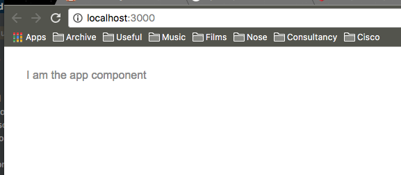

Angular 2 [Modules](https://angular.io/docs/ts/latest/guide/ngmodule.html) and [Components](https://angular.io/docs/ts/latest/tutorial/toh-pt3.html) are important building blocks, trying to use the framework without having perfect knowledge on their purpose and placement will slow your learning and ability to leverage the framework later down the line. This article is designed to cement your knowledge at a fundamental level. It will show you how an Angular 2 web app is bootstrapped into a position where it can be constructed from modules and components.

**'Code Stops'** are used throughout the article which reference the ```git repository``` and ```git commands``` that go with this article. To download the repo see the details at the bottom! Remember to perform an ```npm install``` before running the app.

> This article uses Angular 2.0.0 and Webstorm 2016.2.3

#### What We Will Cover :

- Pre-Bootstrapping & Javascript Dependencies : Preparing the Browser for Angular 2
- Initial Framework Architecture (Modules and Components) : Dependencies
- Exercise : Wiring up a ```child``` module & component
- Exercise : Wiring up a ```grand-child``` module & component
- Exercise : Wiring up a ```shared``` module & component

####  Pre-Bootstrapping & Javascript Dependencies : Preparing the Browser for Angular 2 #####

Angular 2 applications are built around the concept of node modules which live in a node_modules folder within a new project. Upon starting the application the browser will load up the default document (index.html). Before Angular 2 can get loaded this is responsible for a number of pre-bootstrapping steps, the ```index.html``` will use ```<script></script>``` tags to load scripts to do 4 things:

1.  ***Browser [Polyfills](https://remysharp.com/2010/10/08/what-is-a-polyfill) [line 8]*** - ensures the framework has everything it needs in place if older browsers are being used.
2. ***Zones [line 10]*** - these are involved with managing context in Angular 2 applications.
3. ***Reflect [line 11]*** - this adds some extra language constructs which help us define certain Angular 2/Typescript syntaxes like ```@NgInclude``` and ```@Component``` attributes.
4. ***Module Loader [line 12-17]*** - this will use [SystemJs](https://github.com/systemjs/systemjs) : a Javascript module loading libray which will be needed to load the rest of the Angular 2 application.

```html
<head>
  <title>Angular 2 QuickStart</title>
  <meta charset="UTF-8">
  <meta name="viewport" content="width=device-width, initial-scale=1">
  <link rel="stylesheet" href="styles.css">

  <!-- Polyfill(s) for older browsers -->
  <script src="node_modules/core-js/client/shim.min.js"></script>

  <script src="node_modules/zone.js/dist/zone.js"></script>
  <script src="node_modules/reflect-metadata/Reflect.js"></script>
  <script src="node_modules/systemjs/dist/system.src.js"></script>

  <script src="systemjs.config.js"></script>
  <script>
    System.import('app').catch(function(err){ console.error(err); });
  </script>
</head>
```
> modules-and-components/app/index.html

**Line 16** from above ```System.import``` will automatically pick up the ```system.config.js``` file above it which is located at the root of the application. This file tells us about the rest of our application structure. This is the file ...

```javascript
(function (global) {
  System.config({
    paths: {
      // paths serve as alias
      'npm:': 'node_modules/'
    },
    // map tells the System loader where to look for things
    map: {
      // our app is within the app folder
      app: 'app',

      // angular bundles
      '@angular/core': 'npm:@angular/core/bundles/core.umd.js',
      '@angular/common': 'npm:@angular/common/bundles/common.umd.js',
      '@angular/compiler': 'npm:@angular/compiler/bundles/compiler.umd.js',
      '@angular/platform-browser': 'npm:@angular/platform-browser/bundles/platform-browser.umd.js',
      '@angular/platform-browser-dynamic': 'npm:@angular/platform-browser-dynamic/bundles/platform-browser-dynamic.umd.js',
      '@angular/http': 'npm:@angular/http/bundles/http.umd.js',
      '@angular/router': 'npm:@angular/router/bundles/router.umd.js',
      '@angular/forms': 'npm:@angular/forms/bundles/forms.umd.js',

      // other libraries
      'rxjs':                       'npm:rxjs',
      'angular2-in-memory-web-api': 'npm:angular2-in-memory-web-api',
    },
    // packages tells the System loader how to load when no filename and/or no extension
    packages: {
      app: {
        main: './main.js',
        defaultExtension: 'js'
      },
      rxjs: {
        defaultExtension: 'js'
      },
      'angular2-in-memory-web-api': {
        main: './index.js',
        defaultExtension: 'js'
      }
    }
  });
})(this);

```
> modules-and-components/app/system.config.js

After the ```index.html``` has done it's thing it's time to execute the first bit of code. Where is this code located? Well if you look at **[line 29]** from the above snippet you can see for yourself - it's the ```main.js``` (however since by default Angular 2 uses [Typescript](http://www.typescriptlang.org/) + transpilation into Javascript we will study ```main.ts```). Let's have a look at ```main.ts``` to see how it works...


```typescript
import { platformBrowserDynamic } from '@angular/platform-browser-dynamic';
import { AppModule } from './app.module';

platformBrowserDynamic().bootstrapModule(AppModule);
```
> modules-and-components/app/main.ts

In the above file we have everything in place to start the actual bootstrapping of Angular 2. This is done with two lines.

1. ***[line 1]*** Importing the ```platformBrowserDynamic``` module - which will handle the bootstapping of our Angular 2 app. In practice all this really means is that it will understand the convention for the way that modules and components (and other things) will be declared.
2. ***[line 2]*** Importing the ```AppModule``` module - the very first application module. We could call this anything we want. But convention dictates we don't.

Once ***[line 4]*** executes it's all systems go! Angular will begin executing the code in the AppModule it will then load the very first component the ```AppComponent```.

From this point onwards Angular can load the rest of the modules it needs by reading this file and then programatically going through it and loading sub-modules/dependencies.

Following is a visualisation of what we have just covered.


####  Initial Framework Architecture (Modules and Components) : Dependencies #####

The ```AppModule``` which you can see from the diagram is the first module to be loaded after ```main.ts``` has done it's thing. For our next listing we are going to look at the code in this ```AppModule```, it works like this...

1. ***Loads the module @angular/core [line 1]*** - this is the basic Angular 2 library, it will contain all of the base objects that the framework needs.
2. ***Loads the module @angular/platform-browser [line 2]*** - this is for browser and platform detection (such as IOS/Android).
3. ***Loads the root app component (```app.component.ts```) [line 4]*** - in order to show some html we need a *base* component at minimum, otherwise the rest of the application has nothing to attach to.
4. ***Declares a root module class (line 11)*** - using Typescript it declares a static type class ```AppModule``` and uses a decorator ```@NgModule``` ***[line 6]*** to wire up import the platform browser module into the runtime.

```typescript
import { NgModule }      from '@angular/core';
import { BrowserModule } from '@angular/platform-browser';

import { AppComponent }  from './app.component';

@NgModule({
  imports: [ BrowserModule ],
  declarations: [ AppComponent ],
  bootstrap: [ AppComponent ]
})
export class AppModule {
  constructor(){
    console.log('I am the app module');
  }
}
```
> modules-and-components/app/appmodule.ts
> **handy tip** : typescript is a superset of javascript. You can see on line 13 we use javascript to log to the console.

The important thing to realise at this point is that after this point is Angular 2 applications are created from modules and components. We use modules to encapsulate features within our application. And components to display them. Of course there are other things (like services, directives etc) but at a fundamental level understanding these two is paramount to be able to architect your applications.

From this point on we can now begin to declare our own modules and components which and is essentially how we build the rest of our application.

**CODE STOP 1** : ```git checkout step_01``` and then run ```npm start``` (get the git repository from the bottom of this article)

You should see a scren like this :



-----

The rest of this article can be read alone but for maximum benefit I reccomend you download the clone the git repository and try and implement the changes I make. There is no better way to learn than by following along and writing code. Details on the git repository are at the bottom of this article.

### Exercise : Wiring up a ```child``` module & component

The first thing we want after getting our base application working is to wire up our first module. A module in this context is simply a dependency.  If you come from a Java background it would be a seperate **jar** file or C# it would be a **dll**. However since we are using **on the fly** compiled languages the code is not compiled into some artifac, instead we reference we reference the code directly. Fundamentally it's the same thing. For the sake of maintainability and modularity non-trivial applications should be split into multiple modules each serving their own independant purpose. The work that I am doing with a client system [Cisco dCloud](https://dcloud.cisco.com/) at the moment does this and it works well to maintain large code bases.

The first thing we have to do is to add a new folder which will store our component. For the sake of argument (and to make it easy for you to understand) we are going to call this the **ChildComponent** component as it will be a direct descendant of  the **AppComponent**. After adding the folder we need to add the **child** module and component. The folder structure should look like this...


The code for the ```ChildModule``` should be similar to the ```AppModule```. In fact I would suggest just copying and pasting the code from one to the other until you remember how to write them from memory. The child module will import the ```@NgModule``` (in the same way as the ```AppModule``` did. And it will register it's own component ```ChildComponent```. The critical thing to remember here is that it must declare and export the component for it to be used outside the context of this module. It does this using the **declaration** property and the **exports** property in the ```@NgModule```.

```typescript
import { NgModule }      from '@angular/core';
import { ChildComponent } from './child.component'

@NgModule({
  imports: [  ],
  declarations: [ ChildComponent ], // <-- notice here
  exports: [ ChildComponent ]// <-- notice here too...
})
export class ChildModule {}
```
> modules-and-components/app/child/child.module.ts

Next up, we need to create our ```ChildComponent``` and ensure that it  is created and populated with a ```@Component``` decorator (much the same as we use the ```@NgComponent``` decorator on our module definitions). Inside the decorator we need to define the selector and the template. The selector is a html unique string will be used by our ```AppComponent``` to actually know where to render our child component.

```typescript
import {Component} from '@angular/core';

@Component({
  selector: 'child-component',//--> will be referenced like <child-component>
  template: `<div>I am the child component</div>`
})
export class ChildComponent{}
```
> modules-and-components/app/child/child.component.ts

The final step now is to remember to reference our child component from our ```AppModule```.

```typescript
...
@Component({
  selector: 'my-app',
  template: `<div>{{title}}</div>
            <child-component></child-component>`, // <-- this line gets added
})
...
```
> modules-and-components/app/app.module.ts

Okay so now we have added our first component to the base configuration for a component. Hopefully you can see there isn't much to it. You just have to create a module (decorated with ```@NgModule```), a component (decorated with ```@NgComponent```) and then reference it in another module (in our case the ```AppModule```.

**CODE STOP 2** : ```git checkout step_02``` and then run ```npm start``` (get the git repository from the bottom of this article)

You should see a scren like this :


-----

### Exercise : Wiring up a ```grand-child``` module & component

Okay, next up we are going to wire up a module that is referenced by the module we just created. This is an exercise is exposing a component between two of our own modules in a linked way. We let the ```AppModule``` load the ```ChildModule```, it in turn loads the ```GrandChildModule``` and will display it's component.


The first step is to modify the ```ChildModule``` to reference the ```GrandChildModule``` we will be adding in a minute.

```typescript
import { NgModule }      from '@angular/core';
import { ChildComponent } from './child.component'

import { GrandChildModule } from '../grand-child/grand-child.module'// <--new line

@NgModule({
  imports: [ GrandChildModule ],// <--new line
  declarations: [ ChildComponent],
  exports: [ ChildComponent ]
})
export class ChildModule {}
```
> modules-and-components/app/child/child.module.ts

And then update the ```ChildComponent``` to reference the (non-existent) ```GrandChildComponent```.

```typescript
import {Component} from '@angular/core';

@Component({
  selector: 'child-component',
  template: `<div>I am the child component</div>
            <grand-child-component></grand-child-component>`// <-- new line
})
export class ChildComponent{}

```
> modules-and-components/app/child/child.component.ts

Now we should add our grand child module and component files in.


> handy tip : green in webstorm means a file that has been git added but not committed yet!

Our ```GrandChildModule``` and ```GrandChildComponent``` are roughly similar to the ```ChildModule```, here is what they will look like.

```typescript
import { NgModule }      from '@angular/core';
import { GrandChildComponent } from './grand-child.component'

@NgModule({
  imports: [  ],
  declarations: [ GrandChildComponent ],
  exports: [ GrandChildComponent ]
})
export class GrandChildModule {}
```
> modules-and-components/app/grand-child/grand-child.module.ts

```typescript
import {Component} from '@angular/core';

@Component({
  selector: 'grand-child-component',
  template: `<div>I am the grand child component</div>`
})
export class GrandChildComponent{}
```
> modules-and-components/app/grand-child/grand-child.component.ts

> **handy tip** : the ```import``` statements in these files by default are using **node require**. The upshot is that ```./someref``` means (a file which is local to the current file). ```../../someref``` means (a file two directories above the current file). You don't need to use file extensions with node require. By default it looks for the .js file with that name at the targetted path.

**CODE STOP 3** : ```git checkout step_03``` and then run ```npm start``` (get the git repository from the bottom of this article)

You should see a scren like this :


--

Hopefully you now have a good understanding how how modules import other modules using require and the ```@NgModule``` directive. This allows their components to interact in a way that can help us keep our application maintainable. Here is a quick visualiseation to help you cement your knowledge.


> the blue arrows represent the source code dependency direction

---

### Exercise : Wiring up a ```shared``` module & component

So, now for the final piece of the puzzle, how to wire up a module that is shared between components. I left this piece until the end because I wanted you to get a really solid understanding of the basics behing module loading. As you grow your Angular 2 applications you should refactor out common functionality into shared modules. Where you keep this is ultimately up to you but for most projects I reccomend using a ```/commmon``` folder or a ```/shared``` folder.

The ```SharedModule``` will simply declare a module and component in the same way that we did earlier. And then it will be referenced by the ```ChildModule``` and the ```GrandChildModule```. Here is a visual representation...


Now, you should have a good grasp of a module and component layout and quite a few files have changed for this next example so for brevity we can look at just the modules that consume the shared module. But remember if this section is too much to digest just run the ***code stop** at the end of this section.

```typescript
...
import { SharedModule } from '../shared/shared.module'

@NgModule({
  imports: [ GrandChildModule, SharedModule ],//<-- line updated
  declarations: [ ChildComponent],
  exports: [ ChildComponent ]
})
export class ChildModule {}
```
> modules-and-components/app/child/child.module.ts

```typescript
...
import { SharedModule } from '../shared/shared.module'

@NgModule({
  imports: [ SharedModule ],//<-- line updated
  declarations: [ GrandChildComponent ],
  exports: [ GrandChildComponent ]
})
export class GrandChildModule {}
```
> modules-and-components/app/grand-child/grand-child.module.ts


In our components for the modules that imported the ```SharedModule``` we can now add template code that references the ```SharedComponent``` :

```typescript
import {Component} from '@angular/core';

@Component({
  selector: 'grand-child-component',
  template: `<div>I am the grand child component</div>
             <shared-component></shared-component>`//<-- line added
})
export class GrandChildComponent{}
```
> modules-and-components/app/grand-child/grand-child.component.ts

**CODE STOP 4** : ```git checkout step_04``` and then run ```npm start``` (get the git repository from the bottom of this article)

You should see a scren like this :


---

### Conclusion

In this article we learned we have covered foundational knowledge which is important to understand to be able to build more advanced knowledge about Angular 2. Specifically we have covered :

- How an Angular 2 application goes through a pre-bootstrap phase where it prepares the browser and uses normal javascript to load frameworks that in turn help Angular 2 to bootrap and load. We saw how you can look at the ```system.config.js``` file in the root of the application to get an overview of the applicaion framework architecture.
- The minim number of framework files needed for an Angular 2 app is three. And these are
  - ```main.ts``` - which is responsible for bootstrapping the app
  - ```app.module.ts``` - our root module
  - ```app.component.ts``` - our root component
- How to create modules and sub modules and how the module needs to be prefixed with ***(@NgModule)*** and the component needs ***(@NdComponent)***.
- How to make shared modules (by using the import statement across multiple dependant modules) we can expose the shared module components into them.

Hopefully you enjoyed this article, learning the basics firmly is paramount for master of a topic. It can help you further down the line with your projects if you have a very strong foundational knowledge.

### Downloading The Resources

You can download the resources for this tutorial (and be informed of subsequent tutorials as they are released) by entering your info below. And don't worry your details won't be shared or spammed!
