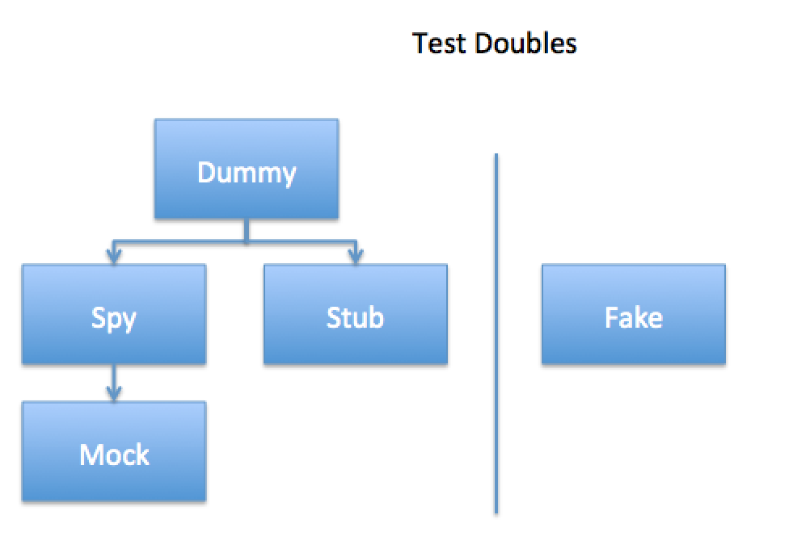

In this blog we will have a look at 5 Test Doubles. In my free [TDD E-book](http://www.peteheard.com/testdrivendevelopment/) I only cover 2 (the Stub and the Spy) since my personal experience is that when taking a state based approach to testing this is all that is needed. But it's good to know these 5 because most likely they will be dotted around code bases and being able to identify them is important.

## What is a Test Double?

A '`Test Double`' is a piece of code which can be used in place of code within the context of a test to help us make assertions. Whether you use TDD or BDD or you simply write tests after you write your code the definition of Test Double should not really alter. Of course it does depending on who you speak to but if you look at the history behind them (and by history I mean publication of books*) then you can that there is a rough conclusion about the different types. The most important thing we can do as professionals is to understand all terms, and what they mean so that in conversation, we can identify what we are speaking about more easily. * Test Driven Development, Kent Beck. Growing Object Oriented Software Guided by Tests, Steve Pryce and Nat Freeman. Xunit Test Patterns, Gerard Meszaros

## What is a Test-Double?

A Test Double is simply an object that can be used in place of a real world object when executing production code with a unit-test. They have 3 main purposes...

1.  To stop IO from happening - this would makes tests slow an unreliable since they should be able to run anywhere
2.  To track the internal state - this means we can check certain things happened or were left in a certain state once execution has finished
3.  To force the system into a desired state - sometimes we want to pretend we the system is already in some predetermined state

I will use Javascript and AngularJS to demonstrate the different types.

## 1) The Dummy Object

The first and very foremost type of Test Double is a `Dummy Object`. This is simply a test object which overrides a real world object when executing production code in the context of a test. Take, for example; the following code :

```javascript
//the real world implementation
function Alerter(){
  this.alert = (msg){
     window.alert(msg);
  };
}

var Alerter = new Alerter();

//the Alerter is injected
angular.module('app').controller(function(Alerter){

     Alerter.alert('hello world');

});
```

In it we have an object called an `Alerter`, this object will actually be responsible for creating a javascript `'alert()'` command when it is injected into the Angular controller. However we really don't want the test to try and launch an alert box (it's generally not a good idea to allow tests to invoke IO operations). So what we do is create a Dummy Object which matches the design of the Alerter.

```javascript
//the dummy implementation
function DummyAlerter(){
    this.alert = (){
  };
}

var Alerter = new DummyAlerter();

//the DummyAlerter is injected
angular.module('app').controller(function(Alerter){

  Alerter.alert('hello world');

});
```

The dummy is then used in place of the Alerter. The key defining attribute of the dummy object is it's simplicity. It just serves as a sort of blank holder to allow the code to get past some point without creating undesired behaviour before we hit the portion of code we want to test.

## 2)The Stub Object

The Stub builds on the Dummy object, it adds functionality that will allow a test to depend on the output of of the Stub. Take the following code:

```javascript
//a real world object that performs io over a network connection
function HttpAuthenticator($http){
  this.load = (){
      return $http.get('/api/login')
  };
}

var Authenticator = new HttpAuthenticator();

//when injected the controller will perform io
angular.module('app').controller(function(Authenticator){

     Authenticator.load().then(function(dto){
         if(dto.authenticationSuccessful){
             $scope.showLoggedInPanel = true;//we want to test this value is set
         }
     })

});
```

We can see here that our Angular controller needs to load a result from the `HttpAuthenticator`. If we try and unit test this controller we hit the same problem we hit in part 1\. Our `$http` object will cause an IO operation which we want to avoid. We aren't testing http after all we can assume the developers of the $http module will do their job properly for now and will make an api that works. What we want to do is test that our code that runs inside the controller runs as expected when authentication is successful. We want to check the bit inside the 'if' statement. So what we do is create a stubbed `Authenticator` like this...

```javascript
//our stub is a simple data structure which has the same shape as the real world object we are trying to mimic
var stub = {authenticationSuccessful:true;};
function AuthenticatorStubHolder($http){
  this.load = (){
      return $.when(stub);
  };
}

var Authenticator = new AuthenticatorStubHolder();

//stub holder containing the stub is injected in
angular.module('app').controller(function(Authenticator){

     Authenticator.load().then(function(dto){
         if(dto.authenticationSuccessful){
             $scope.showLoggedInPanel = true;//we want to test this value is set
         }
     })

});
```

When we now inject the `AuthenticatorSuccessStub` instead of the `HttpAuthenticator` we can force our application to reach the correct pre-condition : that the user is authenticated. **Bottom Line : When you want to force-set what a webserver responds with (in your test); use a Stub.**

## 3) The Spy Object

The Spy also builds on the Dummy object. It's purpose is to 'sniff' out and detect when a method on it was called. This helps us when we want to use '[state based verification](http://xunitpatterns.com/State%20Verification.html)'. It works like this...

```javascript
function AuthenticatorSpy($http){
  var loadedCalled = false;
  this.load = (){
      loadedCalled = true;
      return $http.get('/api/login')
  };
}

var Authenticator = new HttpAuthenticator();

angular.module('app').controller(function(Authenticator){

     Authenticator.load();

});
```

The somewhat truncated code I have shown above should be enough to demonstrate how the spy works. It's just a variable which is set when the test double is injected into the controller and run. It means we can check that the `Authenticator.load()` function was actually called. The Spy can be extended to also capture what was passed to a function. They can track the what and the how. This type of test double is excellent for ensuring that your application 'dials out' to an IO boundary with the correct functions and the correct arguments. **Bottom Line : When you want to check what a webserver was sent; use a Spy.**

## 4) The Mock Object

The Mock Object builds on the Spy object. In it we declared our Spy property as private but then expose the meaning of the Spy through an actual function; this shows the test an interpretation of what the calling code is doing. The benefit with a Mock is to show behaviour. Fundamentally this allows us to move from 'state based assertions' into a realm known as 'behaviour verification'. Personally I am not a fan of this double, however it is worth saying that a lot of developers are using Mock Objects with behaviour style testing. The idea behind true mocking is to isolate each individual object in the system. It is a not a practice I personally feel I need to use because state based seems to give me enough confidence but it's worth knowing about.

```javascript
function MockAuthenticator($http){
  var loadedCalled = false;
  this.load = (){
      loadedCalled = true;
      return $http.get('/api/login')
  };

  //notice how we are exposing an extra function in our test double which gives a larger
  //surface area which we can access in our test. This is meant to make a mock more descriptive.
  this.authenticationWasCalled = function(){
     return loadedCalled;
  }
}

var Authenticator = new MockAuthenticator();

angular.module('app').controller(function(Authenticator){

     Authenticator.load();

});
```

NOTE: Mock Objects should not be confused with 'Mocking Frameworks'. Mocking frameworks should really be called 'Test Double Frameworks'. They are simply a suite of classes that allow us to dynamically generate Test Doubles. There is a lot of confusion and it doesn't help that the word 'Mock' is used colloquially to refer to Test Doubles. The most important thing is to be aware of this distinction. It helps to clarify this in conversation where not clear. **Bottom Line : A Mock is a specific type of Test Double. It is also a colloquialism for the term 'Test Double'. To add confusion a mocking frameworks helps us to make all types of Test Doubles.**

## 5) The Fake Object

This is perhaps the most interesting and dangerous beast of all Test Doubles. The Fake Object actually mimics business logic. It can be used where you don't have access to a real world object whose functionality your system depends on. You can see below that there is an 'if' statement. Generally speaking if you have an 'if' statement in a Test Double alarm bells should be ringing because anything with conditional logic can break. And if it can break... well it probably needs to be tested in itself.

```javascript
function FakeAuthenticator($http){
  this.load = (userName, password){
      if(userName === 'pete', password === 'cats'){
         return true;
      }
  };
}

var Authenticator = new FakeAuthenticator();

angular.module('app').controller(function(Authenticator){

     if(Authenticator.load($scope.userName, $scope.userPassword)){
         $scope.showLoggedInPanel = true;//we want to test this value is set
     }

});
```

Conclusion: In this blog we learned... **`Dummy Objects`** - Are simply objects that allow our code to run/compile. **`Stub Objects`** - Are types of Dummy object preconfigured values which we can use to force our system into a desired state. **`Spy Objects`** - Are types of Dummy object that allow us to track when something was called on them. **`Mock Objects`** - Are types of double object which expose our properties in such a way that show a 'behavioural surface area'. **`Fake Objects`** - Are types of object that contain 'fake' business logic. They can be used in places where complexity needs to be mimicked. We also learned that a 'Mock object' should not be confused with a 'Mocking framework'. A mocking framework will allow us to dynamically generate all manner of Test Doubles. This picture should help with keeping the types of doubles and their relative spacing to each other in mind. [caption id="attachment_566" align="aligncenter" width="300"][](images/1_image.png) Test Doubles[/caption] Try to aim to always use the simplest possible type of Test Double for the job. This blog has ordered the doubles in their relative complexity. Using Fake objects will be fraught with problems, they will almost definitely have bugs in themselves so use with extreme caution. You can learn more about test doubles here... [The little mockist - Uncle Bob](http://blog.8thlight.com/uncle-bob/2014/05/14/TheLittleMocker.html "The little mockist - Uncle Bob") [Test Doubles - Martin Fowler](http://www.martinfowler.com/bliki/TestDouble.html "Test Doubles - Martin Fowler")