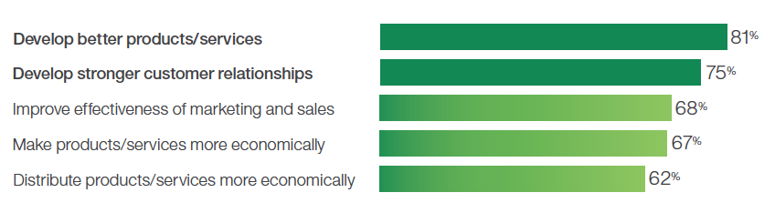
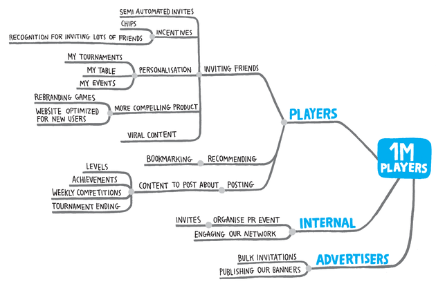
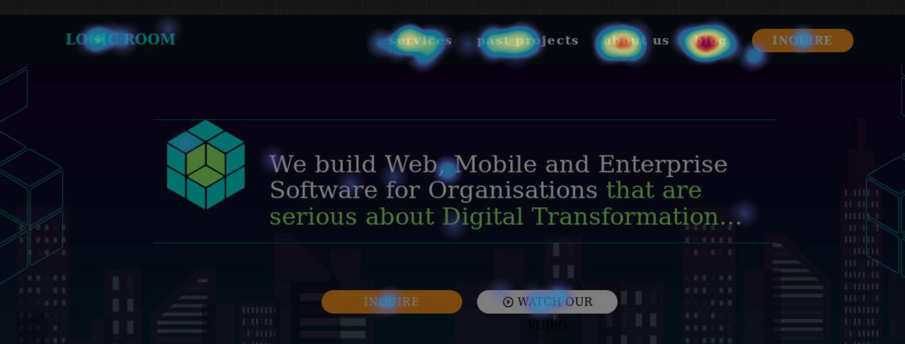
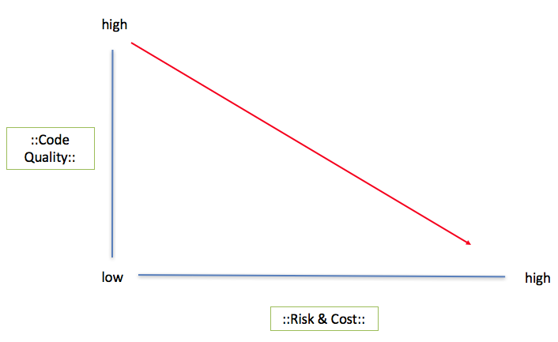
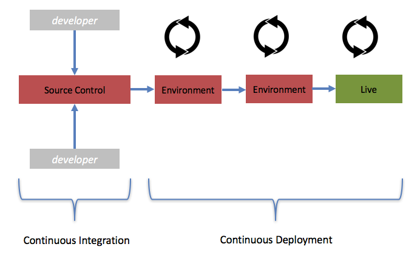

When you cut costs, profits go up and research [carried out by IBM](https://www-01.ibm.com/common/ssi/cgi-bin/ssialias?subtype=XB&infotype=PM&htmlfid=GBE03729USEN&attachment=GBE03729USEN.PDF){:target="_blank"} on 5000 business leaders in 2015 found that cutting cost is the fourth highest priority for a C-level exec  (CEO, CTO, COO, CIO and IT Directors).

{:target="_blank"}
> The top priorities for C-level execs courtesy of IBM

The best type of cost to cut is the one that saves not only hard cash but also time and effort. When you save time and effort you improve efficiency. Producing software efficiently should be at heart of every Lean enterprise. This guide will explore 6 techniques C-level execs and software leaders can use to create software more efficiently which in turn help to actually lower cost.

## What we will Cover:

- **Technique 1** : Lead Development Choices With Better Strategic Planning
- **Technique 2** : Measure End Users At Every Stage Using Analytics
- **Technique 3** : Improve Requirements Building
- **Technique 4** : Introduce a Testing Mind-set
- **Technique 5** : Embrace DevOps and Continuous Integration/Continuous Deployment
- **Technique 6** : Refactor Legacy Systems - Don't Rewrite

## Lead Development Choices with Better Strategic Planning

In one of my last blog posts I explored the [limitation of story points](https://www.logicroom.co/should-we-stop-using-agile-story-points/){:target="_blank"}, I made the point that story points help the business manage a team but they don't necessarily help the team make software.

I go on to clarify that we create software for companies that need to make a profit from it. This is done either by making money or saving money and this happens by adding value to customers. Story points don't capture any information about value from a customer's perspective.

This leaves us in a difficult position because often the direction of focus on what features to implement goes the wrong way from executive through to team when in actual fact it should go from team to users. By getting the team to directly work on what users need rather than hearing it second hand there is a higher chance they will be able to develop the 'right' features.

One such technique which is becoming more popular for  helping teams plan which features to build is [Impact Mapping](https://www.impactmapping.org/){: target="_blank"}. Impact Mapping is a strategic planning technique which involves considering what users need. This is done by firstly visualising assumptions about the endpoint goals of the user and then working backwards to identify what the software needs to do to fulfil this.

> Impact mapping image from impact mapping website

By having clear objectives which are 'tuned in' to your users, you will save money by not developing software that isn't needed.

## Guide Feature Choices Using User Analytics

We develop software for end users. Be it internal or external; our users are the ones we have to keep happy. Today's modern application economy and web development industry allows for the collection, retrieval and visualisation of a deep array of data points which we can use to guide product development.

Bad decisions cost us money; apart from wasting time physically developing them, we waste resources managing their development. Bad feature decisions can often create bloated solutions with features that simply don't provide a good Return on Investment (ROI).

In the [Human Factors International video](https://www.youtube.com/user/HFIvideo){:target="_blank"}, Dr. Susan Weinschenk notes that of those IT investments, up to 15% of IT projects are abandoned and at least 50% of a programmer's time during the project is spent doing rework that is avoidable. Following best practices helps to identify challenges upfront so that a solution can be found early.

By using data we can begin to profile our users and improve our decision making. The following approaches can be used:

### Web and Mobile Analytics

For example, here is one such tool we use here at Logic Room [hotjar](https://www.hotjar.com){:target="_blank"} which helps us create HeatMaps that we use to monitor our homepage to see which links were clicked on the most.

You can get a very real idea of what it is that people want to do as soon as they come to our site; in our case - they want to read our blogs!

As someone running a business and making decisions on our site, this is _really_ important business intelligence information which helps me guide our online strategy. From this data I know that I must focus initially on building a library of accessible and interesting blogs because people are coming to our site for information first and foremost! I can worry about selling to them second.

In the world of software I know I should add value first; data and analytics can help me figure out which features of my digital strategy to focus on first, thereby making us more efficient.

>Logic Room heatmap

### Social Media and Sentiment Analysis

Social Media is a powerful tool which can be leveraged to send targeted ads to users and then direct them towards data collection portals (such as landing pages).  They can also be used to gauge sentiment around certain topics by using machine learning on comments and tweets on Twitter.

By analysing trends on social media we can see not only what is big with users at any given time but also how to proposition our offerings to align with our users. This 'forward looking' approach will help us add features which are more likely to be useful to our users, meaning we spend less time developing things that aren't.

### Paid Digital Advertising and A/B testing

Apart from using advertising to sell products, paid advertising is very effective at controlling what potential users see and thus what they click on. By strategically placing ads on Google or another search engine and seeing what makes them click, we can build up a profile of what our users are interested in, this is called 'A/B split testing'.

For example, if I want to create network virtualisation software I can run 1000 ads. On 500 of them I advertise a drag and drop interface. On the others, a command line interface. By seeing which receives the most clicks, I know which feature to develop first. This type of feature development is actually inspired by the biological standpoint of natural selection and is emerging as a powerful way to drive business strategy. For a really interesting case study about these sorts of techniques I recommend a fantastic book [Why The Tories Won (the 2015 election)](https://www.amazon.co.uk/dp/B016DE6COE/ref=dp-kindle-redirect?_encoding=UTF8&btkr=1){:target="_blank"} which talks about many methods the Tories used to get into the heads of voters to find out what they wanted using digital strategies. They then knew **exactly** how to run their campaign by using data. The same rules can be applied to development.

> David doing his 'thumb' thing

## Improve Requirements Building

The global, non-profit application developers' portal 'App Developers Alliance' collected data for their [Insights Report](https://www.appdevelopersalliance.org/developer-insights-report-2015){:target="_blank"} and they found that 48% of project failures are from poorly documented requirements.

The _most_ inefficient way to develop software is to fail outright. So in order to be more efficient and cost effective we can look to improve the process of requirements building.

There are many ways to build requirements effectively. We don't need an Agile pundit to force the user story syntax on us just because that seems to be 'the way' that software should be developed.

On the contrary, I have worked with teams where collecting requirements in this way was actually too costly and time consuming. What we found is that taking a more common-sense approach was needed.

For example, on a project I worked on a while ago I was developing software for power network optimisation. There were very specific requirements that the power engineers needed to visualise. It would have been over the top and unhelpful to start _thrusting_ Agile user stories around.

The engineers needed to explain what the software should do; and we needed to provide a solution. We cut down development time by using open source User Experience tools and mocking up pages just using HTML and CSS. When I didn't understand something I spoke to the engineers directly by simply picking up the telephone or walking to their desk with my Mac and asking/showing them.

Taking a lightweight approach was effective. It reminded me of some fundamental principles that should be considered when building requirements:

1. **Easy Access to Decision Makers** The development team should have free access to the person who has high knowledge of what the software should do; this person should also have the authority to make and sign off decisions. Whether this is a Business Analyst, Product Owner or an end user, the point, is to have someone with a vision of requirements. But this should be one person.
2. **Build by Convention** The developers should take an active approach to using common patterns for developing well-worn avenues such as navigation menus. Object architectures should be standardised as soon as possible to make the bolting together of components quicker.
3. **Feedback** We should not overcomplicate requirements building; we should simply feedback regularly and release often into test environments.
4. **Simple Designs/Prototypes** We should use, where appropriate, (visual wireframing and prototyping tools) but these can be costly to implement.  Sometimes it's cheaper and quicker to build the product than it is to build a prototype.

## Introduce a Testing Mind-set

There is a very clear relationship between software quality and cost. When code quality is high, cost goes down. This is because the software can be modular and extensible which allows it to be leveraged for more valuable uses.

> The inverse relationship between cost and quality

Test Driven Development (TDD) is a discipline that developers use where they write tests before they write code. Interesting [research](https://www.infoq.com/news/2009/03/TDD-Improves-Quality){:target="_blank"} carried out by a number of large vendors (for example, Microsoft) indicates the TDD approach has been proven to reduce the cost of development by improving quality.

TDD can be difficult to implement correctly in an organisation because it is often administered in a way that doesn't promote speed and ease of use. Be sure to download our [TDD guide](https://www.logicroom.co/tdd-simplified-in-5-steps/){: target="\_blank"} which breaks it down into easy to do steps.

## Embrace DevOps and Continuous Integration/Continuous Deployment

DevOps is a software development practice that refers to an entire team taking responsibility for the automation of end-to-end software packages and releases - in the book ['A Practical Approach to Large-Scale Agile Development'](https://www.amazon.com/dp/0321821726?tag=contindelive-20){:target="_blank"} some interesting figures were cited where they speak about applying DevOps; they found:

- Overall development costs reduced by ~40%
- Programs under development increased by ~140%
- Development costs per program reduced by 78%
- Resources driving innovation increased by 5x

> Continuous integration and Continuous Deployment

It's important to realise that DevOps is simply the manifestation of developers spending time to optimise their environment. As Abraham Lincoln said:

_'Give me six hours to chop down a tree and I will spend the first four sharpening the axe.' - Abraham Lincoln_

DevOps is fundamentally about culture; a culture of automation reduces complexity and this will drive down cost and improve efficiency.

## Refactor Legacy Systems - Don't Rewrite

Astonishingly, there is [$1,000,000 of technical debt](https://www.logicroom.co/the-cost-of-poor-quality-code-on-digital-transformation/){:target="_blank"} included in the average code base.

The article I linked to (above) shows that this debt causes huge problems for organisations. There are several problems that bad code is likely to create in an organisation

- It increases complexity which slows delivery
- It increases risk which reduces time to market
- It frustrates developers meaning your staff turnover rate increases

All of the above drive up cost and reduce efficiency.

Legacy code is in every organisation and organisations often re-write entire systems. However refactoring (modernising) legacy systems is often a far better approach.

A skilled engineer can help their client/employer slowly improve code. They can do it in a non-destructive way that mitigates risk. You can read more about the approach using Michael Feathers book called [Working Effectively with Legacy Code](https://www.amazon.co.uk/Working-Effectively-Legacy-Michael-Feathers/dp/0131177052){:target="_blank"}.

## Conclusion

Developing software is hard. Time, money and effort get quickly expended. Anybody who has been in the industry for more than the 'blink of an eye' has probably seen how quickly projects can become unproductive.

In this article we have looked at some ways to make the scoping and building of software more efficient, using simplified processes such as close collaboration with users and automation of a DevOps culture.

We have also discussed analytics and social media techniques to help us guide feature selection and have seen that refactoring and modernising code is an option, instead of rewriting entire systems.

A new era awaits the future of development as companies look to consolidate legacy systems, improve customer relations and increase technical efficiency in order to become more efficient and digitally 'aware'!

I hope you enjoyed this article.