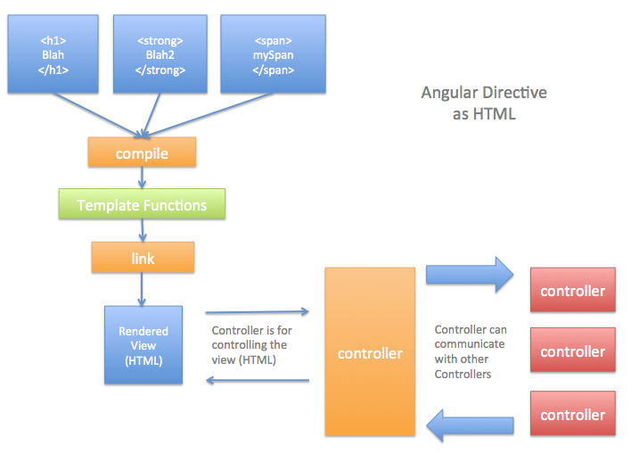
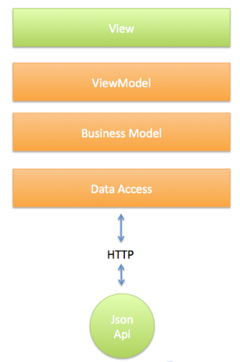

In this article we will take a look Angular Directives, how they are dealt with during the Angular bootstrapping pipeline and how they should be designed if you want to architect large-scale Javascript Angular applications. It follows on from the [article I wrote the other week](http://www.peteheard.com/angularjs/the-truth-about-angular-services-what-they-really-are-and-how-the-really-work/){:target="_blank"} whose purpose was to give us a different perspective with which to think about the types of objects Angular gives us to work with, these articles will focus around making us better Object Oriented Software Architects who can leverage frameworks to fulfil our objectives without letting them take over!

## Motive

The [Separation of Concerns](https://en.wikipedia.org/wiki/Separation_of_concerns){:target="_blank"} (SoC) is a design principle in Software Engineering which deals with separating the design of code into distinct parts that deal with their own concerns. I have noticed that since Single Page Applications (SPA's) have become more prevalent it's absence has become more pronounced and I think there is a reason; if you look at the evolution of Javascript being regarded originally as a small scripting language for doing trivial tasks it is easy to see over time how the desire to separate concerns in Javascript may not have been as great as in multi-developer large scale C# or Java applications. However, with modern day (SPA's) being as large or if not larger than their backend counterparts it would be wise to hold onto tried and tested design principles for the sake of well maintained and extensible code!

## How Angular Directives Work in Angular

Angular Directives are a constituent part of an Angular code base that often violate the Separation of Concerns principle. This artcile will attempt to tackle it's subject in two phases. Firstly an explanation of how they work. And secondly what this means in terms of their limitation. In order to be better Software Architects it's important to understand the limitation of any tool you use in so that you can break out of using the tool when appropriate to do so.

## Step 1

The first thing we do is declare some html on a page. The html is actually HTML 5 'syntactic style' meaning we can insert anything we want into the tags. What this allows us to do is insert a unique string (in this case called 'my-directive') which will let Angular bind some behaviour to.

## Step 2

Okay that was easy, now let's make a bit of Angular code written in Javascript. This code is the Angular Directive declaration itself. It's nothing special but it conforms to a special contract which Angular understands. We let Angular know it's a directive by attaching it to a module and calling it a 'directive' (line 1).

```javascript
angular.module('networkappApp').directive('myDirective', function() {
  return {
    restrict: 'AE',
    replace: true,
    scope: {
      ngLabel: '='
    },
    template: '

<div>{{message}}</div>

',
    compile: function(elem, attrs) {

      //compiles html into compile functions

      return function(scope, elem, attrs){

        //links the dom

      };

    },
    controller: function($scope) {

      //connects the DOM to our App

    }
  };
});
```

## Deconstructing an Angular Directives Code

As you can see from the above we have declared a very simple directive. The syntax for Angular Directives can be difficult to memorise. They have a billion different confusing options (some of which override each other), have complex set up and tear down, and the string interpolation stuff going on at the scope.ngModel level is enough to give anyone a headache. But really when you get down to it they have 3 main things going on you need to be aware of.

1.  `Compile`(line 9) is a function that **you** write that will be called by Angular during it's compile phase. What this means in plain speak is that Angular is going to interrogate the html (which you just created in the template property on line 8) and is going to turn it into something that Angular can deal with later down the line (called a template function).
2.  `Link`(line 13) is a function which is responsible for manipulating the DOM. It will have the scope injected into it. The scope is just a little object which helps our Javascript talk to the Angular View (Template). I like to think of it as glue between Javascript and the View. The link function can only be invoked 'after' the compile function because as well as the scope it also needs access to DOM elements such as the attributes and elements. It can only deal with compiled html (step 1) and thus will be called when this phase is complete.
3.  `Controller`(line 20) is no different to any other controller inside angular. Simply put all we are doing is declaring it in the same file as the directive. With this in mind we get access to one of the main features of Angular and more specifically Angular Directives; Dependency Injection (DI). This means that we can inject in a dependency of our own choosing at this point. And because we also have access to the scope we can 'attach' whatever logic resides in our application to the DOM using this function. It's worth noting that we also get DI in the constructor function of the directive but the controller is independantly testable.

The `Compile`, `Link` and `Controller` functions will be called by the Angular bootstrapping code in this order... 1 -> Compile 2 -> Controller 3 -> Link Here is a diagram which shows how the compile and link function serve to generate HTML which the controller will control!  {:target="_blank"} NOTE : The link function is invoked (after) the controller because it is the one place that needs to be able to access the controllers of other directives.

## What does this mean?

Looking at the above steps we can see that the directive just does two things...

1.  HTML Modification (Compiling and Linking)
2.  HTML interaction (Controlling)

From a technical perspective the directive is nothing more than a placeholder in the view, it allows to us to respond to events that happen in the browser and it allows us to dynamically update the view and call our own code.

## So What's New?

Well ... the native HTML DOM Api built into any modern browser does already allows us to do this in the form of HTML and it too can be [accessed using Javascript](https://developer.mozilla.org/en-US/docs/Web/API/Document_Object_Model). So... looking at it this way an Angular Directive is simply allowing us to extend HTML... enter the **Meta Framework**....

## The Meta Framework

The word [meta](https://en.wikipedia.org/wiki/Meta){:target="_blank"} means to 'refer to oneself or genres of itself'. This is a great description of what a directive does. The directive is a self referential description of the thing it creates (HTML). Because by using HTML and some javascript we have just extended the HTML description, we have created 'edge' so that you can connect your own logic to it in a way that is maintainable and comprehensible. This is the essence of the Meta-Framework aspect of AngularJS! This **fundamental** truth leaves us with conclusion that a directive is simply an extension of HTML and defines the core theme of this article....

> **Angular Directives are Just HTML.**

## Separating Concerns - The In Page Sql Dilemma

If you have been programming web applications long enough or you use certain frameworks you may be aware that some web frameworks will allow you to write SQL code in the view. For example PHP allows this and so does .Net. As I'm sure you are already saying to yourself it would be a terrible idea to exercise this feature. Quite simply, hard coding data access into a view quickly becomes a maintenance nightmare. There are two reasons for this... 1) a single change to the structure of the data and your view breaks 2) it's very difficult to understand context when you lump data structures in with the view behaviour and structures So, What implications does our new found insight about directives and the little consideration we just had about embedding persistence into the view give us? Well...consider the following code :

```javascript
angular.module('networkappApp').directive('customerLister', function() {
  return {
    restrict: 'AE',
    replace: true,
    scope: {
      ngLabel: '='
    },
    template: '

<div>{{message}}</div>

',
    compile: function(elem, attrs) {

      //bind html/dom click handlers
      $.on('elem.click', function (event, state) {

        //do stuff

      });

      return function(scope, elem, attrs){

        //respond to interaction and update DOM
        scope.$watch('ngModel', function (newValue, oldValue) {

          elem.click();

        }, true);

      };

    },
    controller: function($scope, CustomerService) {

      CustomerService.getAllCustomersWithBookings().then(function(customers){

        angular.forEach(customers, function(customer){

          $scope.bookings.push({name:customer.name});

        });

      });

    }

  };
});
```

The above has a design flaw... one line in particular is the problem. Can you spot it? It's (line 32 - line 40) where most importantly `CustomerService.getAllCustomersWithBookings()` is accessing an API in order to get data and map it to a property on the $scope. Now... it just so happens that the API is a remote HTTP JSON based but, for the purpose of this discussion this fact is irrelevant. What **is** relevant is that we didn't create the return object `customers`. It is returned from an application that we do not hold the right to change and have no control. Even if we did it wouldn't be wise to force ourselves to have to. What we now have is a situation which is EXACTLY the same as the SQL dilemma we had at the start of this section. Because we don't own the interface to the returned object `customers` it is no different to accessing a data persistence object directly in the view. Another way to think of it would be like writing Javascript which performs business logic inside **script** tags, any javascript professional would probably avoid doing this without good reason as it isn't maintainable; it just isn't a good idea to write business logic inline in a view! Designing software like this where the business logic is so close to the view poses problems that shouldn't be underestimated let's just recap....

## First Problem : risk

The risk we carry is that if the `customers` object ever changes it's schema... our view breaks. This character of software design is known as **[brittlety](https://en.wikipedia.org/wiki/Software_brittleness)**. One change in one place will have unexpected consequences in another part of our application (the view).

## Second Problem : cognitive dragging

Because the design is not [orthogonal](https://en.wikipedia.org/wiki/Orthogonality_(programming)), over time; from a cognitive perspective it will be difficult to reason with and it will be hard to see exactly what responsibilities the directive holds, this will have a slowing effect on being able to comprehend and thus maintain the code base. This type of design in Angular directives is extremely weak. At the start of a project when the code base is small it's possible to manage the risk associated with this design flaw. But as the projects grow inevitably features will start to break. The only option is heavy refactoring or in the worse case entire rewrites, this puts whoever is paying for the software at extreme risk.

## Breath....Breaking Out Layers

I'm not one to throw the baby out with the bathwater. So if you do have directives already like this stay reading, I am going to show you how you can address the problem with a clear focus. The approach is the same across any Object Oriented software and is called layering. For a more detailed explanation of it then checkout my [E-Book about TDD](http://www.peteheard.com/tdd-simplified/). In almost all the projects I have worked on in a commercial capacity we have always ended up needing a minimum of 3 layers, Persistence Modelling, Business/Entity Modelling and View Modelling. The following diagram is from my E-Book.   The basic premise is that you decouple the directive from deeper parts of your application using something [Inversion of Control](https://en.wikipedia.org/wiki/Inversion_of_control) (IoC). For example the `CustomerService` (which by the way is a terrible name, please see my other [article](http://www.peteheard.com/angularjs/the-truth-about-angular-services-what-they-really-are-and-how-the-really-work/)) we saw should be separated from the directive by virtue of an an abstract interface, I mean this in the looser sense of the word being an implicit affair as opposed to a strongly typed interface, however the core idea is the same. What I mean is that the directive should talk to an interface not a concrete dependency. Read on...

## Enter the ViewModel

What we need to do is create an interface on the Javascript object responsible for returning our data. And that interface will be responsible for exposing the data structure that the view is going to render not the underlying object. This data structure has a special name. Because it is a model that is intended for the view we call it 'The ViewModel' I am sure you have heard of ViewModels before. Lot's of people can get hung up at this point in the [MVC](http://www.dofactory.com/topic/1105/details-about-mvc-design-pattern.aspx)/[MVVM](https://msdn.microsoft.com/en-us/library/hh848246.aspx?f=255&MSPPError=-2147217396){:target="_blank"} debate, however the focus we are discussing here is not the design pattern it is the motive. We are looking to decouple our application using a data structure designed for the view : The ViewModel. Here is the refactored code....

```javascript
var networkappApp = angular.module('networkappApp');

//Layer 1) hides the web from the model, returns a Data Transfer Object (DTO)
networkappApp.service('CustomersEndpoint',function($http){
  return function(){

    this.getCustomers = function(){
      return $http.get('').then();
    }

  }
});

//Layer 2) shields the directive from the internal design of the DTO
networkappApp.service('BookingsViewModel',function(CustomersEndpoint){
  return function(){
    var self = this;
    self.bookings = [];

    this.load = function(){

      return CustomersEndpoint.getCustomers().then(function(customersDto){

        angular.forEach(customersDto, function(customerDto){
          self.bookings.push({name:customerDto.name});
        });

      });

    }

  }

});

//Layer 3) now the directive cannot see the internal design of the business logic
networkappApp.directive('customerLister', function() {
  return {
    template: '

<div>{{message}}</div>

',
    compile: function(elem, attrs) {

      //do compile stuff

      return function(scope, elem, attrs){
        //do link stuff
      };

    },
    controller: function($scope, BookingsViewModel) {

      //simple mapping
      $scope.bookingsViewModel = BookingsViewModel;

    }

  };
}); 
```

There are 3 main steps that I have done in this refactoring.

1.  Introduced a single endpoint (Line 1-12) which is responsible for communicating with and returning a data transfer object `customersDto` (Line 22)
2.  Introduced a ViewModel layer (Line 14-34) which will map the `customersDto` to a ViewModel property(Line 25)
3.  Completely decoupled the Directive from the internal construction of the viewmodel by simply assigning it once it is in the controller(Line 52)

We now have what is called a Layered Architecture. This type of Architecture has many forms but essentially the premise is to shield each layer from the other. By doing this we reduce coupling. And by reducing coupling we will find that our software becomes less brittle. Over time we begin to refine our layers. Some layers will become more abstract. It is our job as Software Architects to consistently refine what each of these layers represents. You will find over time that you will discuss, change, change back, disagree, agree and go round in circles about these layers and their purpose. This is fundamentally what designing software is all about. Some people call this process incremental design. I call it programming. NOTES :

*   At this point you might be wondering why we didn't resolve the promise in the controller. Well it's best to use something like UI-Router in this case to force resolution before the controller to keep the controller clean.
*   I have used 2 layers not 3 (my recommended minimum). I have done this for brevity.

## Conclusion

As our application grows the sort of poor design we saw at the start of this article **will** with direct view to data transfer or persistence object coupling will be difficult to maintain. In the beginning it will feel natural, it will feel like just enough to get the job done. Be wary because over time it will slowly grow, slowly morph and change into a big slobbering mess growling at people who come across it and screams '**feed me developers aaaarggggg'!!!!** {:target="_blank"} You will notice you fix a bug in one area only for it to be repeated in another. You will realise things breaking in odd ways. You will pull your hair out on a friday because you want to go home but you are stuck in work using chrome debugger :-(. But, most of all you will put the code base at risk and slow development... In our refactored version we did something that at it's core is quite simple. We decoupled implementation of modules that do different things. We separated concerns. We layered our application to hide the internal design of one concern from the internal design of another and we did this using the ViewModel! By realising that the Angular Directive is really just a way to describe HTML we see how to leverage this to connect our application in a minimalistic way to some Javascript code that does 'other stuff'. We see that the frameworks real purpose is to render the view not to handle other things like persistence. We realise we have to keep Angular working on what is good at. Not what it is trying to be good at. It is up to us to make sure we don't give it too much to do. It is our responsibility as Software Architects to make wise decisions about when and when not to leverage a framework. Now can begin to realise a more stable way to construct large scale applications which are decoupled and easier to maintain. Good luck!