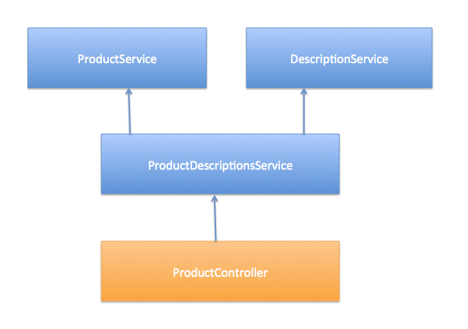
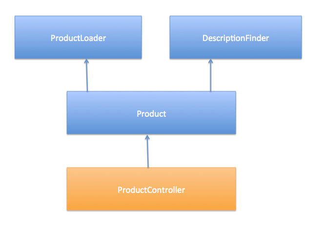

In this article we will look at Angular services and how they are created inside the Angular source code. We will then we will draw a conclusion which will go towards making us better Software Architects. The central concept of this article is also applicable to Angular Factories (which are almost identical in their use but have a couple of subtle differences). See the note I have made further on in the article for clarification on this. On his [blog](http://javascript.crockford.com/javascript.html){:target="_blank"} Douglas Crockford states... “JavaScript is a very nice dynamic object-oriented general-purpose programming language” This comment is important because we often get caught up in the dynamic and functional aspect of the Javascript language before remembering the simple truth that '**Javascript is just objects'**! Forgetting this can cloud our judgement and make us focus efforts inefficiently treating it in a way that is counter intuitive, it can inhibit our ability to use age old tried and tested Object Orientated design principles to architect large applications. Angular Services, in my opinion, suffer from the problem. They are often treated as a one stop shop to denote every architectural naming and object creation decision where the concept of the service becomes the fundamental unit of currency inherent in the overall design of the system. To start this discussion I would like to just explain how an AngularJS service is created. The majority of the following code will peer into the Angular source code, so hold onto your hats - we are going down the [rabbits hole](http://www.huffingtonpost.com/van-winkles/lewis-carroll-was-not-on_b_7743846.html)!

## Step 1 - Our Declaration

We make a declaration to AngularJS to create a 'Service' within our module called 'Dashboard'. Nothing special but here you go...

```javascript
var networkAppModule = angular.module('networkappApp’)'
networkAppModule.service('Dashboard', function (DashboardEndpoint) {
    ///….rest of service code here
```

## Step 2 - Angular Services Bootstrapping

Then we start our application and Angular begins it’s bootstrapping process. The very first function that gets called is ‘invokeLaterAndSetModuleName()’ (we are now in Angular land btw).

```javascript
function invokeLaterAndSetModuleName(provider, method) {

          return function(recipeName, factoryFunction) {

            if (factoryFunction && isFunction(factoryFunction)) factoryFunction.$moduleName = name;

            invokeQueue.push([provider, method, arguments]);
            return moduleInstance;

         }
};
```

What this code does is return a function which takes a scoped parameter called ‘factoryFunction’. This variable is actually our service declaration function (the Dashboard) detailed in step 1\. It adds our service function onto the invokeQueue[].

## Step 3 - The Set Up

The next relevant step is how the service function that we placed in the invokeQueue[] is now invoked. It is done in another Angular function called loadModules. This function (and I have deleted the irrelevant code from it) searches all of our modules and instantiates the services we declared and that were placed into the invokeQueue[] by Angular.

```javascript
function loadModules(modulesToLoad) {
//..
    var runBlocks = [], moduleFn;
    forEach(modulesToLoad, function(module) {
//...
      function runInvokeQueue(queue) {
        var i, ii;
        for (i = 0, ii = queue.length; i < ii; i++) {
          var invokeArgs = queue[i],
              provider = providerInjector.get(invokeArgs[0]);
          provider[invokeArgs[1]].apply(provider, invokeArgs[2]);
        }
      }
```

The most important line you need to be aware of in the code is line 11\. This line is using a Javascript apply (aka the 'function invoker' method). It’s a highly generic function (rightly so) which dynamically invokes all Angular base types (Constants, Factories etc etc). Picking apart this line we see some interesting interfaces in the debugger…

```javascript
provider = {constant:function(){}, decorator:function(){}, factory:function(){}, provider:function(){}, service:function(){}, value:function(){}}
invokeArgs[1] = ’service'
invokeArgs[2] = ‘Dashboard’
```

In other words what the code is really trying to say is this…

```javascript
provider.service(Dashboard)
//but please make ‘this' inside the service function = the provider object.
```

## Step 4 - Preparing for Invocation

Once Angular has used it’s nifty generic module and object loading to bootstrap and set up our application it must now actually start to put pen to paper and spin up the objects. AngularJS uses this object called the $provider and here is the code...

```javascript
////////////////////////////////////
  // $provider
  ////////////////////////////////////
  function supportObject(delegate) {//..}

  function provider(name, provider_) {//..}

  function enforceReturnValue(name, factory) {//..}

  function factory(name, factoryFn, enforce) {//..}

  //the important bit
  function service(name, constructor) {
    return factory(name, ['$injector', function($injector) {
      return $injector.instantiate(constructor);
    }]);
  }
```

Focussing on line 15 we can see a call to $injector.instantiate(constructor); it’s important to note that at this point the 'constructor' argument is just the anonymous function we defined in step 1 (our Dashboard).

## Step 5 - Finally

The very final call is the instantiation method, watch carefully!

```javascript
  ////////////////////////////////////
  // internal Injector
  ////////////////////////////////////

  function instantiate(Type, locals, serviceName) {

      // ..

      var instance = Object.create((isArray(Type) ? Type[Type.length - 1] : Type).prototype || null);

      var returnedValue = invoke(Type, instance, locals, serviceName);

      return isObject(returnedValue) || isFunction(returnedValue) ? returnedValue : instance;

    }
```

Did you see it? Line 9 if you didn’t. AngularJS just used **Object.create** to spin up our Dashboard, so there we have it... Angular services are just Objects! No magic. No secrets. At the fundamental level they are just Javascript objects. NOTE : Whilst this article is about Angular Services the same applies to Factories. The fundamental difference between Factories and Services is that Services return the object through a function constructor. This means that you can use the keyword 'this' inside the Service but not the Factory. Both Services and Factories are also implemented using the [Singleton Pattern](https://en.wikipedia.org/wiki/Singleton_pattern). If you are not storing state then it is good to use a function constructor inside your Factory or Service definition and return this to main thread of execution as your object. That way the consumer will be forced to use the 'new' keyword and this will avoid the obvious state implications with using Singletons.

## What does this mean?

Well...If an Angular service is just an object why do we care if they are services? Well the truth is we don’t really. You see the fact that something is called 'a Service' from the perspective of AngularJS is merely fluff. It is window dressing. The reason we dress our objects up as ‘Services’ is because we are using a framework that tells us to, someone has decided that the thing that does the job of this ’Service’ will be called a 'Service'... that is all. We call it a service so that Angular can ‘handle’ it. Really what this boils down to is Angulars ability to offer us…

*   Dependency Injection
*   Garbage Management

These are great features in their own right but... it doesn’t take us away from the central principle of this blog...

> **AngularJS Services are just Javascript Objects.**

## Pure Object Orientation - Design as a Metaphor

The purpose of an Object Oriented language is to allow us to write the description of a programming problem that makes sense to us. Since humans think in terms of objects it is much easier for us to reason with and craft software if we have a description in front of us that models how we perceive the world or the problem. Writing object definitions in this sense are just metaphorical descriptions. For example take the following design/architecture diagram (I often see this sort of design diagram in projects). {:target="_blank"} The above design is problematic; we have let AngularJS take over. Because we have used Services we have decided to call everything a xxxService. What’s important to consider here is; does the word 'service' inserted on the end of these object names really offer us any value? If we are designing a code base of metaphorical descriptions are we really offering anything of value by repeating in the name what the framework needs to know and the consumer of this object doesn't? I don’t believe we are. Or to put it more specifically I believe we have expended an ‘opportunity cost’. We spent an opportunity, the opportunity to give us a clear definition of intent by using the name to tell us what it is, not what it is made from! I would personally design the above like this…  Now we have a very clear definition of what each of these objects does from an OO perspective. We have not laboured ourself with **how** they are created. Because... quite frankly we do not care, we just care that they are objects and we care about what they do not how they came to be!

## A Better Way To Name Angular Services

My recommendation is to avoid calling everything in an Angular application a ‘service’ just because you have used the service type to declare it. Of course if something truly is a software [service](https://en.wikipedia.org/wiki/Service_(systems_architecture)){:target="_blank"} then call it so, but in the majority of cases of services I have seen are not. There are usually other objects bursting to escape from badly named xxxService type objects. There are usually many types of objects which could have a real world descriptive meaning which have all been loaded into one god like **service**! Think hard about what the service is doing and name it according to it's function not it's form. You are after all a designer of Object Oriented software. Well... hopefully this blog has shone a light on an area of Angular Design and Architecture that will help you in your travels into creating software that is easy to read, easy to modify and fun to work with. Hopefully it will give you some pause for thought about how you name the constituent parts of your Object Oriented AngularJS applications. If you are interested in knowing more about AngularJS architecture our [TDD E-book](/tdd-simplified-in-5-steps/){:target="_blank"} has a section called 'Layering' which is helpful to use to create non-trivial Angular applications.