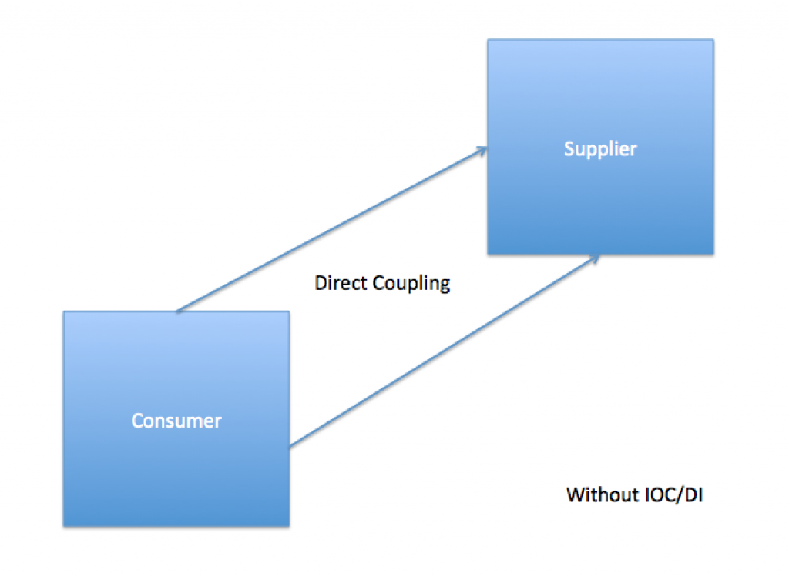
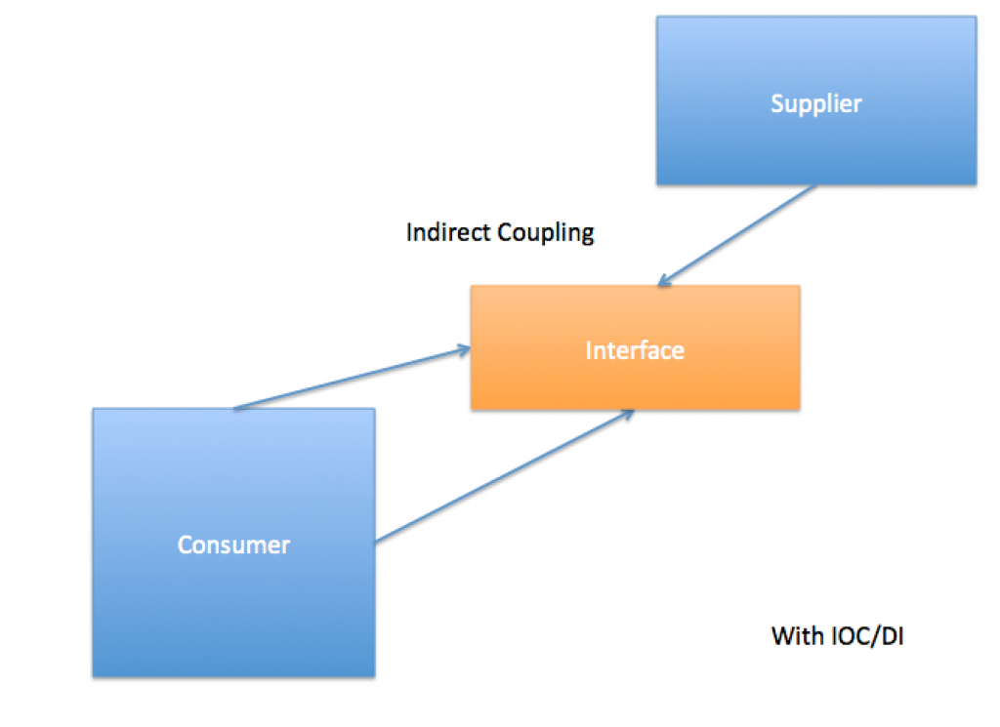

This blog will talk about some hidden benefits of AngularJS Dependency Injection; it's really about Inversion of Control (IoC) in general and it's use in creating non-trivial applications. As a signed-up advocate of the Software Craftsmanship Manifesto I’m always interested in keeping design of software **[decoupled](https://en.wikipedia.org/wiki/Coupling_(computer_programming))** and I talk about this in my [free e-book about TDD](http://www.peteheard.com/tdd-simplified/). This leads to less **rigidity** in design (which over time will make development slow and difficult). Take, for example, the following code…

```javascript
//simple function constructor which defines an order
function Order(){}
Order.prototype.orderId = '';
Order.prototype.orderDate = '';
Order.prototype.shipOrderString = function(){return 'shipping order ' + this.orderId + ' on ' + this.orderId };

//angular controller 1
angular.module('app.controllers').controller('AppleOrderController',
    function() {

        var myOrder = new Order();
        myOrder.orderId = 'apples';
        myOrder.orderDate = new Date();
        var myAlertText = myOrder.shipOrderString();
        alert(myAlertText);

});

//angular controller 2
angular.module('app.controllers').controller('OrangesOrderController',
    function() {

        var myOrder = new Order();
        myOrder.orderId = 'oranges';
        myOrder.orderDate = new Date();
        var myAlertText = myOrder.shipOrderString();
        alert(myAlertText);
});
```

We can see from the above code we have created a class like structure (using a function constructor) which defines an 'Order'. Then we have used this in 2 separate controllers to make 2 different types of Order. One for apples the other for oranges.

## Identifying Software Coupling

At this point we have a design flaw... We have too much coupling between the controller and the Order meaning they are highly connected. A change to one will likely mean a change to the other. Why is this important? Well.. what if we want to change the design of the Order class? If we do, then we have to change all the references to it as well in the OrderControllers; we have exposed the internal design of ‘Order’ to all the consumers. Added to this what if we decide not to use an alert box for showing the order? We now have to change all of that code in the controllers too and use some other alert mechanism. What is worse, is if at runtime we don’t have access to the alert box we could inadvertently crash/hang the application, for example if we are running this in a headless browser (such as PhantomJS). Of course this is a contrived example but hopefully you can see the problems inherent in direct consumer to object coupling. What we want to do is hide the design of our Order from the consumer. Then, when we need to change the order we will not have to introduce risky and/or difficult changes to the consuming code in the controllers.

## Dependency Injection to the Rescue

The answer is to 'invert dependencies’ this is known as [Inversion Of Control](https://en.wikipedia.org/wiki/Inversion_of_control){:target="_blank"} and is a fundamental tenant of good OO design. Now, let us introduce a 3rd object which will be the holder of this inversion. It is called the OrderMaker….

```javascript
var OrderMaker = (function(){

    function make(orderName){

        var myOrder = new Order();
        myOrder.orderId = orerName;
        myOrder.orderDate = new Date();
        var myAlertText = myOrder.shipOrderString();
        alert(myAlertText);

    }

    return {
        make : make
    }
})();
```

We have used a revealing module here in order to make sure that we totally encapsulate an order once and throw it away by exposing a single public function with it's own scope. As you can see now the OrderMaker will expose the minimum amount needed to the calling code (the string id of the order) and will do the heavy lifting of the Order itself. Then we leverage the brilliant dependency injection feature of Angular to simply ‘inject’ a fully loaded OrderMaker into our two controllers (in reality the actual implementation would be different but I am showing what goes on in the internals of angular to give a clear picture of the power of IOC/Dependency injection)….

```javascript
//angular controller 1
angular.module('app.controllers').controller('AppleOrderController',
    function(OrderMaker) {

        OrderMaker.make('apples');

    });

//angular controller 2
angular.module('app.controllers').controller('OrangesOrderController',
    function(OrderMaker) {

        OrderMaker.make('oranges');

});
```

There are three clear benefits to doing this...

1.  The design of the order can be refactored much more easily since we only need to change it in one place (the OrderMaker)
2.  The controllers are much easier to understand since we only have to read one line instead of 6 to know we are making an order
3.  We can easily overwrite the OrderMaker with another implementation which leads us to more flexible design

Quite often we hear about these shiny framework features without knowing why they exist in the first place and Inversion of Control is nothing new. It is deeply intertwined with Object Oriented programming and was identified as a 'thing' long before Angular or even Javascript for that matter was around.

## A Picture Reference to Inversion of Control

In order to visualise Inversion of Control (which Dependency Injection helps us achieve) I sometimes find it handy to refer to the following two diagrams. The first shows a typical scenario with no Inversion of Control {:target="_blank"} We can see how some consuming code calls a supplier directly and has implicit knowledge of it's internal design. If we wanted to reduce this coupling we use Inversion of Control by leveraging Dependency Injection. In essence we wrap the supplier code in an interface and inject that interface into our Angular controllers. The following diagram is the result of having inverted dependencies. [caption id="attachment_276" align="alignnone" width="840"] As the diagram shows an interface is introduced. Notice how the dependency of the supplying code is now pointed at the interface. We say that the code 'implements' that interface. And the consumer code will call that interface not the original code. This is the art of [loose coupling](https://en.wikipedia.org/wiki/Loose_coupling). Many design concepts exist which are a function of pure OO and being aware of them is vital if you want to excel as a designer of non trivial computer applications and become a better Software Architect. Hopefully this blog post has shown you a classic bit of theory by leveraging a modern framework. So... next time you find yourself adding lot's of code that can see the internals of an object, think about inverting dependencies using **Inversion of Control** and **Dependency Injection**.....