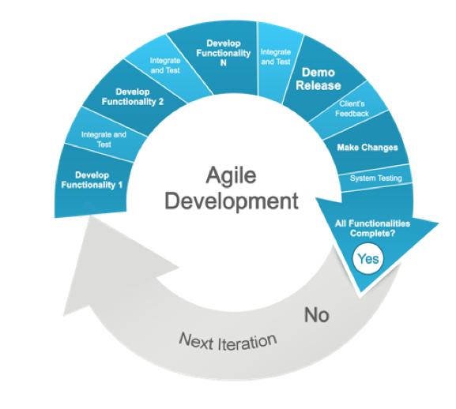

The web application landscape is changing every day as new web apps are being created. Just because a business creates a new app, doesn't always mean that it will be successful and, as you can assume, many are not. Why is this? Doesn't every business have a new idea that no one else has come up with? And shouldn't that new idea for an app become successful? The fact is, many of these web applications are not successful not because of the idea, but because of the methodology used in the [web application development](/services/web-application-development-reading-berkshire/) process. With that being said, we can now assume that a better methodology will turn out a better app. This is where agile methodology comes in.

## What is Agile?

Agile is a term used to describe a set of principles for software development under which requirements and solutions evolve through the collaborative effort of self-organizing cross-functional teams. This leads to more adaptive planning, development and improvement as well as faster delivery and a more flexible response to change.

Applications are usually developed using the waterfall methodology where everything is planned out up-front but those who believe in the principles of agile, want to see more flexibility in the development process. Throughout the agile development cycle, developers are able to assess their app, make changes along the way and reduce the time and effort put into the application to make is successful.

## How do Agile techniques work?

The agile methodology of developing a web application sees the project broken up into short duration iterations. This enables the developer to see a simple, working model of the app after every stage of development giving them an opportunity to make improvements along the way. Additional features that are deemed necessary by market response can be added in the next phase of app development thus improving the quality of the web application and increasing its chances of success. Agile also offers an opportunity for interaction between developers and customers.

## Where does the Agile Methodology work best?

Agile is generally best suited for more explorative projects where there are many unknowns. An agile development project can be pivoted during the development process to completely change the way the web application looks and acts or what features it includes. If these changes are made in the Waterfall methodology, it would lead to wasted time and money.

## Advantages of Agile methodology

There are many advantages to using agile techniques to develop a web application including:

- With agile, a working model of the software is delivered to the market faster and more frequently at the end of each iteration.
- Changes and features can be added to the app at any stage of the development process.
- Agile focuses more on users and interactions than tools or results.
- Agile offers better results and more successful mobile and web applications due to its developer/customer interaction.

## Disadvantages of Agile methodology:

- Agile offers less emphasis on the design and documentation part of the web application development process.
- Customer feedback could cause the agile developer to lose focus if the feedback is not favourable.
- Agile methodology requires experienced developers to become part of a project team leaving new programmers out in the cold.
- Strict Agile approaches such as Scrum can add complexity and for simpler projects may add [unnecessary overhead](https://www.agileconnection.com/article/agile-cheaper-right){:target="_blank"}

Despite its disadvantages, Agile methodology is being used more and more by app developers and many more developers are using some form of agile in their development projects regardless of the original methodology already in use.