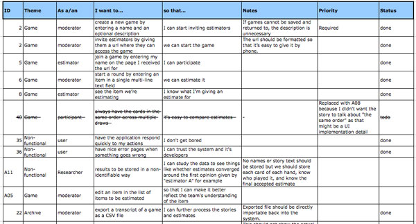
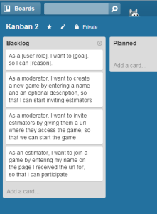
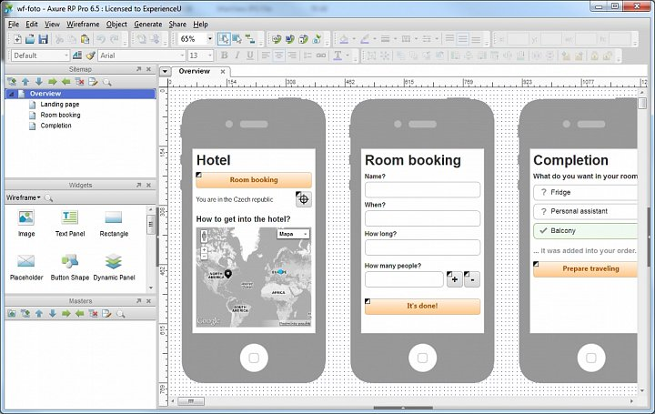
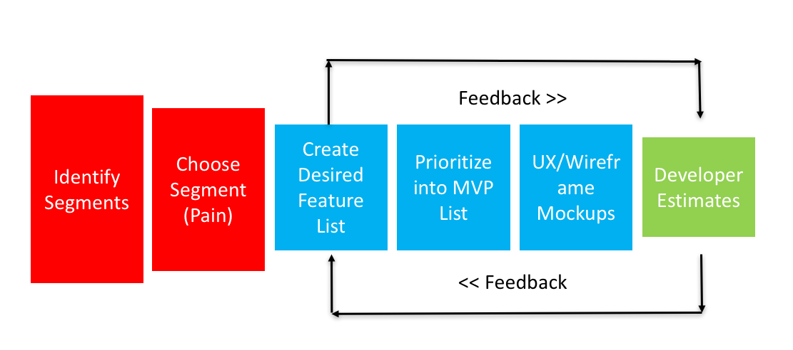

When deciding to build a web application or mobile app solution many companies turn to the idea of an MVP (Minimum Viable Product).

Deciding which are the right features to go into an MVP can be hard. Typically, a business who starts development of a new web or mobile digital product will turn to internal or external users to build a list of 'features' that should go into the product.

This 'want' list will usually expand rapidly. It's expensive to develop web application or mobile app software so we can't put **everything** into it. So how can we work out which features should be in the MVP?

First off - don't loose your head! I have compiled a simple 6 step system which helps you identify what you should put into the first release of your new web application or mobile app!

# 1. Get Clear On Your User Segments and Pain

This part of the process is as much about marketing as it is about building software. Using [customer segmentation](http://www.marketingdonut.co.uk/direct-marketing/your-mailing-list/the-art-of-customer-segmentation){:target="_blank"} techniques identify the categories of customers that you want to target.

The **most** important thing when doing customer segmentation is that you identify the **pain** that each of your customer segments has.

This should be something like...

>*X user is frustrated by Y manual process and it's really stopping them do xyz*

or

>*X user keeps missing a deadline for Y event and it means they can't perform xyz for the business*

Identifying pain (as we will see later) is important because it let's you narrow down your efforts and get very specific.

# 2. Choose A Single Customer Segment

Next, you should be looking to select one single customer segment that you have identified in step 1. The reason you want to select only a single segment is that it is easier to both market to, and build for a fewer number of users.

Your MVP should be focused, and it's hard to focus when you are trying to keep everyone happy. So in order to select the right features your chosen segment should...

##### have a clear and present pain as identified in step 1

Nobody is going to use your web or mobile software unless they need to. So by choosing the customer segment with the biggest pain or problem you are increasing the chances of your initial offering being used.

##### can be early advocates

Another thing that is important at this stage is to choose to build your MVP for users that can be early advocates of your new software. They should be well placed to influence others and share the good news about your brilliant new product!

##### be easily accessible for workshops and feedback

Finally, you should be able to get easy access to your initial segment. You will want to be able to run ideas and designs/mockups of your software past them to get feedback from them as your project progresses.

# 3. Make a List Of Potential Features (Backlog)

You should work with your internal/external stakeholders (people with ideas and good knowledge surrounding your new product idea) to gather feature ideas to go into the MVP.

You should also interview your customer segments and establish what features they would like to see first. You have done your research and identified their pain so now it's time to listen to how they might like to see it solved. They should be able to help you come up with a list of things they would like to see or perhaps will help you discount ideas other stakeholders might have come up with.

In the Agile world we call this list of potential features the 'backlog'. This backlog contains the entire universe of requested features that will (inevitably) be raised.

The list of features or backlog doesn't need to be complex. In fact simply keeping this list in a spreadsheet can work...

or an online tool like [Trello](https://trello.com/){:target="_blank"} should be fine at this stage.

# 4. Prioritise The Backlog Into An 'MVP List'

This list should detail a list of features you actually intend to build. So you should begin to split your entire 'backlog' into two lists.

This list should be fairly prioritised by this point (because of your segmentation) but it's worth noting that you can further prioritise as you go along.

The tip here is to begin to remove features that don't align to your customer segment and are not relevant.

# 5. Consolidate The Backlog Using User Experience (UX) Design

At this point it's worth beginning to see if any of the items in your MVP list can be simplified down further using some magic UX design.

This can be done with paper and pencil to create simple mockups or if you want it can be done with Photoshop but the idea is to take everything you have learned so far and see can you create simplified feature ideas that will solve your customers' pain points. You are looking to explore both simpler and cost effective ways to solve their problems.

# 6. Begin Collecting Developer Estimates

At this point you should begin to include your developers in the discussion. Your developers should be able to work with you on your MVP list designs that you have been building from step 5. They will need to help you decide the right technology choice and also advice you on how complex what you want to build is.

At this step what they tell you will help you to decide if you can cut or re-prioritise even more items from your MVP list.

They will also help you get clarity on what technology choices you will be making (web/mobile and backend etc). For some tips on choosing the best mobile app development framework see my [post](how-to-choose-the-best-mobile-app-development-framework/){:target="_blank"}.

# Finally - Feedback

At this point it's important that the above undertaken in a way that is 'repeatable'. In the software world we call this Agile but really Agile just says to do something simple/lightweight and then keep repeating it.

Repeat steps 4 - 6 over a several week/day cycle until you come up with a final list of features that should go into your MVP.

The idea is that you can keep learning on each step and repeating it over and over again. Feedback helps you reduce risk and cost because you incrementally learn what you need to do.

# Conclusion

In this mini-guide about choosing the right features to go into your new web application or mobile app product we have seen that there are a few critical elements to help you ensure success.

1. You need to identify potential customers and get clear on what their pain is (so you can build a product that solves this problem)
2. You then need to build a list of total features (a backlog) and cut this down into a list of MVP features
3. You then need to begin to design how the features using UX Mockups and Wireframes with the development team. The development team will push back on things and help you come up with simpler ways to get to your goal of an MVP

The most important part of this process (apart from identifying pain) is to keep repeating this process as your project matures.

I hope you enjoyed this article!

