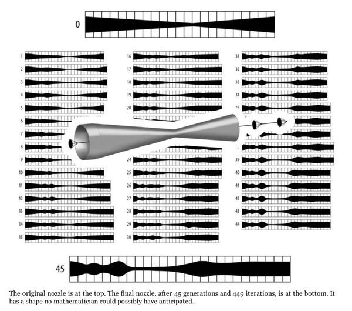
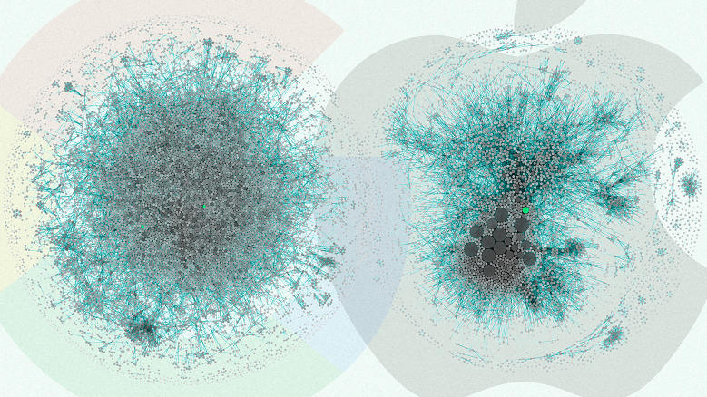
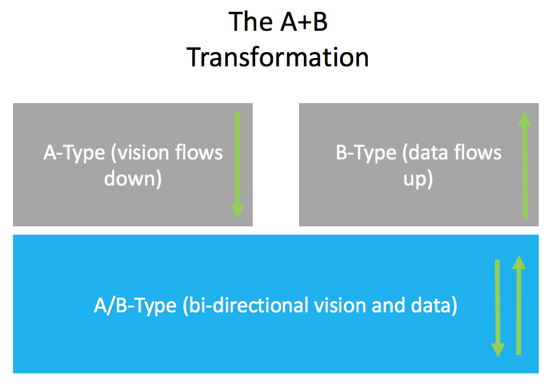

When companies undergo digital transformation, choosing which technology to deploy can be difficult, and changing a business operating model is risky. 

Companies are beginning to use data more and more to help to decide where to guide their efforts, alongside more traditional 'vision' led approaches. Making decisions is perhaps the most important part of running a successful business. Make the right one; you create profit; make the wrong one; you lose money. 

We will compare two different ways of making decisions and look at the types of business who make them; the A-type and the B-type.

### The A-Type

The A-Type is usually used in an expansive business that has many customer interactions happening across multiple parts of the business. They are already making a lot of transactions; this means that they have access to a lot of data. 

An example of an A-Type company that makes decisions using data is [Google](http://www.smartdatacollective.com/bernardmarr/85871/analytics-google-great-example-data-driven-decision-making). The article speaks about how Google have used data to help with the HR process. 

In the A-Type; data can be used to help to drive their strategy. This is their **competitive advantage**. For A-Types a **systematic approach** to refining business decisions using data is often preferred. For example in the book; [KPI Checklist](https://www.amazon.co.uk/KPI-Checklists-Bernie-Smith-ebook/dp/B00GKMOIKK/ref=sr_1_1?ie=UTF8&qid=1489392095&sr=8-1&keywords=bernie+smith) the author; Bernie Smith, talks about a 7 step system that can be used to set up key performance metrics and then use them to slowly communicate and drive decisions. Through a process like this; firstly objectives are identified which can be measured. Then they are slowly tracked on a dashboard which gives a very transparent way of tracking actual performance against desired performance. At any stage in the process business decisions can be made when there is any deviation from the desired path.

What's great about this approach is that it removes a lot of risk from the equation of business strategy, since you can prove your hypothesis with data.

#### The A-Type thrives on

- smaller progressive steps 
- optimising decisions based on regression analysis of data
- removing bias using statistics
- low risk 'provable' ventures

The key consideration here is that the A-Type uses a 'bottom-up' approach to business decision making.

### The B-Type

The B-Type typically drives most of their decisions through a more **innovative approach**. They are often involved in more creative styles of product development which bridge gaps in emerging fields. For this reason; often the data is not available, or if it was, it would not be useful since they are taking much bigger leaps in deciding which decisions to make.

One such example is Apple. Steve Jobs was well known as an advocate of keeping things simple for his customers. This meant using logic to decide what to build and what not to. In the book [Insanely Simple](https://www.amazon.co.uk/dp/B007N72M9K/ref=dp-kindle-redirect?_encoding=UTF8&btkr=1) Ken Segal, talks about how Steve Jobs would regularly reject the notion of decisions made using data which could help them drive business strategy. Instead, he opted to keep things simple for their customers as the overriding principle. 

His fear was that some decisions based on data could end up creating complexity. One such example in the book was a near fragmentation of the iPhone models which were somehow 'proven' to be a good idea but he decided to not let happen.

The problem with B-Types is that there can be a lot more risk since you can't prove assumptions; but in [Black Box Thinking](https://www.amazon.co.uk/dp/B00PW634YQ/ref=dp-kindle-redirect?_encoding=UTF8&btkr=1) Matthew Syed talks about some engineers at Unilever that were trying to create a new type of nozzle. 

They had a particular factory component which kept failing and costing them a lot of money (in lost production). They had hired a team of physical modelling experts to use equations to create the 'perfect nozzle'. No matter how many times they tried to create perfection using math they just couldn't seem to get it to work. So they decided to take another approach.

They started again and created two nozzles with different designs. Then they got rid of the one that worked less well. They kept repeating this process (which mimics natural selection); over and over. Within 449 iterations they had finally found a nozzle which didn't clog.

 

What is interesting about this was that data was actually impeding their ability to come up with an optimum solution. No amount of data would work; what they needed was a more natural process. A process that was based on 'agility' and speed of movement. It allowed more rapid implementation and a 'fail fast' mentality to drive product development.

#### The B-Type thrives on

- rapid implementation of ideas
- being first to market with totally new products
- tapping into a rich system of past experience
- failing fast

The key consideration for B-Types is that their approach to business strategy is more centralised and 'top-down'.

### Which is Best?

The point of Digital Transformation is to ultimately improve the profit a business makes using digital technology.

Regardless of what type of transformation type you are; (A or B type), it doesn't really matter as long as what you are doing is helping you to make technology and transformation decisions that expose new [value streams](https://www.isixsigma.com/dictionary/value-stream-mapping/){:target="_blank"} in your organisation. 

In business; we often lose the ability to act decisively because we don't have clarity, its the loss of clarity which really holds us back.

We can actually see the A-Type and B-Type hypothesis I am making in this [article](https://www.fastcodesign.com/3068474/the-real-difference-between-google-and-apple) which shows a visual representation; a node-based comparison of innovation between Google and Apple. 

The diagram shows proximity of patents that each company have. Apple have fewer but they are controlled through a centralised strategy. This is because Apple (a B-Type) spends a larger proportion of it's time working on larger innovative products than Google (an A-Type). They have a more vested interest in each patent because each of their strategy is based around larger moves. Whereas Google a 'data driven' decision company  makes a larger amount of smaller innovations (patents). 

The point here is that both Google and Apple are successful companies in their own right. You can't just say that one is better than the other but you **can** get clear on identifying these two approaches. The real question is; 'can we combine the A-Type and B-Type?'

#### Mixing A and B

Most people I speak to in the industry believe that Digital Transformation is as much about culture as it is about technology. Empowering people is the first level of transforming a business and in order to empower you have to have clarity. What I am really speaking about here is clarity between leadership teams and employees. It makes sense that leaders need to effectively lead; but in order to promote a good culture they should listen to their workforce. Competent leaders understand the important of listening.

What's interesting about modern transformation programmes is that by combining both the 'shop floor' proof that comes with using data, along with the top down 'vision' set by leadership, we can actually be in a very powerful position. By effectively managing the transition of data and insight 'up' towards management, and having very clear vision that guides general direction 'down' towards operational units; we can actually arrive at a position of strength on both fronts. 

What I propose is that whilst A-Type thinking is powerful on it's own. And B-Type thinking is also powerful. What if we began to use the two in harmony. By combining both factual insight from hard data alongside the human ability to create innovation through insight we actually begin to see a new strategy model emerging. We can call this 'The A+B type'!

The A+B type can be a paradigm that businesses use to get clear about the channel of communication that needs to be set up if they want to transform their business with the highest success rate. They can be clear on when exactly they are looking to gain A-Type information and when they want to execute B-Type strategy. 

By combining the two they will begin to leverage both what the company 'has' and what it 'does'.

### Conclusion 

Business is complex. We have a collection of people in different departments all with their own agendas, working to different timescales and with different resources. 

It makes sense for businesses to be clear on boundaries that they reach their objectives in. In today's modern business we see that data plays a huge part in strategy and execution; but we also see the reverse of that with companies using more innovative approaches coupled with fail fast mentalities to make progress.

We can see that in the large enterprise **information** is an asset, but in the smaller enterprise **agility** is an asset. In reality many organisations have a little of each in both. So it makes sense for technology leaders to identify what type of business or sub-business they reside in so they can follow a clear strategy, and as we have seen a little bit of both might help to power an extra dynamic digital transformation :-)