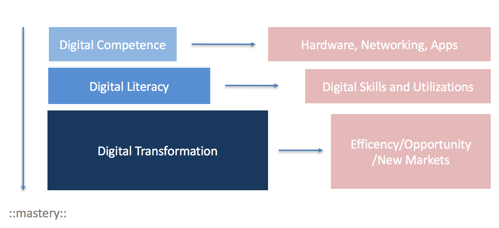
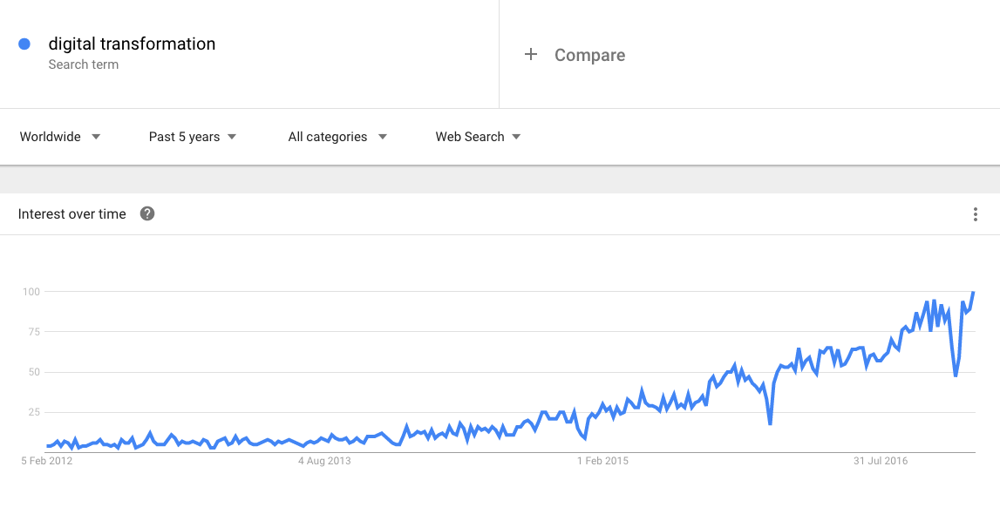
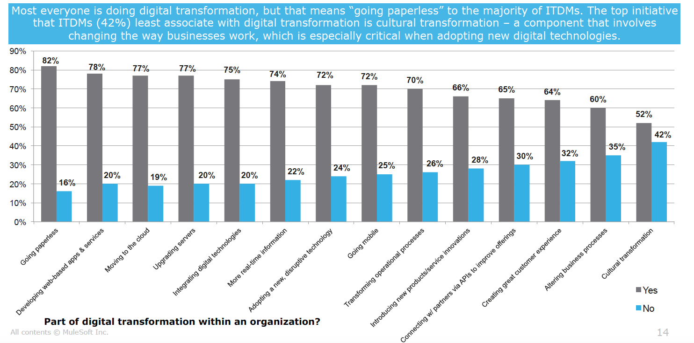
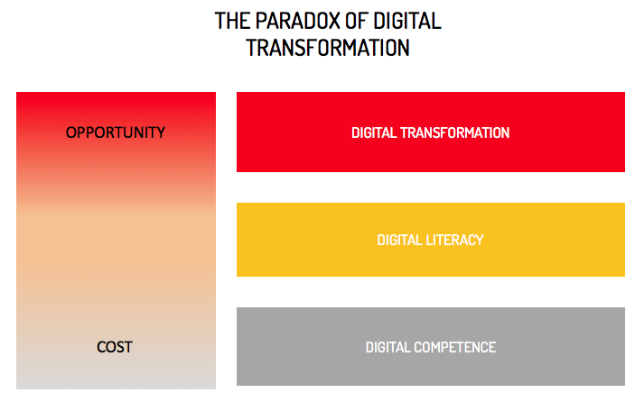

UPDATE : I'm doing a talk on this in my group in Reading [https://www.meetup.com/Digital-Transformation-In-Reading/events/237925093/](https://www.meetup.com/Digital-Transformation-In-Reading/events/237925093/){: target="_blank"}

Digital Transformation is one of the biggest change management topics to hit the enterprise in recent years but it seems that there is wide-spread confusion about what it really is.

In this article we will discuss the origins of the movement and see evidence which highlights that organisations are not fully clear on what it is. This means they may be missing out on the opportunities it presents.

## What we will cover:

- What is Digital Transformation?
- Origins
- What Businesses 'Think' Digital Transformation is
- What Digital Transformation is Really About
- The Paradox of Cost and Opportunity
- Conclusion

## What is Digital Transformation?

Digital Transformation is a phrase that describes how organisations are undergoing change which is supported and augmented by digital technologies.

What it entails is how a business will align many parts of its processes and digital systems to be able to support its overall strategy/vision.

The idea underpinning business change in general is that in order for a business to stay competitive, it must keep changing how it works so that it can become more efficient. If it does not change continually, then it risks becoming less efficient. This means it may not be able to compete in a market that is always becoming more competitive overall.

Digital Transformation builds on the basic idea of business change by taking into consideration digital infrastructure which can expose new ways of working.  This will increase a company's basic ability to become more efficient. The ultimate objective of Digital Transformation from a business perspective is to become more profitable.

There are 3 basic steps involved in a full scale Digital Transformation.  These are:

1. **Digital Competence** : At its foundation, a company will use digital systems. This will include well understood and mature technologies such as computers, networking, servers, applications and infrastructure.
2. **Digital Literacy** : After basic infrastructure and competence requirements are met, an organisation can begin to become skilled in the use of their digital systems. They already have skills and expertise that relate to the usage of these systems, often at an advanced level. This could include use of word processors, reporting tools, email and even use of programming languages to improve internal systems.
3. **Digital Transformation** : This includes the wholesale adoption and leverage of the two previous layers to create higher levels of operational efficiency and expose new opportunities for both revenue growth and protection.

> The three layers of a full scale Digital Transformation

These three layers allow us to understand a modern company in terms of its technological adoption from the commodity level (hardware, software etc.) right up to the transformation level (which deals with people and processes). It's important to understand these different layers because, as we will see, having confusion will actually inhibit meaningful change which can prevent management from spotting opportunities.

## Origins

According to [Wikipedia](https://en.wikipedia.org/wiki/Digital_transformation){:target="\_blank"} the earliest formal definition came after a three year study conducted by the MIT Centre for Digital Business and Capgemini Consulting which concluded: 'One-third of companies globally have an effective Digital Transformation program in place.'

Google trends, which shows search volume data, reveals that this word has been tracked since 2012 (before then volume levels were too low for Google to track it).

> Google trend for Digital Transformation

It's important to realise that Digital Transformation is not new; it is just that the expression has been used a lot recently which has attracted more attention. The technological transition from traditional analogue business to digital has been happening for at least [20 years](https://thenextweb.com/insider/2011/08/06/20-years-ago-today-the-world-wide-web-opened-to-the-public/){:target="_blank"} since the introduction of the web.

## What Businesses 'Think' Digital Transformation is

As we already discussed, transformation is important to businesses because it enables change and flexibility. This ability to change can help the business to maintain its competitive advantage.

Research obtained by [Forbes](http://www.forbes.com/sites/brucerogers/2016/01/07/why-84-of-companies-fail-at-digital-transformation/#68d258e3588f){:target="_blank"} suggests that 84% of businesses are failing at Digital Transformation. According to the research, only 25% of companies actually understand what Digital Transformation is.

So what is creating this confusion that we are seeing? Mulesoft, the API integration company, did some interesting research for their [2016 Connectivity Benchmark Study](https://www.mulesoft.com/lp/reports/2016-connectivity-benchmark){: target="_blank"} which came up with the following statistics about what companies think Digital Transformation is:

| Type | Result |
| --- | --- |
| Going paperless | 82% |
| Developing web-based apps and services | 82% |
| Moving to the cloud | 77% |
| Upgrading servers | 77% |
| Integrating digital technologies | 75% |

What is interesting about this list is that they ALL focus on the bottom two layers of the Digital Transformation pyramid that we looked at in the start of this article, which actually pertain to competency and literacy based transitions. We can see, rather surprisingly, that things relating to process are all the way down at the bottom:

> Google trend for Digital Transformation

In other words, companies are not identifying Digital Transformation as a wholesale process that includes the competency, literacy AND transformative opportunities that are exposed by mastery of digital infrastructure and systems. They are actually regarding Digital Transformation as an arbitrary 'replace and upgrade' exercise rather than embracing its ENTIRE business change manifesto.

This poor understanding could well be why the rate of failure is so high.

## What Digital Transformation is Really About

As we have seen, Digital Transformation is something that happens not only at the technological level but at the level appertaining to people and processes. It's important to realise that it is about deeper changes which happen at a cultural level.

Changing a company's culture is based on principles and whilst these are often harder to embed into a company; ultimately they are needed in order for organisational change to take place.

Digital Transformation can actually be seen as a self-referencing process that includes both the processes of upgrading technology and that by which technology becomes upgraded in the first place. It includes the 'why' and the 'how'; a process of processes. We can think of it as a 'meta-process'.

True Digital Transformation is not just about low level digital processes change, it is about a wholesale cultural change that is built on top of lower level digital infrastructure.

## The Paradox of Cost and Opportunity

We have looked at the current confusion regarding Digital Transformation, but what we also need to consider is an important paradox that comes as a direct consequence of understanding the three layers (competency, literacy and transformation).

At the lower level of our pyramid we find topics such as upgrading hardware, networking and application installation. These are usually base functions of IT and translate very directly into cost based decisions that an organisation can make.

However, at the top of the pyramid we move away from cost based initiatives into process, new markets and thus opportunity. Both of them are about increasing profit but it is worth noting the parallel between the two.

> Digital Transformation starts with cost and ends with opportunity

The number one facet of Digital Transformation that companies should be aware of is to make a conscious choice between these two by-products of digitisation. On the one hand, technology allows the immediate commoditisation of information which can in turn be leveraged to reduce operating cost. On the other hand, increased technology allows greater sophistication which can add value. These two by products are sort of opposites.

The advantage of reducing cost is that markets can be consolidated which frees an organisation up to follow other objectives. The problem with cost-reduction strategies is that in themselves, they are expensive to implement. The time a CxO level executive spends trying to reduce cost is time that could be spent on the other by-product; a possible new opportunity. Cost is a race to the bottom but new opportunity can be a better long-term strategy.

## Conclusion

In this article we have seen research that suggests the majority of businesses are treating Digital Transformation as a lightweight 'find and replace' initiative rather than embracing the deeper transformative aspects, including realisation of new opportunities.

Ultimately this narrow understanding leads us to an interesting duality that although cost savings can be achieved, this may end up in a 'box shifting' type of set-up which may inhibit the long term ability of an organisation to innovate and create better value-added offerings.

Organisations should make a conscious decision regarding this. On the one hand, they view IT and technology as a commodity with which to cut cost and purchase the cheapest in terms of partnerships and services, or they see the opportunity inherent in technological advances and use this to power a full-on Digital Transformation.

Digital Transformation is not just about tactical improvements at the small scale; it's about fundamentally enabling the business to improve its overall capability to create better value for its customers, partners and for society as a whole!

I hope you enjoyed this article. 

