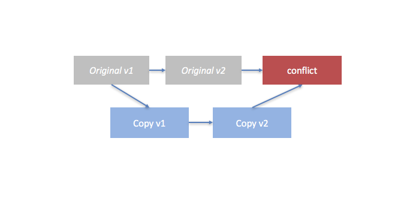
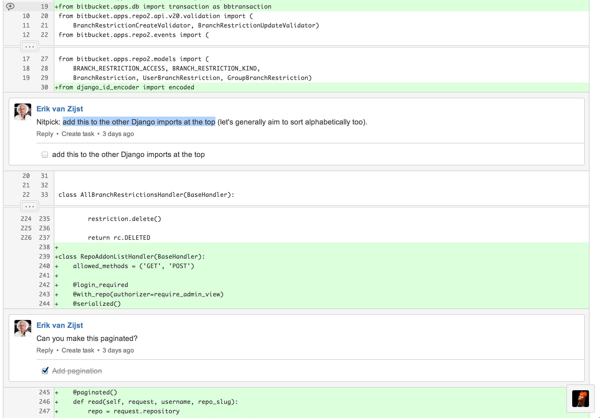

Feature branching is a modern approach to software development that all the top teams, gurus and consultancies use so it must be the right way to develop software right? Wrong. 

Feature branching is a hugely wasteful technique which directly violates Lean principles and also contravenes Agile. It's a practice that has been shoe-horned into the enterprise and it costs companies dearly.

## What is 'Feature Branching'

Feature branching is a technique that software teams use to create multiple copies of the same software. The purpose is so that they can add features to a copy of the software without affecting the original. 

When the feature is complete the idea is that they will 'merge' their changes back with the original copy. As we will discuss in this article the problems start when the original copy is modified 'after' the feature branch was created because now you have two copies of the same thing and they are conflicted. 

This conflict underpins the argument I make in this article. To begin our story we start with the origins of feature branching.

## Where 'Feature Branching' Came From

Feature branching first took hold in our industry with the proliferation of distributed source control; notably [Git](https://git-scm.com/){:target="_blank"}. It exploded onto the scene just about the same time open source became big with distributed developers.

Because it allowed distributed development it could be used between independent developers. The ability to commit to the same code base enabled the growth of open source projects and also fuelled the increase in use of the worlds most popular open source public repository; [Github](https://github.com/){:target="_blank"}.

Ironically, because of Gits' ability to empower distributed humans to collaborate in a decentralised manner (which has been a huge benefit to us all) it has now been jumped on by the enterprise software community and is being used as a way to perform "change management" on code.

## The Perceived Benefit: The Pull Request

Git can be used with tools such as Bitbucket and introduces the concept of the 'pull request'. This pull request is an official area where changes are dissected before the are 'allowed' back into the mainline; it enables a debate on code that a developer has produced and is leveraged to allow collaboration. The pull request is argued to offer 2 benefits

- It allows a **code review** to occur
- It allows **bugs** to be caught before they are integrated

It's assumed that discussing code before integration has a benefit; that it catches bugs and improves software quality. It's assumed that the process has benefit because it manages control. The problem, is that this 'benefit' comes with really extreme **costs**.

## Why Feature Branching Isn't Lean or Agile 

Wikipedia states that [Lean Software Development](https://en.wikipedia.org/wiki/Lean_software_development){:target="_blank"} should eliminate waste; it states; extra processes, task switching, waiting and management activities as all areas that classify as waste during the development cycle.

Feature branching violates all of these principles because firstly it causes context switching between the branch you are working on and the mainline. When a bug comes in you have to manage that bug in another branch. If someone needs help you have to manage yet even more branches. Secondly, it creates abundant waste because it delays the integration of code. This integration inevitably leads to conflict issues. Conflicts are quite **literally** the definition of waste since you have to delete either mainline or branch code to proceed.

In Agile we are told to use continuous integration (CI). Using feature branches is the polar opposite to continuous integration since it promotes working in a different branch. Feature branching diametrically opposes continuous integration. You might as well rip up the CI book if you are using feature branching. 

> "Feature Branching diametrically opposes continuous integration" 

# History Repeats Itself

The real reason why feature branching is used so much isn't because it's better, it isn't because it really solves a problem that needed to be solved it's because the IT industry is fuelled by trends. We quite often forget to push back on things that add too much complexity for too little benefit.

I'm not entirely sure why many developers love to wield a sense of mastery over Git and the complexities of feature branching. I sometimes feel developers are too clever and scupper their own productivity by learning something really complex. I guess when someone cool like Linus Torvolds (inventor of Linux) creates something like Git it's automatically assigned God status and is rolled out in great jubilee and fanfare too which doesn't help. We gravitate to it like a magnet and instead of judiciously using 'parts' of it we use 'all' of it!

I dine at the table of common sense. I assume everything is a fad and stick to what I know because too much of IT is overly complex. If feature branching now has a hedgemony because it's shiney. And we validate that hedgemony based on the idea that it adds benefit; no matter the cost; my next logical question is; can we cut feature branching away but still hold onto the benefits of catching bugs and maintaining code quality? Yes we can!

## A Recovering Branchaholic

It's actually better to catch bugs after integrating code since the best way to assert bugs in software is to perform testing. By merging continuously all day we increase the amount of testing that happens on the final artifact. And this increases the chances that we find bugs.

The reason we review code is to protect our employer/client from bad code. But it might make more sense to use pair programming and good education to ensure better software development. There are numerous approaches to this for example I created an [e-book](https://www.logicroom.co/guides/tdd-simplified-in-5-steps/){:target="_blank"} called TDD Simplified which offers a simple model with which to apply Test Driven Development (TDD). For architecuture; teams can use a single paradigm to create designs for example the [hexagonal architecure](http://alistair.cockburn.us/Hexagonal+architecture){:target=_blank"} is one such principle I have used on multiple projects.

## Conclusion

Feature branching; like everything else is a solution to 'a problem'. Like every solution it has specific use cases (like open source). But in the Lean enterprise we can see that by applying logic we arrive at a conclusion that tells us; it's wasteful. Instead, we should continuously integrate our code all day and write fast but robust automated testing to catch bugs. We can use better education for team members to ensure higher quality code.

We can implement pair programming and a unified model of systems architecture such as hexagonal architecture to bring clarity and consistency to our code. But above all absolutely above all, we can keep things simple by avoiding feature branches!

