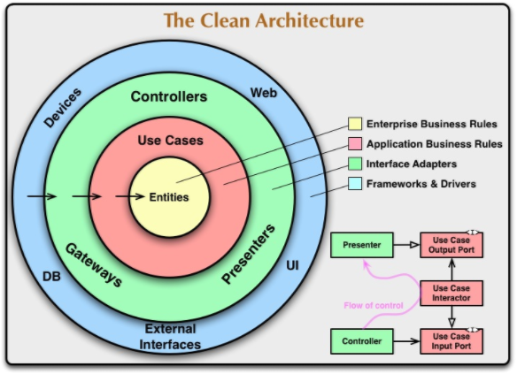

In this article we will discuss a plan for you to interview senior JavaScript developers and architects; including interview questions.

JavaScript is rapidly growing in popularity as a cross-platform multi-device programming language. It is powering the next generation of enterprise applications. [Githut](http://githut.info/) which parses data from Github shows JavaScript to be the most popular programming language. You can read more about it [here](/JavaScript-is-the-future-of-application-development/){:target="_blank"}

> source : [http://githut.info/](http://githut.info/)

JavaScript is one of the more tricky languages. Finding developers who can build complex business applications which need to scale can be a challenge. There are 4 fundamental points which should be taken into consideration which make it a little bit different to the other popular languages such as (Ruby, C#, Java etc). These are :

- it'a single threadedness
- it's functional aspect
- it's confusing language specification 
- it's diverse but also fragmented tooling

This article isn't just about hiring software developers. It's about hiring software designers! Engineers who can deal with highly abstract software design principles that will allow them to create robust systems for large scale projects. Let's proceed ...

## What We Will Cover :

- The Traits of a Brilliant JavaScript Developer or Architect
- Interview Part 1 : Their Exercise
- Interview Part 2 : The Technical Test
- Interview Part 3 : Finding Out How They Think
- Interview Part 4 : Get Them To Review YOUR Code
- Conclusion

## The Traits of a Brilliant Developer or Architect

The first thing we need to establish is what we are looking for in our JavaScript developer. At the start of this article I said we were looking for JavaScript designers. What I meant by this was that we want to hire people who can design large scale non trivial applications as opposed to simple applications. In order to do this these developers should have a few traits:  

### Genuinely Care About Code Quality

You can't scale large JavaScript applications without high technical quality. Unless your engineers are interested and  demand high code quality the software project will build up technical debt. Technical debt will [sink your project](/the-cost-of-poor-quality-code-on-digital-transformation/){:target="_blank"} eventually forcing an expensive re-write, so hire developers that care about building well-engineered code.

### Fascinated by Object Oriented Design

JavaScript is primarily an Object Oriented (OO) language. And for the most part large scale systems will be built from interacting objects that model something in the real world. A skilled JavaScript engineer should want to keep refining these objects to be able to build scalable systems. They should have deep interest in things like loose coupling, encapsulation, data-hiding, SOLID principles, DRY etc etc....

> Uncle bobs 'clean architecture' is a great example of an advanced OO design princple : [https://8thlight.com/blog/uncle-bob/2012/08/13/the-clean-architecture.html](https://8thlight.com/blog/uncle-bob/2012/08/13/the-clean-architecture.html)

### Love Automating Stuff

A good trait to find is; developers hate doing mundane and repetitive tasks. There is a good chance they will automate them. Great software engineers work on tooling and meta programming as much as they do the actual programming. Some call this dev-ops but I call it common-sense! It's good to hire developers with common-sense.

> "Give me six hours to chop down a tree and I will spend the first four sharpening the axe." - Abraham Lincoln

### Test First Mindset

JavaScript is weakly typed meaning that if you don't have tests to tell what is broken when you 'try' and change it, you invariably never will. In the end technical debt will kill your project if you can't clear it. So you need to ensure that your JavaScript engineers genuinely have both the **knowledge** and **discipline** to write loosely coupled code which is developed with automated testing.

### Ability to Explain Things

This is my favourite. Working with developers who have great command of the english language and can use it expertly to describe complex problems is going to help your project succeed. There is a correlation between how well someone can explain something and how well they understand it.

Check out this little story from Richard Feynman, by two of his colleagues at Caltech in 1989 (after his death):

>"Feynman was once asked by a Caltech faculty member to explain why spin 1/2 particles obey Fermi-Dirac statistics. He gauged his audience perfectly and said, "I’ll prepare a freshman lecture on it." But a few days later he returned and said, "You know, I couldn’t do it. I couldn’t reduce it to the freshman level. That means we really don’t understand it."
>
>source : [https://en.wikiquote.org/wiki/Talk:Richard_Feynman](https://en.wikiquote.org/wiki/Talk:Richard_Feynman)

## Interviewing Part 1 : Their Exercise

Ok, dependant on how much the candidate wants the job you may be able to get them to spend an hour or two on an exercise before they come in.

One such way I know to make someone interested in something is to get them to speak about themselves. What I recommend is to get them to organise a very brief lightening talk/presentation on a JavaScript 'thing' they are proud of. Here are some ideas to get you started.

**Idea 1** : Get them to present techniques they used to decouple various parts of their application in the past such as data transfer (JSON) from the user interface

**Idea 2** : Ask them to show the architectural patterns they have used to handle the update and refresh of user interface components when application models are updated

**Idea 3** : Ask them to present how their automated testing works and how it guards against JavaScripts' dynamic nature, and what sort of patterns they were using to make sure their tests were maintainable and of a high standard

You aren't necessarily looking for right/wrong here. You are looking for engineers that have spent time tackling the sorts of problems that plague JavaScript (poor design, poor test coverage, coupling, confusing dependencies etc). You will be able to tell a lot from the level of presentation they give to you as to what sort of JavaScript development they have been doing. You will see if they have been working on simple 'script based' sites compared to large apps with complex domain models and challenges.

## Interview Part 2 : The Technical Test

Technical testing is fraught with problems so we need to look first at how NOT to do it. The purpose of a test at interview stage is for two reasons :

- to find out if the candidates skills are in line with what was included on their CV
- to evaluate who has the best technical talent of all applicants

Hiring teams often buy or design a technical test which they feel fulfills those objectives and then they place a time limit on it such as 1 or 2 hours. This is a completely arbitrary and biased approach to testing someones ability and has actually been found to be the wrong way according to research:

> In 1998, Frank Schmidt and John Hunter published a meta-analysis of 85 years of research on how well assessments predict performance. What they found was that the best predictor of how someone will perform in a job is a 'work sample' test. This entails giving candidates a sample piece of work, similar to that which they would do in the job, and assessing their performance at it.

> source [see the results here](http://mavweb.mnsu.edu/howard/Schmidt%20and%20Hunter%201998%20Validity%20and%20Utility%20Psychological%20Bulletin.pdf)

What I recommend is that new developers are tested using a pair programming exercise. They can work with one or more of the current developers on the team. This should be an exercise to accurately gauge how they work and whether they can contribute working software.

You can either design a test which covers the key areas (which we covered in our 'traits' section), or if you are really adventurous why not work on a real user story with them?

##### Avoid algorithms

Avoid algorithm based tests unless this is genuinely a pre-requisite for the job. Companies love giving them to candidates but in most cases the tests prove nothing about Object Oriented business software. They are a separate skill in their own right so treat them as such.

##### Ditch the time limits

Don't set time limits on tests. Not only does this make the candidate rush (leading to increases in mistakes) it will also force you to evaluate them in the incorrect order. You should be looking to evaluate their quality of their work before how fast they deliver, since delivering rubbish code is worse than delivering quality 'late'; is it not?

If you are opting for the pair programming test just tell them you expect not to finish it. If you give them a test to do in their own time then let them have as long as they want.

##### Allow internet connection

In the real world all developers have access to the net. Cutting of the internet is forcing them to recall from memory which will impede their ability to write software as effectively. If this happens you are testing their memory not their skill. 

If you leave them with a solo test they should have access to the internet. This should place the burdon back on you to create a test that is sufficiently complex enough that it can't just be 'looked up' and thus you will create a better test too! (Not making this easy for you am I?)

Remember, you are looking to test their 'actual' ability to write software. Not their ability to complete tests or carry out instructions. So structure your tests against real world objectives as opposed to artificially constructed ones.

## Interview Part 3 : Asking them questions

A [study](http://blogg.hrsverige.nu/wp-content/uploads/2010/04/Stubborn1.pdf){:target="_blank"} in 2008 by sociologist Lauren Rivera found that when interviewing people the sample set of interviewers (made up up by bankers and lawyers) typically (and unconsciously) tended to hire people like themselves. 

This worrying trait is unfavourable to a hiring process for an organisation because it limits what I like to think of as "cognitive diversity". Cognitive diversity is important because it means you have lot's of different types of thinkers, these 'thinkers' when put together in a team; will be more critical of each others work.

Matthew Syed covers the topic of teams being critical of each other in his book [Black Box Thinking](https://www.amazon.co.uk/Black-Box-Thinking-Marginal-Performance/dp/1473613809/ref=sr_1_1?ie=UTF8&qid=1484484775&sr=8-1&keywords=black+box+thinking){:target="_blank"}. 

In it, he refers to an experiment conducted by Charlan Nemeth, a psychologist at the University of California, Berkeley, and her colleagues. She took 265 female undergraduates and randomly divided them into five-person teams where she measured the effect of having them work in both critical ways and non-critical ways together. The results were startling. The groups with the 'dissent and criticise' guidelines generated 25 per cent more ideas than those who were brainstorming (or who had no instructions)!

#### Removing your bias

In order to remove your bias when asking questions you should do the following three things :

1. Make sure that all questions you ask of candidates are the same
2. Ask them in the same order
3. When a candidate answers; you mark on a piece of paper how well you feel they answered the question, and how correct you thought they were on a scale of 1-10.

For each candidate you simply add up their scores at the end. The important thing is to have an interview that is structured and scoring like this will help. This allows you to remove bias from the 'questioning' part of your interview and will allow better people to come through your interview process.

#### Create balance

In my own personal experience the icing on the cake with finding people to work with is about you making a decision made on your gut feeling of 'team balance'. You have to weigh every hire up against the general flavour of the entire team too. The key here is diversity. Hire some introverts and some extroverts. 

#### Specific JavaScript interview questions

Here are some ideas for JavaScript questions you can ask in an interview. They are purposely left open ended. They are challenging questions and are designed to get the interviewee to think and discuss their approach to, and their understanding of building complex JavaScript applications.

- How do you implement dependency injection in JavaScript? 
- How can you decouple a JavaScript application?
- What are the bad or difficult aspects of JavaScript?
- How do you build scalable JavaScript? 
- Why have promises and observables become so popular?
- What was the biggest architectural problem you faced in JavaScript and how did you solve it?
- What problem do observables solve? (e.g. decoupling, asynchronous updates)
- Where do you think JavaScript is going in the future with regards to language design?
- What is the most important thing to you with regards to developing software?
- What is all the fuss about Redux/Flux?
- How do you go about finding the right tools and frameworks to use in JavaScripts endless sea of choices?

## Interview Part 4 : Get Them To Review YOUR Code

Ok, now my favourite part of an interview. Be warned; this is for mature interviewers only. Asking someone else for feedback on your own teams work especially when you are interviewing them totally flies in the face of convention. In the typical setting the company hiring is the one who decides what is 'right'. I appreciate opening up your code base so a developer can critique 'you' instead of you judging 'them' is probably a million miles away from the mindset most hiring teams are using. 

However, there is a very good reason you should break the mould here;

1. You may actually learn something from them
2. You will see if they are going to bring something you haven't already got to the table
3. They will get to see how well managed your code is 

Ask them to make a list of improvements they would suggest to make the code more readable and maintainable. Ask them if there is anything they can spot in the code that could be improved. For example:

- Could the code be made more testable
- What would be the best way to separate the framework and business logic
- Are there any patterns that could be introduced to remove duplication

Even if they only pick up one or two improvements this will tell you a lot about the sort of skill level they have in being able to read large and complex code bases.

Simply allowing a developer an hour or two to look at the code they will be expected to develop and maintain says a lot about your transparency and openness as a team. It's beyond me why this isn't done more by companies. Writing an NDA would be a trivial affair!

## Conclusion

In this article we have discussed interviewing JavaScript developers and looked at a plan for a structured interview. The steps were based on my own experience and research that has been in academia and should provide an interview which is:

1. Structured
2. Un-biased
3. Transparent
4. Representative of the role as opposed to artificial

Many of the techniques we have discussed can be used for hiring software developers in general but we have discussed some JavaScript specific questions. We have seen how we should remove our own bias by creating a well-planned interview where we score a set of answers using an index of 1-10 and then total it at the end. 

Interview processes can be a great way to establish a 'specification' for your team. By improving interview processes organisations will not only find it easier to convince the right engineers to join their team but they will also learn a lot about what their teams actually need. 

I hope you have enjoyed this article/guide, feel free to write questions below or connect with me on LinkedIn where I post regularly. Happy Hiring :-)