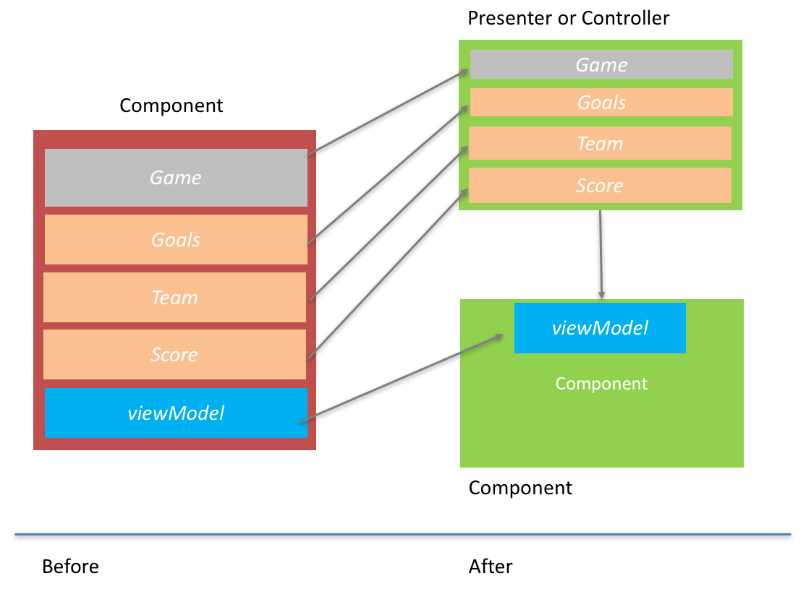

This article is part of a series which will discuss a technical approach to building large-scale Single Page Applications (SPA's) from frameworks such as Angular, React, Ember, Vue, Backbone or Knockout.

It can be used by novices and pros. The ideas are simple, the effects can be profound.

Part 1 will discuss 3 ideas which form a basic level of understanding needed to achieve scale, in the often confusing world of JavaScript browser applications. It has 3 sections:

- The Baseline of Application Design : Responsibilities
- A History of MV* Whatever
- Framework Entanglement

# The Baseline of Application Design : Responsibilities

Code is complex. When we write code we don't know beforehand what we are trying to do. We get a problem, we break it down into a number of steps and we begin to write each line, making mistakes, correcting, adjusting, making more mistakes (swearing) and eventually what we see in front of us hopefully does what we intended it to do. 

We know this as the first part of software creation: getting it working.

At this point programmers (who care about code quality) go back and refactor the code so that it is easier to read and understand. Typically we will

- remove duplication
- encapsulate complexity behind simple functions, objects or both
- remove anything that wasn't needed

When we write code, we 'learn' as we go. It's this learning that is a key aspect of programming. What we end up with is almost always different to how we thought it had to be done in the first place.

Consider the following JavaScript fragment:

```javascript
function getVehicleEngineInfo(){

   var view = {engines:null};
   
    //get cars
    DataLoader.getCars((carsFromServer) => {
		
		_.each(carsFromServer, (car) => {
			var vehicleId = car.Id;
			var totalEngineCapacity = car.engineSize;
			view.engines.push({vehicleId:vehicleId, capacity: engineSize});
		})
	
	});
	
	//get planes
	DataLoader.getPlanes(() = {
		
		_.each(carsFromServer, (plane) => {
			var vehicleId = plane.Id;
			var totalEngineCapacity = plane.engines[0].size + plane.engines[1].size;
			view.engines.push({vehicleId:vehicleId, size: totalEngineCapacity});
		})
		
	});
	
}
```

The above code is responsible for accessing two data sources (for cars and planes). It accesses these data sources and iterates the results in order to populate local information.

Whilst the above code does work, when I reflect on it; I'm not happy. I can see duplication in the form of loading data and I can also see that the main context of ```getVehicleEngineInfo``` is also unpicking some low level information about the different types of engines (e.g. a car only has one but a plane has two). So I decide to refactor.

```javascript
function getVehicleEngineInfo(){

   var view = {engines:null};
   	
	loadVehicles(DataLoader.getCars, (car) => { return car.engineSize; });
	loadVehicles(DataLoader.getPlanes, (plane) => { return plane.engines[0].size + plane.engines[1].size; });
	
	function loadVehicles(vehicleLoaderFunc, engineConstructor){
			vehicleLoaderFunc((vehicles) => {
				_.each(carsFromServer, (vehicle) => {
				var vehicleId = plane.Id;
				var totalEngineCapacity = engineConstructor(vehicle);
				view.engines.push({vehicleId:vehicleId, size: totalEngineCapacity});
			})
			
		});
	}
	
}
```

What I have done here is to use a function ```loadVehicles``` for data loading and code re-use. I have used a function as a parameter; ```engineConstructor``` to allow specific information (captured as a pure function) about the specific vehicle engine information to be passed to it. Now that we have refactored our code to remove duplication we can begin to see other interesting things emerge.

Originally, it felt right to lump all of our code together (in our first attempt) but now we see our code **really** has at least two responsibilities. 

- loading data
- manipulating data

When we have code with different responsibilities it's best to separate them like this, in fact just placing them in different functions isn't enough, because if we want to make something maintainable we don't want to have to keep using the same file for different purposes. 

At this point we decide to take the ```loadVehicles``` function and place it into a totally separate file. Because keeping code with separate responsibilities is always easier to read and maintain when we do this. Instead of forcing anyone else to understand **all the code** they only have to understand **some of the code**, and they do this by reading a single file at a time.

We now end up with two files which contain code which has a single responsibility in each file.  I have decided to set the name on both files appropriately.

NOTE : at this point I am using the word 'file' instead of 'object' because many people want to use a functional approach to JavaScript. For me at this point this distinction is not important. What we are looking for is separate files with separate responsibilities. This is about maintainability and understanding units of information, not how we connect code together.


```javascript
//vehicleLoader.js
function vehicleLoader(){

   var view = {engines:null};
   	
	vehicleConstructor.loadVehicles(view,DataLoader.getCars, (car) => { return car.engineSize; });
	vehicleConstructor.loadVehicles(view, DataLoader.getPlanes, (plane) => { return plane.engines[0].size + plane.engines[1].size; });
	
}

//vehicleConstructor.js
function vehicleConstructor(){

	function loadVehicles(view,vehicleLoaderFunc, engineConsturctor){
			vehicleLoaderFunc((vehicles) => {
				_.each(carsFromServer, (vehicle) => {
				var vehicleId = plane.Id;
				var totalEngineCapacity = engineConsturctor(vehicle);
				view.engines.push({vehicleId:vehicleId, size: totalEngineCapacity});
			})
			
		});
	}

}

```

There are still some design issues in the above code. For example regarding the ```view``` variable and passing it as a reference. This section merely exists to highlight a point. This point is that by separating responsibilities like this our architecture begins to take a better shape.

We have reduced the responsibility down to a pattern (loading) and moved it into another file. This other file can be called in exactly the same way by any code that needs to 'load' vehicles.


Our ```vehicleLoader.js``` becomes very easy to extend and understand because it is interacting with the ```vehicleConstructor.js``` in a uniform manner. We could extend this loader to load lot's of different vehicles and the changes would be trivial. 

```javascript
//vehicleLoader.js
function vehicleLoader(){

   var view = {engines:null};
   	
	vehicleConstructor.loadVehicles(view,DataLoader.getCars, (car) => { return car.engineSize; });
	vehicleConstructor.loadVehicles(view, DataLoader.getPlanes, (plane) => { return plane.engines[0].size + plane.engines[1].size; });
	vehicleConstructor.loadVehicles(view, DataLoader.getTrucks, (plane) => { return car.engineSize; });
	vehicleConstructor.loadVehicles(view, DataLoader.getBikes, (plane) => { return car.engineSize; });

}

```

We have now fully separated responsibilities. We have taken the tangled up mess on the left and consolidated it down to a more componentised design.


When we separate out responsibilities like this we can begin to create files at certain boundaries in our application (e.g. vehicleLoader) which become more trivial to understand and use from other parts.

These boundaries will control our application logic from an external context that is more

- trivial to read
- easy to update
- standardised

We can now begin to use these sorts of patterns for any other type of loading requirement. As our application begins to scale out we can keep plugging together modules that use this same type of ```somethingLoading``` objects that contain this single **responsibility**. 

Every developer on the team can now become acquainted with this design much easier because each responsibility is canonical and when this happens everyone can follow along more easily (they don't have much choice not to). Having multiple people all build your application in the same way is the first step to achieving **scale**.


# A History of MV* Whatever

In 1970 a chap called [Trygve Reenskaug](https://en.wikipedia.org/wiki/Trygve_Reenskaug){:target="_blank"} introduced the pattern of MVC (Model View Controller). 

In this pattern he decided to split up user interface components into separate responsibilities. As we saw in the last section separating responsibilities is a key component of creating scale in an application. I would imagine he had been through the same journey we have been through in this article; trying to decide how to create better scale inside application logic.

What he did was take the elements that 'could' be jumbled up in a single file (a view and a model) and decide to bring in a 3rd type of element. This element would help to control the relationship between the view and the model. It was called the controller. It didn't really matter what he called this last element, it's just that the word 'controller' describes what it does. In the world of software it's best to just name things so the name matches what they do. In other words the name of something should be it's **responsibility**.

Ok, I might be digressing and I never actually asked Trygve what he intended, but I have used many implementations of the model view controller pattern in things like .net, Ruby and Angular etc. Almost all documentation for these implementations points to the same basic point : separating responsibilities.

So we find ourselves at a logical conclusion. We know that separating responsibilities is important and we know the software community keeps bringing us frameworks with this separation built in. Angular brought us MVC. Knockout brought us a very similar pattern; MVVM. Even 5 years ago I was working on .net forms applications which had the 'MVP' pattern.

The point about all these patterns is that they are simply introducing ways that the designers of the frameworks are trying to get us to build our applications. By creating **separation**.

What we have to realise is this 'simple truth'. Separation of responsibilities is an underlying software design concept not a **framework** design concept. Just because a framework proposes a pattern does not mean it is the only time this separation **can** or **should**. Contrary to this I believe separation of concerns should be **everywhere**.

My fear is that in the world of JavaScript we get hung up on some sort of pattern that is built into the framework. We end up designing our applications around the pattern that the framework 'suggests' that we use instead of naturally and **always** creating this pattern. 

The question we can ask is...can we do better?


# Framework Entanglement

Typically we see this sort of thing happening in a SPAs:

```javascript
var GameTicker = React.createClass({
    renderGames() {
        return this.props.games.map(game => {
            var score = game.goals.join(“ — “);
            return (
                <li key={game.id}>
                    {game.teams.join(score)}
                </li>
            );
        });
    },

    render() {
        return <ul>{this.renderGames()}</ul>;
    }
});
```

In this example we can see what is called a ```functional reactive``` approach to SPA design. Don't panic at this hi-falutin term. It just means the closure of functions being used to manipulate views directly.

What this FRP approach does is allow us to write declarative binding functions at the view level, unfortunately we **do** write them in that exact place and we create the first problem we have with building scalable front end solutions.

The problem with this code is that subtly we have actually introduced two responsibilities into the same file. We have some html blocks and we have some nested code which uses functional style lamda syntax to do some manipulation.

This code always makes me worried. We spent years learning to decouple views from data using things like stored procedures (instead of inline sql). We learned that burying logic in the view was dangerous. 

Yet in the SPA world we seem to be repeating the same mistakes again. We built frameworks to take the html out of javascript. But then we reversed the trend and simply stuck JavaScript into the html. 

I'm always surprised because we seem to go around in circles.

The code above has 

1. The view rendering responsibility in the view
2. The data manipulation responsibility in the view

As we have seen before we will forever be chasing our tail with this design because now we can never re-use the logic that handles the data. Can we do better? I believe we can and it starts by separating responsibilities.


```javascript
//datamanipulator.js
class DataManipulator {
	static joinGames(props, callback){
		props.games.map(game => {
			var result = {gameId:null,joined:null};
			var score = game.goals.join(“ — “);
			result.gameId = game.id;
			result.joinedScore = game.teams.join(score);
			callback(result);
        });
	}
}

//component.js
var GameTicker = React.createClass({
    renderGames() {
        return DataManipulator.joinGames(props, (result) => {
            return (
                <li key={result.gameId}>
                    result.joinedScore
                </li>
            );
        });
    },
    render() {
        return <ul>{this.renderGames()}</ul>;
    }
});
```

In the example above I have abstracted away the code that **builds** the view from the code that **is** the view.

The ```DataManipulator``` class is now standalone and independent. Added to this I have also more cleanly created encapsulation between it's inputs ```props``` and it's outputs ```result```.

Creating a better separation like this is also a critical aspect of testability. I will cover this more in another article but the idea here is that testing components where lot's of logic is interspersed with markup is hard because your test code has to rummage around in the framework markup. But now I can test the ```DataManipulator``` in isolation without all of these framework manipulation issues making my tests easier to read and maintain.

I could even decide to take the above refactoring a step further and take it into the world of MV*. 

I can decide to rename the class and function parameters for the ```DataManipulator```. I decide to call it a 'presenter' and the output a 'viewmodel'. 

Alternatively I could have called the presenter a controller if I wanted to use an MVC style pattern. They are just words after all that we use to assign meaning to the way something works. The only purpose with naming a file and it'ts 'object' is so that we can understand it.

```javascript
//gamePresenter.js
class GamePresenter {
	static joinGames(props, callback){
		props.games.map(game => {
			var viewModel = {gameId:null,joined:null};
			var score = game.goals.join(“ — “);
			viewModel.gameId = game.id;
			viewModel.joinedScore = game.teams.join(score);
			callback(viewModel);
        });
	}
}

//component.js
var GameTicker = React.createClass({
    renderGames() {
        return GamePresenter.joinGames(props, (viewModel) => {
            return (
                <li key={viewModel.gameId}>
                    viewModel.joinedScore
                </li>
            );
        });
    },
    render() {
        return <ul>{this.renderGames()}</ul>;
    }
});
```

This above refactor should highlight an important point. MV* is nothing to get hung up on. It is just a pattern that some frameworks build themselves around. If you want you can easily implement your own as you see fit as we have done above.

Le't not get hung up too much on patterns and let's start to build software that is declarative of what it is doing!



Our above architecture has now begun to separate out our responsibilities. It is attempting to make the view layer (with our HTML) trivial and small so that we can begin to re-use the code we extracted away (in this case what we called the presenter or the controller). When we make things simple like this we can achieve scale.

The key consideration is that the patterns you use should be leveraged to separate out the framework code and the logic you write for easier maintenance, testability and in my case at least comprehension. 

## Conclusion

I did originally want to go into more depth with this article. But from experience people have told me that some of this stuff can take a while to become familiar with so I wanted to leave you with just a few ideas.

In this article we have discovered :

- Separating out responsibilities in SPAs is critical if you want to make enterprise solutions. It allows you to begin to create standardised patterns which help you achieve conformity between developers and thus 'scale'.
- MV* isn't magic. They are just patterns designed by other humans to allow us to separate out our responsibilities. Just because a framework is using an MV* pattern doesn't mean you have to. You are free to apply whatever patterns you need to build your applications around the frameworks own patterns. Patterns are not laws, they are tools.
- We have looked a React example and how we are often led down a path of mixing responsibilities. The hype of new frameworks makes us forget basic design fundamentals. You can begin separating out your ```views``` and your ```view``` logic into discrete modules. This will make testing easier and re-usability will be improved. 

These techniques can be used in any framework (Angular, React, React Native, Vue, Ember, Knockout). The go back to basics and are rooted in tried and tested software design concepts.

It's important to realise that SPA's are just another detail in our quest to build software. By considering the basic idea behind separating responsibilities you can begin to architect large-scale enterprise web apps! 

Sign up to our news letter or connect with me on linked-in to get part 2 of this article where I will go deeper into framework entanglement and how to architect better SPAs.

I hope you enjoyed this article!