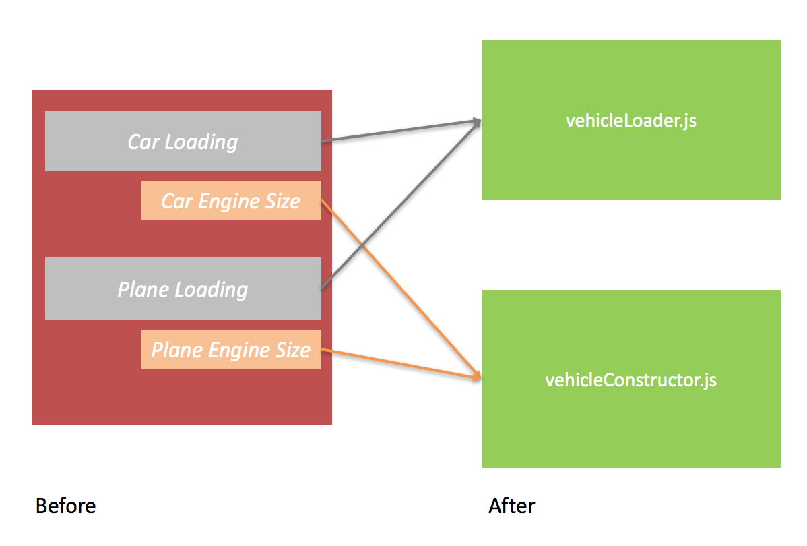

This article is part of a series which will discuss a simple technical approach to building large scale Single Page Applications. 

It can be used by novices and pros. The ideas are simple, the effects can be profound.

It will discuss 3 basic ideas which you can apply to your projects to achieve scale in your JavaScript SPA's.

- responsibilities
- history of MV*
- framework entanglement

# The Baseline of Application Design : Responsibilities

Code is complex. When we write code we don't know beforehand what we are trying to do. We get a problem, we break it down into a number of steps and we begin to write each line, making mistakes, correcting, adjusting, making more mistakes (swearing) and eventually what we see in front of us does what we intended to. 

We know this as the first part of software creation: getting it working.

At this point two things happen. For programmers that care they will usually go back and refactor their code so that it makes more sense. We do things like 

- remove duplication
- encapsulate complexity behind simple functions, objects or both
- remove anything that wasn't needed

One of the key aspects of writing code is that we 'learn' as we go. It's this learning that is a key aspect of programming. And what we end up with is almost always different to how we thought it had to be done.

For example I may sit down and write the following code in JavaScript

```javascript
function getVehicleEngineInfo(){

   var view = {engines:null};
   
   //get cars
	DataLoader.getCars((carsFromServer) => {
		
		_.each(carsFromServer, (car) => {
			var vehicleId = car.Id;
			var totalEngineCapacity = car.engineSize;
			view.engines.push({vehicleId:vehicleId, capacity: engineSize});
		})
	
	});
	
	//get panes
	DataLoader.getPlanes(() = {
		
		_.each(carsFromServer, (plane) => {
			var vehicleId = plane.Id;
			var totalEngineCapacity = plane.engines[0].size + plane.engines[1].size;
			view.engines.push({vehicleId:vehicleId, size: totalEngineCapacity});
		})
		
	});
	
}
```

But when I sit down and look at the above code i'm not happy. I can see duplication in the form of loading data and I can also see that the main context of ```getVehicleEngineInfo``` is also unpicking some low level information about the different types of engines (a car only has one but a plane has two). So I decide to refactor.

```javascript
function getVehicleEngineInfo(){

   var view = {engines:null};
   	
	loadVehicles(DataLoader.getCars, (car) => { return car.engineSize; });
	loadVehicles(DataLoader.getPlanes, (plane) => { return plane.engines[0].size + plane.engines[1].size; });
	
	function loadVehicles(vehicleLoaderFunc, engineConsturctor){
			vehicleLoaderFunc((vehicles) => {
				_.each(carsFromServer, (vehicle) => {
				var vehicleId = plane.Id;
				var totalEngineCapacity = engineConsturctor(vehicle);
				view.engines.push({vehicleId:vehicleId, size: totalEngineCapacity});
			})
			
		});
	}
	
}
```

What I have done here is to use a function ```loadVehicles``` for data loading code re-use. And I have used a function as a parameter to allow specific information about the specific vehicle to be passed to it. Immediately we can see we have highlighted another problem through our refactoring.

Originally it felt right to lump this all in togehter but now we see our code **really** has at least two responsibilities. 

- loading data
- manipulating data

So we decide to take the ```loadVehicles``` function and place it into another file. Because keeping code with separate responsibilities is always easier to read and maintain when we do this. Instead of forcing anyone else to understand **all the code** they only have to understand **some of the code**.

We now end up with two files which contain code which has 2 responsibilities.  I have decided to set the name on both files appropriately.


```javascript
//vehicleLoader.js
function vehicleLoader(){

   var view = {engines:null};
   	
	vehicleConstructor.loadVehicles(view,DataLoader.getCars, (car) => { return car.engineSize; });
	vehicleConstructor.loadVehicles(view, DataLoader.getPlanes, (plane) => { return plane.engines[0].size + plane.engines[1].size; });
	
}

//vehicleConstructor.js
function vehicleConstructor(){

	function loadVehicles(view,vehicleLoaderFunc, engineConsturctor){
			vehicleLoaderFunc((vehicles) => {
				_.each(carsFromServer, (vehicle) => {
				var vehicleId = plane.Id;
				var totalEngineCapacity = engineConsturctor(vehicle);
				view.engines.push({vehicleId:vehicleId, size: totalEngineCapacity});
			})
			
		});
	}

}

```

There are still some design issues regarding the view and passing it as a reference but this section merely exists to highlight a point. 


What is awesome about this now is that our ```vehicleLoader.js``` almost becomes a configuration file. We could extend this loader to load lot's of different vehicles and the changes would be trivial. 

```javascript
//vehicleLoader.js
function vehicleLoader(){

   var view = {engines:null};
   	
	vehicleConstructor.loadVehicles(view,DataLoader.getCars, (car) => { return car.engineSize; });
	vehicleConstructor.loadVehicles(view, DataLoader.getPlanes, (plane) => { return plane.engines[0].size + plane.engines[1].size; });
	vehicleConstructor.loadVehicles(view, DataLoader.getTrucks, (plane) => { return car.engineSize; });
	vehicleConstructor.loadVehicles(view, DataLoader.getBikes, (plane) => { return car.engineSize; });

}

```

We have now separated responsibilities. We have taken the tangled up mess on the left and consolidated it down to a more componentised design.



When we separate out responsibilities like this we can begin to create files at the boundaries of our application (vehicleLoader) which become trivial to set up and maintain.

These boundaries will control our inner application logic from an external context that is is

- trivial to read
- easy to update
- standardised

We can now begin to use this pattern for any other type of loading requirement. As our application begins to scale out we can keep plugging together modules that use this same type of 'somethingLoading' pattern. 

Every developer on the team can now become aquanted with this type of 'pattern' and when this happens the can follow the same pattern. Having multiple people all build your application in the same way is the first step to achieving **scale**.


# A History of MV* Whatever

In 1970 a chap called Trygve Reenskaug introduced the pattern of MVC (Model View Controller). 

In this pattern he decided to split up user interface components into separate responsibilities. As we saw in the last section separating responsibilities is a key component of creating scale in an application. And let's face it he probably had the same thoughts.

What he did was take the elements that 'could' be jumbled up in a single file (a view and a model) and say 'ok' view and model why don't we say that in order to keep responsibilities separate let's just bring in another type of file. We can call this file anything. But since it is going to be manipulating the view and the model and is in 'control' let's call it the 'controller'.

Ok, I haven't actually asked Trygve what he intended but I have used many implementations of the model view controller pattern, .net, Ruby and Angular. Almost all documentation for these implementation points to the same basic point : separating responsibilities.

So we find ourselves at a logical conclusion. We know that separating responsibilities is important, we know the software community keeps bringing us frameworks with this separation built in. 

Angular brought us MVC. Knockout brought us a very similar pattern MVVM. And a few years ago I was working on .net forms applications which had a 2rd the MVP pattersn.

The point about all these patterns is that they are simply ways that the designers of the frameworks are trying to get us to build our applications. By creating **separation**.

What we have to realise is the simple truth. Separation of responsibilities is an underlying design concept. Just because a framework proposes a pattern does not mean it is the only time this separation **can** or **should**. Contrary to this I belive separation of concerns should be **everywhere**.

My fear is that in the world of JavaScript we get hung up on some sort of pattern that is build into the framework. And we end up designing our applications around the pattern that the framework 'suggests' that we use.

The question we can ask is...can we do better?


# Framework Entanglement

Typically we see this sort of thing happening in a Single Page Application:

```javascript
var GameTicker = React.createClass({
    renderGames() {
        return this.props.games.map(game => {
            var score = game.goals.join(“ — “);
            return (
                <li key={game.id}>
                    {game.teams.join(score)}
                </li>
            );
        });
    },

    render() {
        return <ul>{this.renderGames()}</ul>;
    }
});
```

In this example we can see what is called a ```functional reactive``` approach to SPA design. 

Because React allows us to write declarative binding functions at the view level, typically we **do** write them and what we get is to me the first problem we have with building scalable solutions.

The problem with this code is that subtly we have actually introduced two responsibilities into the same file. We have some html blocks and we have some nested code which uses functional sytle lamda syntax to do some manipulation.

This code always makes me worried. We spent years learning to decouple views from data using things like stored proceudres (instead of inline sql). We learned that burying logic in the view was dangerous. 

Yet in the SPA world we seem to be repeating the same mistakes. We built frameworks to take the html out of javascript. But then we reversed the trend and simply stuck JavaScript into the html. 

I'm always surprised because we seem to go around in circles.

The code above has 

1. The view rendering responsility in the view
2. The data manipulation responsibility in the view

As we have seen before we will forever be chasing our tail with this design because now we can never re-use the logic that handles the data. Can we do better? I believe we can and it starts by separating responsibilities.


```javascript
//datamanipulator.js
class DataManipulator {
	static joinGames(props, callback){
		props.games.map(game => {
			var result = {gameId:null,joined:null};
			var score = game.goals.join(“ — “);
			result.gameId = game.id;
			result.joinedScore = game.teams.join(score);
			callback(result);
        });
	}
}

//component.js
var GameTicker = React.createClass({
    renderGames() {
        return DataManipulator.joinGames(props, (result) => {
            return (
                <li key={result.gameId}>
                    result.joinedScore
                </li>
            );
        });
    },
    render() {
        return <ul>{this.renderGames()}</ul>;
    }
});
```

In the example above I have simply abstracted away the code that **builds** the view from the code that **is** the view.

The DataManiplulator class is now standalong and independant. Added to this I have also more cleanly created encapsulation between it's inputs (props) and it's outputs (result).

Creating a better separation like this is a critical compontent of testability. I will cover this more in another article but the key aspect here is that testing components is hard because your test code has to rummage around in the framework. But now I can test the ```DataManipulator``` in isolation making my tests easier to read and maintain.

I could decide to take the above refactoring a step further and take it into the world of MV*. I can decide to rename the class and function parameters. I decide to call it a 'presenter' and the output a 'viewmodel'. Alternatively I could call the presenter a controller. They are just words after all that we use to assign meaning to an object that does something. The only purpose with naming a file and it'ts object is so that we can understand it, is it not?

```JavaScript
//gamePresenter.js
class GamePresenter {
	static joinGames(props, callback){
		props.games.map(game => {
			var viewModel = {gameId:null,joined:null};
			var score = game.goals.join(“ — “);
			viewModel.gameId = game.id;
			viewModel.joinedScore = game.teams.join(score);
			callback(viewModel);
        });
	}
}

//component.js
var GameTicker = React.createClass({
    renderGames() {
        return GamePresenter.joinGames(props, (viewModel) => {
            return (
                <li key={viewModel.gameId}>
                    viewModel.joinedScore
                </li>
            );
        });
    },
    render() {
        return <ul>{this.renderGames()}</ul>;
    }
});
```

This above refactor should highlight an inportant point. MV* is nothing to get hung up on. It is just a pattern that some frameworks build themselves around. If you want you can easily implement your own as you see fit as we have done above.


Our above architecture has now begun to separate out our responsibilities. It is attempting to make the view layer (with our HTML) trivial so that we can begin to re-use and thus scale out our application. When we make things simple we can achieve scale.

The key consideration is that the patterns you use should be leveraged to separate out the framework code and the logic you write for easier maintenance, testability and in my case at least comprehension. Let's look deeper into this.

## Conclusion

I did originally want to go into more depth with this article. But from experience people have told me that some of this stuff can take a while to become familiar with so I wanted to leave you today with one simple idea that you can take away.

In this article we have discovered :

- Separating out responsibilites in JavaScript is critical if you want to make code simpler and more trivial. It allows you to begin to create standardised patterns which help you achieve conformity between developers and thus 'scale'
- MV* isn't magic. They are just patterns designed by other humans to allow us to separate out our responsibilities. Just because a framework is using an MV* pattern doesn't mean you have to. You are free to apply whatever patterns you need to build your applications around the frameworks own patterns.
- We have looked a React example and how we are often led down a path of mixing responsibilities. The hype of new frameworks makes us forget the lessons of the past. You can begin separating out your ```views``` and your ```view``` logic into discrete modules. This will make testing easier and re-usability will be improved. 

These techniques can be used in any framework (Angular, React, React Native, Vue, Ember, Knockout). The go back to basics and are rooted in tried and tested software design concepts.

It's important to realise that SPA's are just another detail in our quest to build software. By considering the basic idea behind separating responsibilities you can begin to architect large-scale enterprise web apps! 

I hope you enjoyed this article!