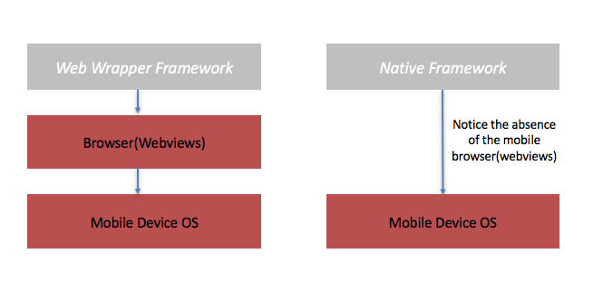
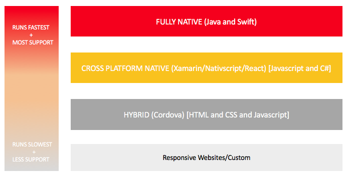
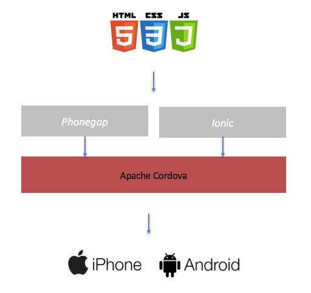
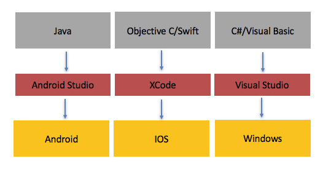

Choosing the right mobile application approach can be difficult. Trying to weigh up the strengths and weaknesses can be challenging. Should you choose Hybrid? Native? Or Cross platform? Or what do those terms even mean?

A little thought and consideration up-front can really help you later down the line, hopefully this guide will help!

## What We Will Cover :

- What is the Difference Between Hybrid/Cross Platform Native and Fully Native?
- Deciding Factors For Your Choice
- ***Option 1*** : Hybrid Mobile App Choices (Cross Platform)
- ***Option 2*** : Native Mobile App Choices (Cross Platform)
- ***Option 3*** : Fully Native Choices (Platform Specific)
- Conclusion

## What is the Difference Between Hybrid and Native Cross Platform App Development?

In order to get a high level view of

A ***Hybrid Cross Platform*** development framework is a set of development, configuration and build tools that allow standard web technologies (HTML 5, CSS 3 and Javascript) to be packaged and deployed onto a mobile device. Typically the assets will be uploaded to the Apple store for IOS or the Play store for Android. At runtime the application uses the mobile device browser (webview).  

A ***Native Cross Platform*** development framework offers the same as the Hybrid approach. However it cuts HTML and CSS from the equation and allows the packaged app to talk directly to the mobile Operating System. This offers two advantages over hybrid. Firstly the apps can use native User Interface controls (rather than mimiced ones), this can make development easier since there is consistency in devices and the applications will potentially run faster (since there is less processing to perform).

A ***Fully Native*** approach uses Apples and Googles original tools respectively to specifically target the mobile device. They are developed stand alone and use different languages and development environments in each context.


> how web wrapper mobile app frameworks work

## Deciding Factors For Your Choice

There are 4 main points to consider when choosing your mobile development platform.

1. Speed Considerations
2. Feature Support 
3. Framework Risk
4. Development Cost

### Speed Considerations

The first thing you need to think about is how fast the application needs to be. The fastest execution will typically come from true native apps written in Java (Android) and Swift (IOS). Following close on; then native cross platform and finally Hybrid. It's worth noting that the difference in speed may be trivial for the majority of apps and may only be important if developing games. The golden figure for speed when it comes to mobile app development is 60fps. Anything less; and to the eye it will look 'laggy'. Usually hybrid choices do not reach this golden figure.

### Feature Support 

If you build cross platform apps there may be features specific to each device that don't yet have support from cross platform and hybrid frameworks. Generally as time progresses features will be added by the mainatainers of these frameworks but there will be a delay. 



### Framework Risk

By choosing to shop outside of the officially supported mobile development frameworks (Android Studio/XCode) you introduce slightly more risk since you are putting more layers of abstraction between the target platform and the code that is running on it. This may not be a problem but it's worth looking into the support contracts that any of the Hybrid or Cross platform framework developers offer. Try looking around on line and researching problems people have had with frameworks before proceeding and making your choice.

### Development Cost

It's worth thinking about the current development expertise you either already have in-house or can easily access externally. If you have a lot of web developers already then Hybrid options offer the ability to leverage cost savings because it takes less time for them to learn.

Using cross platform code is useful to allow code sharing and thus significantly reduce the cost of development.

## Option 1 : Hybrid Mobile App Choices (Cross Platform)

There are tons of players in this space. But the ones that come up time and time again are the Cordova family of frameworks.

### Apache Cordova

Simply put, [Apache Cordova](https://cordova.apache.org/) is a development framework that is command line driven, it includes build tools that will take an input of (HTML, CSS and Javascript) and will produce something that runs on a mobile device. For example; a developer will write a command in Windows or OSX which tells a build tool to package our app:

```bash
install cordova /asssets/ create target:android
```
> (heavily abridged)

And hey presto we have a mobile app! Clearly this is insanely simple because almost no immediate knowledge is needed about mobiles specifically to get started, herein lies the beauty of a web wrapper. 

### Phonegap (Built on Cordova)

Phonegap is a development framework created by Adobe that is built on top of Apache Cordova. A good analogy here is that it's like an operating system that is running on a host machine (Cordova). The reason it exists is because Adobe originally made it (although they handed over the licencing to Apache). The main benefit is it's integration with the Adobe universe. For example Adobe offers build tools which run in the cloud.

### Ionic (Built on Cordova)

Ionic is another framework which is built directly on top of Apache Cordova. Ionics forte is that it integrates with the well known Single Page Application framework called Angular. Ionic is open source. This means that the focus is on the product itself (as opposed to the services offered around it like with Phonegap). Recently Ionic have upgraded their offering to include a native version too!


> Phonegap and Ionic are both built on Cordova

## Option 2 : Cross Platform Native

These tools allow a single language to target multiple platforms. If you are developing high performance games with a lot of processing fully native is usually the way to go. But if you are creating common business applications cross platform can present significant savings. There are a few main types of cross platform choices.

### React Native

[React.js](https://en.wikipedia.org/wiki/React_(JavaScript_library)) is an open source Single Page Application (SPA) framework that allows web developers the ability to build large scale JavaScript applications for the browser. It composes common application requirements (such as rendering views) into a single framework that can be leveraged for productivity. [React Native](http://www.reactnative.com/) is an extension of react that removes browser specific features and introduces mobile specific knowledge. Facebook are key contributers to this project.

***Supported Devices*** : IOS, Android

### Angular 2 Nativescript

The newest release of the most popular SPA Angular 2 has built in support to Teleriks [Nativescript](https://www.nativescript.org/). Although developed by Telerik, Nativescript is open source. It allows development to target mobile devices using JavaScript or [Typescript](https://www.typescriptlang.org/). The benefit is that Angular 2 is a very mature platform with a lot of developers that understand it.

***Supported Devices*** : IOS, Android

### Xamarin

Xamarin uses C# to target multiple devices. It comes with a powerful Integrated Development Environment (IDE's) and will work well with Microsoft Visual Studio (via an extension). It's a good choice for large corporates that have lot of Microsoft developers in-house, and it supports windows phone too!

***Supported Devices*** : IOS, Android, Windows 

## Option 3 : Full Native

From a speed and interoperability perspective this choice presents the least risk. However, because there is no code sharing it also presents the highest potential cost. 

### Swift/Objective C (IOS)

Objective C has been the dominant language to develop for IOS for many years. It has a lot of support on the devices in terms of libraries and at the moment the majority of applications are written in it. [Swift](http://www.apple.com/swift/) first appeared in 2014 and superceded Objective C for IOS devices. Development using both languages is carried out using OSX using XCode.

***Supported Devices*** : IOS

### Java (Android)

Java can be developed using [Android Studio](https://developer.android.com/studio/index.html) to target Googles Android operating system. It provides a very good developer experience and great tooling and support.

***Supported Devices*** : Android

### Windows Phone 

You can use either C# or Visual Basic alongside Microsofts [own tools](https://msdn.microsoft.com/en-us/library/windows/apps/ff402526(v=vs.105).aspx) to create windows phone apps. It would probably be better to use Xamarin in this case so you have the option to re-use code later down the line.


> Default languages and IDE's for each device. 


## Conclusion

In this article we have hopefully covered enough information so that you can be ready when people start talking about mobile. We have looked at the web wrapper versions (hybrid) which are simply web code which is packaged. And we have looked at cross platform solutions which let us write in any language but produce a real native app. We also considers straight up native where the applications are written in the lanuage the phone manufacturers intended (Java and Swift).

We have seen that in some cases where games are needed that normal native might be needed but for the majority of cases cross platform will be the best solution since it offers a write once deploy anywhere approach!


