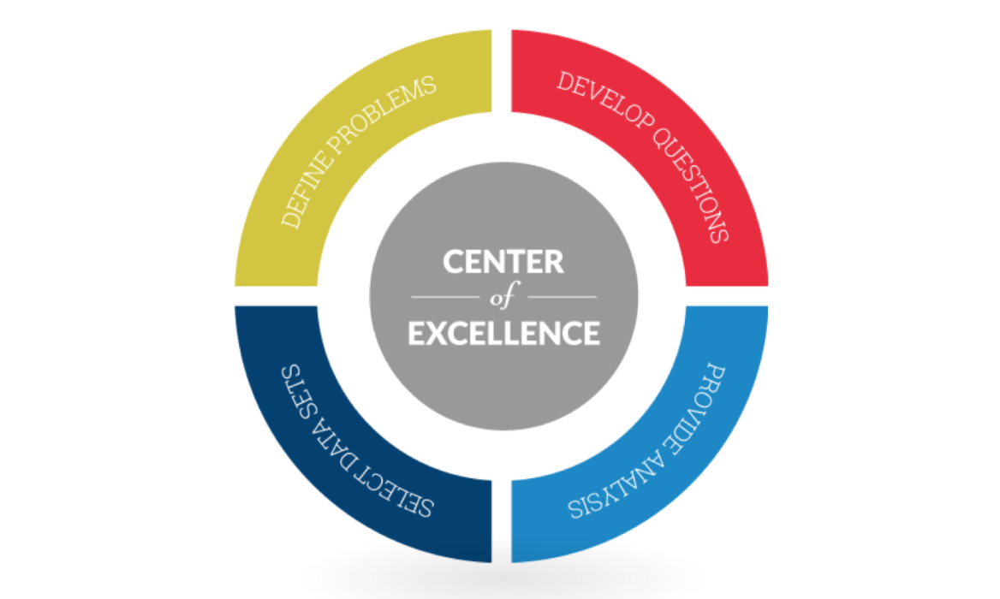

The new era in business is digital. We can all agree on that and we can also agree that a business that doesn't have a digital strategy could be left behind by their industry competition. Creating an effective digital strategy is important and although many business managers already know this, what they still seem to struggle with is implementing that process. One way they can implement their digital business strategy and accelerate the process to either catch up with their competition or blow past them is to automate it.

Why do you want to speed up this process and how can automating it do just that? The sooner you implement your digital business strategy, the sooner you can begin using the latest software, the sooner you can use the newest technology and the sooner you can begin meeting your customers' needs more effectively. What's not to like about that?

Let's take a look at some ways that you can make your digital business strategy more effective and how you can automate these processes to make it happen even sooner.

**1) Know your current business processes and how you can make them better:** Understanding your current business processes will not only make you more informed and effective at your job, it will also enable you to find ways to improve on them. The single, most effective way to improve on those day to day, mundane tasks is to automate them. Manually entering data is a thing of the past. Using automated business process discovery software can simplify this task and make your business more effective.

**2) Automate, automate, automate:** For processes that are updated multiple time per day, automating them can save you both time and money. With the newest automated business process software, your employees can introduce new ideas and new business methods that could improve on your services and create a much larger client base. Don't be afraid to automate tasks that would normally consume many hours per day of your employees' valuable time.

**3) Make business and IT one:** What I mean by this is that you need to stop separating IT and business operations and make them work together. The software is available, why not use it to your advantage? Work together you're your IT department or developers to save time and money and to create useful solutions that meet both of your needs. The more you know about your businesses technology, the more effective you can be. This is also true for your IT department. The more they know about your business, the more effective they can be at delivering effective solutions.

**4) Embrace Artificial Intelligence. techniques to analyze & optimize:** End-user interactions are very important but collecting and analysing that data can be time consuming. Using AI techniques to look for specific patterns, problems and failures can help you find new solutions or fix the things that aren't working.

**5) The Importance of the Centre of Excellence:** the Centre of Excellence, or COE, is important to the success of your digital business strategy. A center of excellence is a team that provides leadership, best practices, research, support and/or training. Creating a COE from the start will enable your digital strategy to have the best chance of succeeding. As with any new technology, there are many up and downsides and these must be planned for. This is where your COE comes into play. It will lay the ground rules for building and maintaining your digital strategy and your ability to use it effectively and accelerate its growth.

**6) Realise that software is at the heart of transformation** 5 of the most valuables companies are now software. So stop delaying on those projects and begin building your next software platforms that are going to help you build your business scale by using the power of code!

|   | Company      | Valuation |
|---|--------------|-----------|
| 1 | Apple        | $570.7B   |
| 2 | Alphabet     | $560B     |
| 3 | Microsoft    | $434B     |
| 4 | Amazon       | $365B     |
| 5 | Facebook     | $354B     |
| 6 | Exxon Mobile | $351B     |

> source : [http://uk.businessinsider.com/4-most-valuable-public-companies-all-tech-companies-2016-8?r=US&IR=T](http://uk.businessinsider.com/4-most-valuable-public-companies-all-tech-companies-2016-8?r=US&IR=T)

Becoming an effective, successful digital business takes careful planning and should include the business leaders and IT department. When working together as a team, a digital business strategy can be created and implemented that enables the business to become an integral part of the digital world. This means automated tasks, streamlining business processes, using artificial intelligence to your advantage and planning your digital strategy thoroughly. If you are serious about your digital business transformation and you need cross-platform software that you can depend on, choose the JavaScript professionals at Logic Room and let us create the web, mobile, desktop and backend digital products your business needs for success :-)

