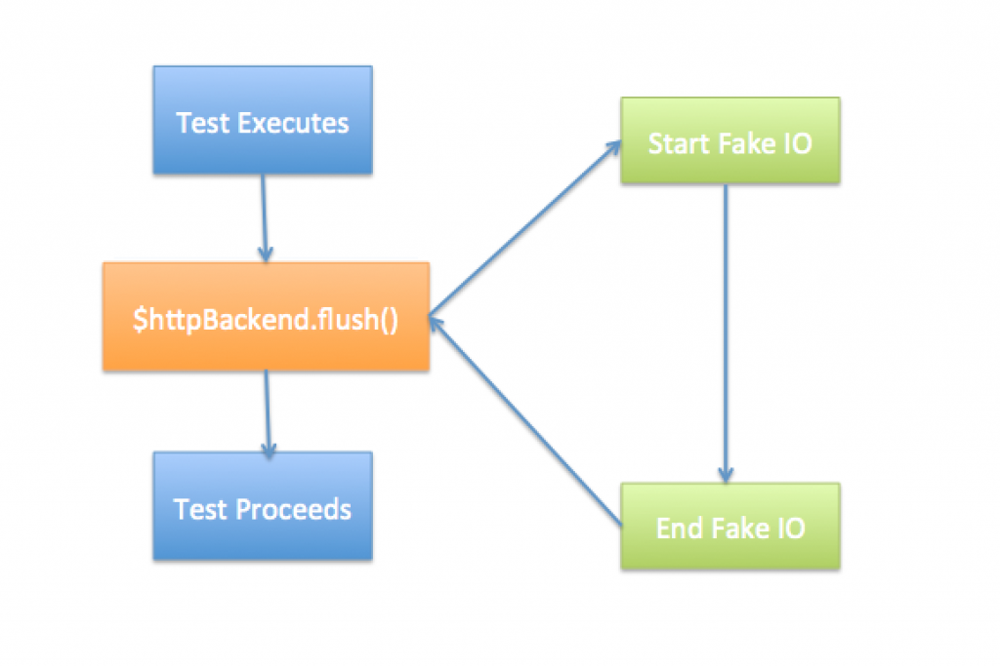

In this blog post we will examine the $httpBackend object and how it really helps us to write clean and maintainable unit tests when practicing Test Driven Development (TDD). I’m a practitioner of Test Driven Development. If you have read my [e-book](http://www.peteheard.com/testdrivendevelopment/){:target="_blank"} you can see that I am keen on applying the 80/20 rule to automated testing and creating unit tests that work like behaviour tests. This means that in my tests I recommend using the applications' own API to physically set pre-conditions of a test. However, in pure vanilla Javascript this can become quite cumbersome and brittle using only pure callbacks. Take, for example, the following test code…

```javascript
// using spaghetti callback expectations
it('when user goes back then delete is called', inject(function(){

    spyOn($http,'delete').and.callThrough();

    RouterWizard.back(function(){

        expect($http.delete).not.toHaveBeenCalled();

    });

}));
```

_This test code explains an object called the 'RouterWizard'. It is a component which shows a progress indicator on some forms a user needs to fill out. The user can 'step back' or 'progress' through the screens. The code above does 3 things..._

1.  (Line 4) - Firstly it spies on the '$http' . 'delete' function
2.  (Line 6) - Invokes a function called 'back' on the 'RouterWizard'
3.  (Line 6 - 10) - It will execute a callback when 'RouterWizard' has finished

The **final callback** (Lines 6 - 10) should be called when the 'RouterWizard' has finished executing but because of it’s functional nature this unit test could exit before this final callback has had a chance to execute. This could lead to a false positive (which you really really want to avoid at all costs when automating testing). The initial solution is to inject a 'done' function into the test (which will force the test to fail if it never completes), for example…

```javascript
// making sure we force the callback to execute
it('when user goes back then delete is called', inject(function(done){

    spyOn($http,'delete').and.callThrough();

    RouterWizard.back(function(){

        expect($http.delete).not.toHaveBeenCalled();

        done();

    });

}));
```

This works by telling the test framework (in this case Jasmine) to inject a function into the test which will guarantee is called before declaring the test finished. If it never get's called the test will fail after a set period of time!

## Enter the $httpBackend object

Whilst the previous code **is** an improvement and fixes the potential false positive issue on our first example this is still fairly ugly, and if we are to be great developers then we don't write ugly code! Ok, so at the moment we only have one callback and so isn't too ugly, but as I said, we may be writing behavioural tests with complex set up and multiple callbacks. The result will be deep and confusing callbacks. It’s really important that the tests are clean and easy to understand (critical in fact). So Angular comes to the rescue with the **$httpBackend** object.

```javascript
//hooray for synchronous looking code
it('when user goes back then delete is called', inject(function(done){

    spyOn($http,'delete').and.callThrough();

    RouterWizard.back();

    $httpBackend.flush();

    expect($http.delete).not.toHaveBeenCalled();

}));
```

As you can see the $httpBackend is an object that is using a reference to an internally stored collection of asynchronous calls, it is overwriting these with test doubles. Then it is executing them synchronously thus blocking the test there and then, and making sure all of the fake backend calls are complete, it does what is says on the tin; it **flushes**. Since we aren’t actually performing IO in this test we don't need to worry about blocking the process so can make the code halt whilst it is being flushed. This diagram is handy to refer to to get the process that the $httpBackend object goes through when the test code invokes it. 

## Conclusion

Using **$httpBackend.flush** has the clear benefits of allowing us to stay out of callback-spaghetti-hell and is truly brilliant for making test code nice and easy to read! Angular has other great testing features but this is just one very powerful one. There we have it, possibly the best feature in Angular for me. When I was a Javascript baby my tests were always just too spaghetti like now they read much easier thanks to this brilliant feature. Thanks Angular!