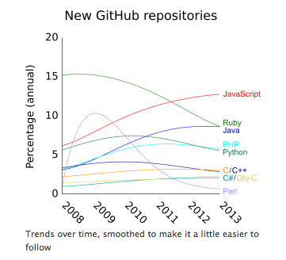
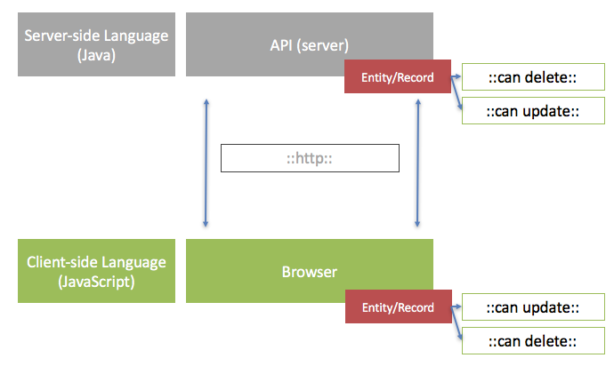
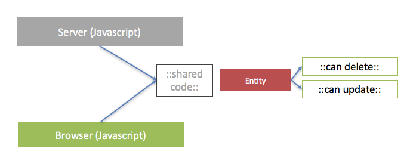

The chaotic nature of technological improvement often throws the world a curveball; things that were never designed to be popular suddenly are. Nothing could have been more of a surprise to me than JavaScripts' recent rise to the top in a sea of modern object oriented languages. Becoming the first truly platform independent language with mass adoption and tooling support. 

### Introduction : The Rise of JavaScripts' Popularity

JavaScript first appeared in May 1995 and was created by netscape as a single threaded scripting language to help with their browser. In the last 5 years it's popularity has been helped along by a number of key developments (which we cover in this article). 

This graph shows data collected by Redmonk which shows JavaScripts rising popularity in comparison to many other dominant languages.

> source : [http://redmonk.com/dberkholz/2014/05/02/github-language-trends-and-the-fragmenting-landscape/](http://redmonk.com/dberkholz/2014/05/02/github-language-trends-and-the-fragmenting-landscape/)

Better tooling, more support and advancements in the language are allowing JavaScript to slowly consolidate it's position as a major player in the software development industry. An example can be seen from this diagram created at Githut - which tracks language use in open source projects.

> source : [http://githut.info/](http://githut.info/)

## Reasons to use JavaScript

### Reason 1 : It's Better For Distributed Architectures

One of the biggest problems with writing software is duplication. As soon as duplication occurs this immediately adds development cost, since every change to the original now has to be done twice. 

This adds significant overhead. Unfortunately with the rise in popularity of distributed architectures (e.g. Single Page Applications and microservices) this duplication is becoming more prevalent, it adds cost because it makes applications more complex and difficult to maintain.

For example; let's take a typical Single Page Application (SPA). You have a client server relationship. On the client (the browser) you need to store a list of security policies against some sort of entity. These security policies are important. They might include things like (can delete, can update). They are important because you don't want to show a user things it can't do. 

The problem is that you also need to store this information on the server. Because anyone with a tiny bit of technical knowledge can send fake requests to the server if you don't apply the same policies there. 

So you end up in a situation where you have a browser application written in JavaScript and a backend written in say (Java). We see in the diagram below that both the server (at the top) and the client (at the bottom) hold the same information. Because they are written in different languages this knowledge has to be duplicated; notice the red security policies in both areas.

> an example of how physcial separation of boundaries causes duplication of information

This situation; where the browser and the server is storing the same information is a typical duplication problem. It is often caused by using different languages in distributed systems. 

The only way to solve this problem is to use shared code between the two. But we can't because we have written them in different languages. And JavaScript is the only language that can be understood by the browser.

###### Server Side JavaScript to the Rescue!...

The JavaScript ecosystem is undergoing rapid growth and has started to accelerate with the advent of a server side hosting tool called [Node.js](https://nodejs.org/en/){:target="_blank"}. It runs on the Google Chrome v8 engine. 

Node allows JavaScript to be executed on a webserver. Not only does this open up software design and architecture options; but because of the way the language works it turns out it's pretty scalable too. 

Many large companies like [Netflix](http://techblog.netflix.com/2014/11/nodejs-in-flames.html) and [Walmart](http://venturebeat.com/2012/01/24/why-walmart-is-using-node-js/){:target="_blank"} have decided to replace their backend architectures with Node. Instead of the usual serverside options such as (Java,C#,PHP,Ruby) etc. By having the option to use JavaScript across both your front and back-end architectures you can develop distributed systems that can use shared modules.

In the diagram below I have extended our diagram from above to show that the policies (in red) are now consolidated down to a single place.

> by using the same language we can share code which reduces complexity and most importantly allows software designers to remove duplication

Using serverside JavaScript will also help with microservices design since the same technique can be used to create microservices that have some shared code.

### Reason 2 : It's Really Good At Multi-Platform

It seems like everywhere you turn there is another product or language touting cross platform support. In todays digital transformation programmes cross platform is a big topic because it allows a `write once, deploy everywhere` development mindset and this ultimately leads to faster time to market. This in turns makes businesses more competitive.

JavaScript has been slowly moving to dominate many platforms. Even as far back as 2007 Jeff Attwood stated in a popular [blog post](https://blog.codinghorror.com/the-principle-of-least-power/){:target="_blank"} that JavaScript would eventually overtake any application that would allow it.

> "Any application that can be written in JavaScript, will eventually be written in JavaScript" - Jeff Attwood

JavaScript is beginning to get mature tooling and support for the three major areas that corporations are interested in developing for (web, desktop and mobile). Here are just a few examples of frameworks that are powering JavaScript as a cross platform language.

**Native Mobile (IOS and Android)** - [React Native](http://www.reactnative.com/){:target="_blank"} and [NativeScript](https://www.nativescript.org/) are the two main frameworks which allow JavaScript code to run on a mobile. They offer mature support for a true native experience; React was used by facebook for the mobile platform.

**Desktop (Mac and Windows)** - [NW.js](https://nwjs.io/) and [Electron](http://electron.atom.io){:target="_blank"} allow developers to package up web apps or call the host system automatically for desktop development.

**Web (All Browsers)** - [Angular](https://angular.io/), [Meteor](https://www.meteor.com/){:target="_blank"} are examples of single page application frameworks that use JavaScript and allow complicated business applications to be run inside a browser. They bring us fat client architectures which are fast and responsive to the user.

### Reason 3 : It's Really Scalable

Ironically, the biggest weakness in JavaScript has now been turned into a significant strength. The key difference between JavaScript and most of the 'other' languages such as (Ruby, Java, C# etc) is that it is single threaded.

If you are a non developer then this probably doesn't mean a lot to you so I will try and explain it in simple terms.

Most languages have functionality that allows them to run more than one instance of themselves. 

They 'place' instructions onto a big list of things to do. The processor comes along and services these instructions one by one. 

This is called 'multi-threading'. So the programmer can write code that takes advantage of this. This opens up numerous options and they can do cool things; like write web servers which need to process lot's of concurrent users.

But... this comes at a cost; context switching! All that switching between processes chews up the processors time because it has to keep dumping stuff in and out of memory. This slows it down.

###### Single Threaded Scalability : A New Paradigm

JavaScript is single threaded by nature. This means that the programmer is physically stopped from dealing with multiple threads because all the JavaScript code runs in a single thread. 

Because this convention is forced on the designers of the system they have to write code that will not lock the processor - this is called a [non-blocking architecture](https://hueniverse.com/2011/06/29/the-style-of-non-blocking/){:target="_blank"}. 

This makes it more tricky for the programmer. Because they have to write code that deals with events rather than code which is linear.

The upshot is that because they write code that isn't allowed to block JavaScripts' only thread; it will immediately release resources, unlike with our 'multi-threaded' environments where resources are held onto for further processing. 

This has the effect of having significant [performance increase](https://dzone.com/articles/performance-comparison-between){:target="_blank"} on applications that run high load processes and makes it perfect in a web environment. 

Again this does come with a cost. What JavaScript is not good at doing is servicing requests that need to hold the processor for long periods to perform tasks...for example writing long data streams to disk or processing graphics in real time (such as in distributed gaming). 

## Conclusion

In this article we have looked at JavaScript and three interesting features. These go to some length to explain it's recent rise in popularity. We have seen how :

**Serverside JavaScript:** It's ability to run on the server using Node.js is allowing consolidation into single code bases. This reduces complexity for large scale applications. This has the benefit of allowing more complex architectures to be handled more easily because the **duplication** problem is being solved.

**Native Cross Platform Support:** It's maturing native cross platform support across IOS, Android and even Windows/Mac Desktop is allowing organisations to improve their time to market. They can reduce bottlenecks around skills and support for their applications.

**Scalablity in High Load Environments:** It's single threaded nature forces a convention on software design which ends up allowing  performance and scalability in many scenarios. Typically these scenarios are in a web context where high loads need to be services. This makes JavaScript a powerful tool to use for organisations that need to scale more traffic for reduced cost.

These three strengths, it's rising popularity and improved tooling and support mean that organisations can leverage a competitive advantage by making JavaScript a staple of their application strategy!

