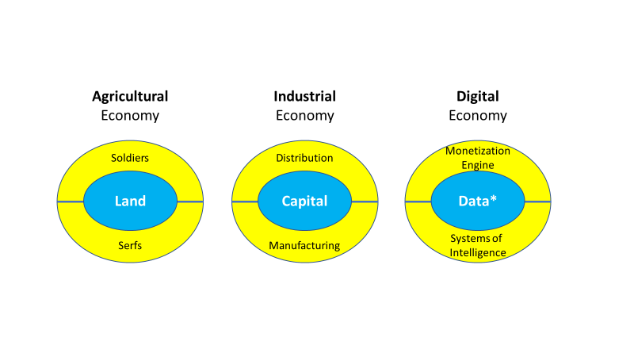
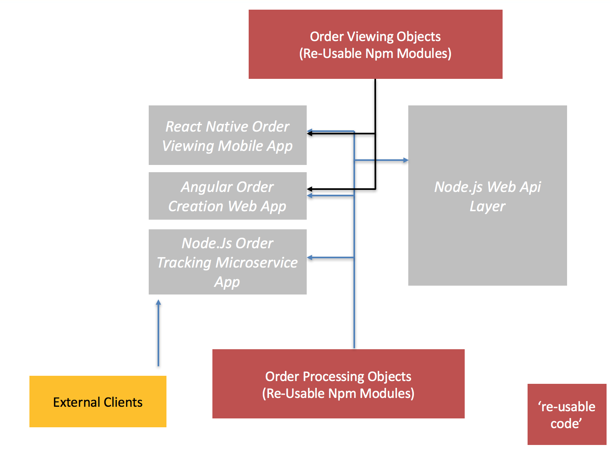

As companies embrace digital and look to leverage their data, processes and products to create new value streams software is becoming more and more imprtant. Being able to deploy to a variety of devices is important; mobile, web and server are all common platforms and now [desktop](https://thenextweb.com/apps/2016/09/14/slack-beta-app/#.tnw_2uCEXoyD) is making a come back. 

Some companies are beginning to ask the question, if we are using much of the same code on different devices, why not re-use it?

The cross-platform economy is a phrase I think best describes how organisations can build a suite of re-usable and modular code that can be deployed to multiple platforms  (web, mobile, server and desktop) and will allow the same code to enable integration across many touch points.

It allows business to unlock the deep value of 'process' described in code and progressively leverage this monetary worth across disparate internal architectures, applications and departments. It also allows business processes to be extracted into independant modules and these can be licensed to partners or even competitors.

# Why Does the Cross-Platform Economy Exist?

In a digital economy the information captured in code represents an underlying asset in the monetary worth of a company much the same as property, equipment, ip or other assets.

Traditionally, software mal-practice leads companies down an ever winding road of replacement and rewriting. They need to target a new platform or create a new product so they get some developers to create it. 

Over time; requirements change, developers come and go, the infrastructure changes and  the codebase inevitably declines; the code becomes more fragile. Each piece of software which serves a specific purpose becomes fragemented and this in turn leads to a decaying and depreciating asset. Companies are stuck in a cycle of re-writing parts of it at great cost.

If we want to build the next generation businesses built on software I ask, does it **have** to be this way?

# The New Dawn of The Software Savvy Enterprise

Digital assets enable the creation of value and wealth at the other areas of the a business. In a modern digital company we can see correlation to history. Much the same way in the age of the castle military assets were used to protect land and supplies in order to serve the economy of land, in the modern era IT assets are used to protect market share and value and exploit new opportunities of digital.

We see a wonderful illustratin of how systems of intelligence (software and ai) actually form a power centre around data in the digital economy and how this correlates historically in Geoffrey Moores article.

> source : [https://www.linkedin.com/pulse/understanding-power-digital-economy-geoffrey-moore](https://www.linkedin.com/pulse/understanding-power-digital-economy-geoffrey-moore)
> 

I go further to say that it isn't just data which is at the centre, but it is also process which becomes encapsulated in software which is at the heart of the 4th revolution we find ourselves in.

Creating software is like creating the glue in your organisation that holds the rest of it together. We can begin to consider that code is an investment into the intelligence of your organisation that should be protected in much the same way as any other asset. You wouldn't erect a building and expect it to fall down every 5 years so why do it with software? It's so important that you invest and maintain it because in this modern era it **is** your company.

A look at a recent article from Business Insider shows that software companies are now the most valuable.

|   | Company      | Valuation |
|---|--------------|-----------|
| 1 | Apple        | $570.7B   |
| 2 | Alphabet     | $560B     |
| 3 | Microsoft    | $434B     |
| 4 | Amazon       | $365B     |
| 5 | Facebook     | $354B     |
| 6 | Exxon Mobile | $351B     |

> source : [http://uk.businessinsider.com/4-most-valuable-public-companies-all-tech-companies-2016-8?r=US&IR=T](http://uk.businessinsider.com/4-most-valuable-public-companies-all-tech-companies-2016-8?r=US&IR=T)

Instead of the old scratch and replace mindset we can think carefully about the time and attention we pay to crafting our digital systems. We should get it right, we should do it well because every year these systems hold more and more value in our enterprises; and the cross-platform economy is one way of looking at our position from a business perspective instead of a technical one.

## Traditional Mothball vs Re-Usable Cross Platform

In order to understand the economics of my proposed model we need to evaluate it against the traditional model, which I like to know as; the mothball model.

### The Traditional Mothball Model

In order to write software, companies turn to one of three methods. They either hire some permanent developers to help them create it. They contract in some indepenant contractors (on short term contracts) give them a spec and let them heave-ho. Or they work with an external agency.

All three models are open to and often do exhibit detrimental factors that end up with software that is written to specifically solve a problem. The systems are often developed independantly to be standalone, once they are finished they hit the BAU (Business As Usual) maintenence teams who supposedly keep on top of them and upgrade and enhance them. 

Then after a few years the systems begin to become slowly bigger and more cumbersome and end up with technical debt. Typically managers are assigned to the management of these systems but do not actually fully integrate their management expertise at the code level. They simply manage it from a staffing and resourcing level.

Because no one actually assigned to manage these systems from a 'code level' in terms of their strategic objectives the code slowly decays and will eventually be re-written or 'mothballed'. This is just natural, managers manage, developers develop and in time the software will decay or loose relevance. It's amazing to me how companies are happy re-writing systems every 4-5 years. It's a total waste of money!

The traditional mothball model exhibits the following characteristics:

1. It is indepenant
2. It is standalone
3. It has a depreciating asset value

### The Re-Usable Model

In the re-usable model a different approach is taken. At this point the first thing that is done is a competent technical leadership team (who can read code) is given strategic oversight over the software to be written. 

They are tasked not with creating the systems per se but in managing the direction of the quality and the organisational specification that the systems 'could' meet. 

For example on some of our recent projects we have begun to establish which parts of a new piece of software could be leveraged against other business objectives so that we can take a strategic approach to our development efforts. 

What's important to note here is we still develop systems to meet only one requirment at a time, but we keep in our objectives the ability to build re-usable code. This is built into the specifics of our our Agile and Continiuos integration environments from the outset.

The re-usable model exhibits the following characteristics:

1. It is managed
2. It is integrated
3. It has a appreciating asset value

### The Economic Advantage Of Re-Usable Code

Knowing the difference between these two strategic approaches to building systems is imporant if we want to create a software enterprise. If software is powering the intelligence in our business we can begin to rationalise the value that is locked in it. When we understand the difference we can **see** the difference.

If we consider that the cost per line of code, multiplied by it's impact leaves us with value we can see that in the mothball model the value of code actually declines over time since the same value over the same time is actually less valuable. But in a re-usable context each line of code is 'used again' so it's value actually appreciates.

**[Cost Per Line of Code] x [Impact Per Line of Code] = [Value]**

The cross-platfrom economy builds on the concept of re-usable and modular code and uses emerging tooling and language to be able to package up this code and deploy to multiple target platforms. It works with two basic objectives:

1. Internal business processes can be encapsulated and re-used this adds **internal value** creation to the enterprise
2. Where relevant these processes can be licenced to third parties, this adds **external value** creation to the enterprise

Instead of simply writing independant standalone systems, re-usability becomes key and we begin to use re-usability and target all of our platforms slowly adding more value over time not reducing it. This is the essence of cross platform economics amd we cam begin to see software as something we can capitalise on.

## Putting Cross-Platform Development Into Action using JavaScript

We have established how software components can be re-used in multiple platforms. We can build web, mobile, server and even now desktop using the same code. But how?

At the heart of re-usability in software is making a decision to use a single programming language so you can remove duplication. You can't re-use code unless you do this. 

JavaScript is a programming language that is at the forefront of cross platform economics because it allows companies to write once and deploy everywhere.

Using the server side engine (Node) we can now power distributed microservices and application based application infrastructures.

A growing developer base, improved tooling and advanced server side support with Node are placing JavaScript at the [forefront of enterprise development]([/javascript-is-the-future-of-application-development/](/javascript-is-the-future-of-application-development/)).

At Logic Room we use JavaScript and here is an architecture from one such project which  which highlights how it is being used to take a write-once deploy everywhere, modular code approach to software delivery.

In the diagram we have extracted common code out into shared repository and simply imported into the correct platforms. This encapsulation of the core business process (the order) into re-usable code is at the heart of the cross platform economy since it allows us to leverage the same code to remove duplication : cool!

My collaborator Andy Ng who is IT Director for UBS is starting a movement called CLean (Contemporary Lean) which talks about his experience creating re-usable systems in the exchange traded derivatives field. In it he goes into depth about a team structure that promotes diversity but keeps re-usability at it's heart. You can see it [here](https://www.linkedin.com/pulse/agile-dark-ages-time-clean-andy-ng?trk=v-feed&lipi=urn%3Ali%3Apage%3Ad_flagship3_profile_view_base_recent_activity_details_all%3BRWtSPf5u%2BCYNZvo8drCyzA%3D%3D)

There are other deeper aspects of creating re-usable code and some of it reaches into advanced object oriented design, type safety, microservices and test driven development. I will look to cover these in a further article.

## Conclusion

I belive software is broke. We spend millions writing and maintaining terrible systems simply because we find it hard to put the right management into place that will help us manage our technical assets at the same time as looking at the strategy of the physical code we write.

We come up with high-falutin terms and elaborate medicine like agile which never seem to cut the point : software is broke, but it doesn't have to be!

In this article hopefully I have distilled down another approach to systems development which:

1. Makes re-usability a key aspect
2. Leverages modern frameworks and tooling (for example JavaScript) to allow us to port our re-usable code to multiple platforms

For the first time in history we hold the power to be able to be able to manufature software in a way that adds progressive value over time both internally AND externally, but only if we do it right!