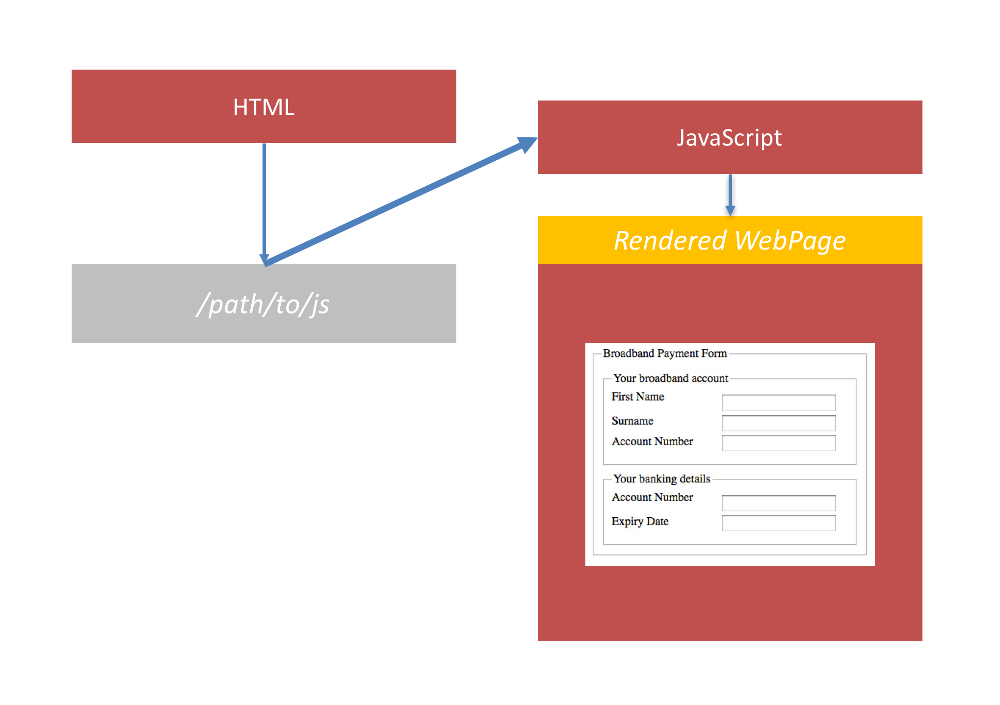
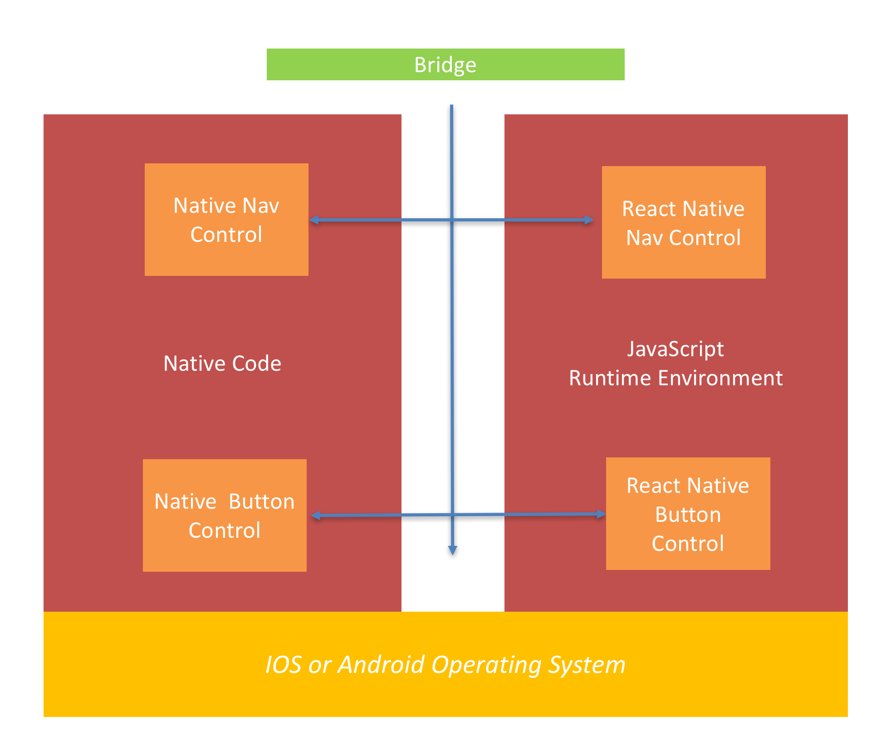
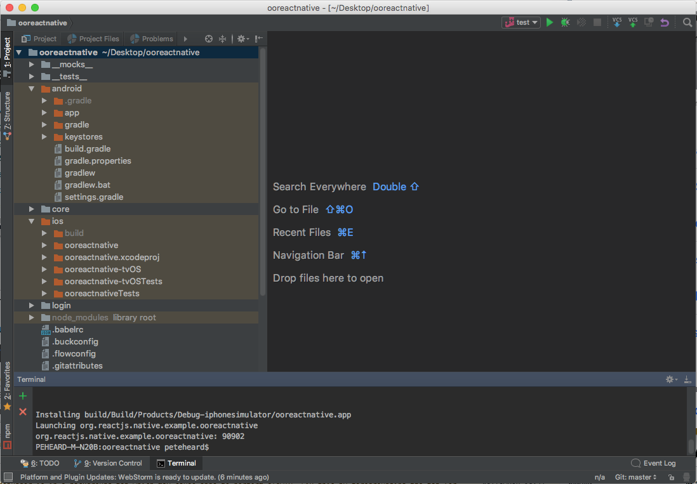
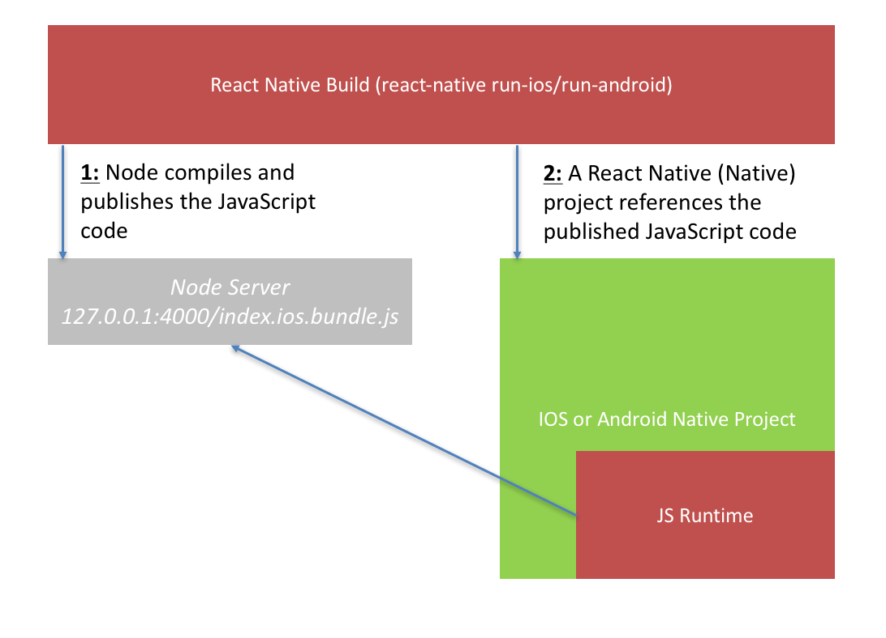
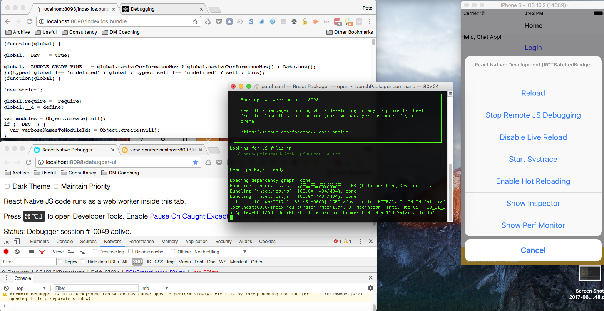

React Native is a modern framework that allows JavaScript to run on and interact with IOS and Android phones in the same way as native code does.

This dynamic and powerful framework is enabling a host of opportunities for organisations that want to consolidate down their application architectures, and take a 'write once deploy anywhere' approach to application development for devices.

But to many people it's not really clear how it works. When you fire up the test project from the React Native website you can be left scratching your head. You have to think about the phone, the emulator, the JavaScript engine, the browser debugger and hell... where does the native even code run?

To begin building apps with React Native we need to understand

1. The runtime architecture
2. The build architecture
3. The debugging architecture

Let's see if we can look at these areas!

## How A Normal JavaScript Web Application Works

To begin to understand the architecture of a React Native application we need to start with the basics. That is how a modern JavaScript application works. 

Since JavaScript is the original language of the web we start our story by looking at dynamic JavaScript applications which are known as Single Page Applications (SPAs) and run in a browser.

In a SPA we have two things that are loaded by the browser

1. HTML document
2. JavaScript

The HTML document (below) contains a reference to the JavaScript

```
<html>
 <script src=/path/to/js/>
</html>
```

The SPA allows our application to be represented using a markup language (HTML) and the interaction between the browser and the user is allowed through our programming language (JavaScript).

The final output is a rendered web page with all the things we expect (e.g. input controls, dynamic behaviour, validation etc).



## The JavaScript Runtime Environment Architecture (Bridging)

The next part of understanding how React Native works is to look at how JavaScript is actually executed. Because JavaScript is not the language that runs natively on the phone we must use a technique called bridging to allow JavaScript to run and to communicate with the phones processor.

This means that the phone must run something called the 'JavaScript core'; which is basically a 'runtime environment'. This runtime environment is nothing more that some code that runs on top of the operating system that will allow JavaScript to execute. It does this by loading some native code that can run JavaScript and then loading some JavaScript into it (which is sent down to the phone in a build process - more on this later). For specific information about this please see the [documentation](https://facebook.github.io/react-native/docs/javascript-environment.html){:target:_blank}.

We see from the following diagram that on top of the phones respective operating system we have our JavaScript runtime environment. Inside this environment the React Native JavaScript code is run.

NOTE : At this point you might be asking is React Native JavaScript? or is it Native Code? Well...actually it's a little bit of both. A React Native project comes with a small native project embedded in the build process.


The above diagram is a simplification of what is happening from the first point of our consideration. It is showing the architecture of what is going on from a high level. In that we have both native code and React Code running in order to power a React Native app. The React Native app is loading our JavaScript 'into' the 'JavaScript core' or 'runtime environment' as I have called it.

The diagram shows only one blue line (which represents a bridging point). In reality there are multiple bridging points that our JavaScript code connects to the native controls on the phone. Why?

Because in order for JavaScript to run a native app it must still use the underlying native code. And there are more than one instances of native code that each app will need to use. For example we may need a single app with lot's of different controls that are unique to each phone. And it does this by setting up each control in the JavaScript runtime environment and then communicating across the bridge.

In reality we end up with something like this...



We can see that each React Native control will interact with a native counterpart component. 

We are 'allowed' to write JavaScript because React Native presents us with a control which is written in JavaScript. But this is always underpinned by the phones actual native counterpart. React Native simply allows the bridge for the two way communication to happen.

So the native code is actually operating on it's own thread, meaning that if our React Native JavaScript code is taking a long time the UI won't hang or slow down. It simply calls back across the bridge using events. This is the one major caveat for developing React Native apps so be aware of not blocking processes in your JavaScript code!

## The React Native Build Process Architecture

Now we understand that React Native will communicate over the bridge we can consider; how does all this get set up?

This is where we need to go back to our original understanding of a JavaScript app. React Native works in a very similar way. What happens is that the phone actually requests a payload (of React Markup and JavaScript in a similar way that our SPA requests HTML Markup + JavaScript).

The very first thing to happen is that the developer will build the React Native project using a command such as 

```shell
react-native run-ios
```

React Native will then do two things.

1. It wil run a node web server locally which publishes a payload file that holds 'all' of our React Native JavaScript code. This is just the markup (which looks a bit like HTML) and the JavaScript logic. This payload is called the ```index.platform.bundle```.
2. Then it will build a pure native application project (for IOS or Android) and deploy this to the phone. This project is configured to have the JavaScript runtime environment and then to download the payload file which we got in step 1.

NOTE : on IOS the runtime environment is hosted on the IOS operating system but on Android it actually ships with React Native. The real name is actually 'JavaScript core' but I am using a generic name so we can understand what it is doing as opposed to what it is called.

Below we see a screenshot of a React Native project. The project itself actually has an IOS and an Android project embedded into it. These are the projects that React Native uses to pull down the payload.



This payload is then delivered directly 'into' the JavaScript runtime environment (which we already saw) via the React Native build process.  Now we have both the native container and JavaScript code which are required to power our entire React Native application.

The diagram below shows the two steps; the webserver with our payload, and the project delivered to the phone.



We should now have a sound understanding of how React Native builds our projects and creates the environment for them to run on a device. 

Whether you are using a real device or an emulator they will both access the payload in the same way.

### Hot Reloading 

So we now understand how the application is build and delivered. But how is it developed?

React Native is only pulling down JavaScript code, and JavaScript does not need to be compiled or built (it is just scripted). This presents us with the biggest advantage of React Native. At any point 'after' triggering a build - which is slow - we can simply re-load the JavaScript by refreshing our React Native app. React Native ships with a 'debug time' tool to do this from the phones menu.

This means we can change and modify a React Native project very fast.

This ability to re-load is called 'Hot Reloading'. Later down the line when we have actually packaged and deployed our apps to the App store we can even publish code fixes to React Native apps using something called 'Code Push' which takes advantage of React Natives ability to 'hot-reload'. This can mean you can avoid entire app store releases (you just update the script on your servers).


## Debugging Architecture

When I first learned React Native I couldn't work out how debugging worked. No one actually explained how the project was built, and it wasn't clear that it behaves in much the same way as a Single Page Application.

When you understand React Native only does these two things (1 package the app and 2 download the payload) you can see that debugging isnt' that complicated.

In order to run a debugger we need two things. 

1. We need to set the location of the source code (which sometimes needs to be manually set on the device)
2. We need to open a browser that the debugger can publish debugging information to



Although there is a lot on this above screenshot we can see 4 main points for consideration.

- Firstly, the app bundle is hosted on localhost:8089/index.platform.bundle
- Secondly, the debugger is hosted on localhost:8089/debugger-ui

Both of these can be browsed to, from the machine which has built React Native using a browser

- Thirdly, a process will stay open (the terminal) which reports the build process output
- Fourthly, we can open the React Native developer options on the emulator or device so that we can change things about the debugging and hot reloading

NOTE : the default port for React Native is 8081 but I changed it to 8089 because of a port conflict. I changed the port using the ```react-native-port-patcher```

## Conclusion

In this article we have discussed : 

1. The runtime architecture
2. The build architecture
3. The debugging architecture

It's hard to begin building something when you don't understand the context of how it runs, and also how it builds. Being able to understand how the normal native code actually communicates with our JavaScript is paramount when building React Native apps.

Knowing this makes it more simple and will give you the confidence to start using this brilliant framework. I hope you enjoyed this article! 


