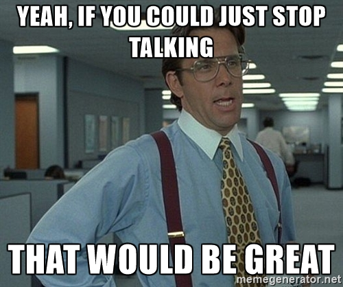

One of the central ideas from Scrum is the use of the daily Scrum meeting. The idea of the meeting is to synchronise and plan activities for the next 24 hours. The [guide](http://www.scrumguides.org/docs/scrumguide/v2016/2016-Scrum-Guide-US.pdf#zoom=100){:target="_blank"} says that each member of the development team should explain

- What they did yesterday
- What they will do today
- What issues are stopping them working (blocking issues)

On the face of it, the meeting sounds like a great idea, a little huddle where everyone keeps everyone else in the loop, cute.

But let's just consider 2 important realities of the Scrum meeting. These two realities are actually quite wasteful. And if we want to create a Lean enterprise we see that the Scrum meeting is actually **anti** -lean.

**They Force Duplication of Knowledge**

One of the key aspects of organising complexity is to keep it simple. And in keeping things simple we have handy tools, such as the Scrum/Kanban board.

On this board we find little stickies explaining what each developer is doing and these get moved across the board throughout the various stages of production (ready, development, testing, complete etc), nice and simple.

Anyone (literally anyone) can easily see what each developer is working on, and how far along they are. The reason we do this is so that people don't have to disturb developers (because disruptions slow productivity).

So wait, the Scrum meeting now tells each developer that every day they need to broadcast to the entire team what they did yesterday and what they are doing today?

Why is it relevant what they did when the whole team can already see what they did just by looking at the scrum-board?

By forcing each developer to tell us what they did yesterday and what they are doing today is basically telling the team what they already know. This creates **WASTE**.

**They Force Developers to Create Noise**

The other problem with the Scrum meeting is one that is caused by psychological herd/caveman mentality. It's the sort of mentality that makes you not want to upset the neighbours, or say the wrong thing to the in-laws. It's our hard wired monkey brain not wanting to upset the pack.

Not only does every developer have to say what they did, they also feel obliged to talk for x-amount of time about it. If there are 7 people in the meeting and every person has just spent 3 minutes droning on about what they did yesterday, then when it gets' round you your turn what are you going to do?

You **want** to just stand up at this point and declare the charade as pointless; then return to your desk to do some meaningful work.

**Instead** you feel compelled to speak for exactly the same amount of time as everyone else. At this point you have become an [**automaton**](https://en.wikipedia.org/wiki/Automaton){:target="_blank"}.

Yep, the second major problem with the Scrum meeting is making intelligent people pad out information and talk for talking sake. Wasteful information in teams is as bad as wasteful work. It's something that shouldn't' be tolerated and the Scrum meeting just forces developer to create **waste** little by little, day by day.

**A Lean Enterprise Meeting**

The idea behind a Lean enterprise is that we cut waste. In the technology sector this waste isn't the same waste as in manufacturing. It's not physical - its informational!

The Scrum meeting forces 2 behaviours from its team members which actually **promote** waste instead of cutting it.

So does this mean we should stop doing Scrum meetings?

Looking at the original Mandate for what the Scrum meeting does; there is still value in the Scrum meeting. We can see that identification of blocking issues is a positive part of it.

A radically different Lean Scrum meeting is that the Lead developer simply summarises what's on the Scrum board in a vocal form and then asks each developer to answer one simple question:

> (X), did you have any problems yesterday which you feel we should be aware of?

It's important that the Lead makes it quite clear that the optimal answer is the **silent** one. If on the rare occasion, there are real issues these should be taken offline as soon as possible.

Again the Lead should act swiftly here to make sure a cap is placed on this conversation as soon as possible, and that people don't have to listen to things which aren't relevant.

**Conclusion**

We do Scrum meetings because the rules say to. And we do Scrum because some developers [said to](http://agilemanifesto.org/history.html){:target="_blank"}. But if we don't stop and think for a moment we end up in a situation where:

- We force developers to **broadcast** what the team already knows; which is wasteful
- We force developers to **dress-up and pad-out** what they did the day before; which is also wasteful

If we want to hold the mantra of cutting waste from our enterprise, then we have to consider that the Scrum meeting opposes this simple idea and that we can cut the meeting to **blocking** issues only. For other aspects of communication they can be done in a more natural and collaborative way through the course of the day by promoting an open and transparent team culture.