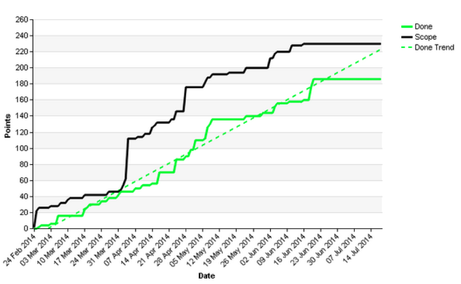

There is a Chinese saying and it goes:

'You can't fatten a cow by weighing it'

I am often reminded of this saying when I find myself obsessively and compulsively checking some sort of arbitrary metric of which I have applied meaning; for example my Google stats on the Logic Room [Site](https://www.logicroom.co/){:target="_blank"} or the amount of plays I get on [Soundcloud](https://soundcloud.com/deepscale){:target="_blank"}.

It's a modern day illness; the constant need to measure success by simple numerical data. We all know that the measure of success is often much more nuanced. For example, what is valued by a person or society in one context is not necessarily shared by someone or anyone in another!

But in the big ol' world of business we love to be able to roll-off numbers. In the world of Agile the story point reigns supreme. Yes... we live by the point!
But let us take a step back and consider:

1.	Why do we develop software?
2.	How do story points help us develop software?

I believe the first point can be answered in a straightforward manner. Organizations write software to either make money or save money. And in the pursuit of making or saving money their ultimate end goal is to increase profit.
The second question is slightly more complex. Story points are used in a number of ways:

1.	They are used as a way to measure output and thus; work out cost
2.	They are used to be able to predict how long projects have left to run
3.	They are used to as a way to prioritize some work over other

All of these are valuable but what I would like to consider is: are points helping us with the most important objective of all creation of software; 'Profit'?

## Profit

It's pointless making turnover unless you make profit, and it's pointless saving money if you are spending more than you save. Profit can be regarded as the number one objective in business because without it businesses [fail](http://www.investopedia.com/terms/t/too-big-to-fail.asp){:target="_blank"}.
So if profit is the number one objective in business do points actually help us achieve that goal? Why exactly do we use points in the software team?

## The Purpose of a Point

The original purpose of a story point was to create a layer of abstraction between how long something takes and its actual real world implementation. Mike Cohn [explains](https://www.mountaingoatsoftware.com/blog/the-main-benefit-of-story-points){:target="_blank"} it is as a solution to a problem where different people on a team might actually take a different amount of time to do something. Different tasks can be more or less involved depending on the time and context under which they are taken. The point provides enough abstraction to be able to take an 'averaging' across a team.
However, sometimes points can cause problems. Usually, points on a team will get translated directly into time (at some stage) whether we like it or not. Usually, they get put into a burn-up or a burn-down chart, both of which have time across the x-axis. 

The business love these diagrams because they can look at the y-axis as a measure of a team’s output. And we know that at some point time can be turned into cost, and cost will be now fixed to points. But... 

## The Bad Bit About Points: Deadlines

By measuring a team’s output using a point we immediately start to create a very simplified measure of output. A single digit on a timeline which is somehow meant to tell us about that entire team’s ability to produce software.

And by reducing a team’s output down to points we may actually be causing unwanted side effects; one such side effect is ‘the precedent’. And that precedent no matter how subtle creates pressure for the team to deliver.

There has been interesting [research](https://www.sciencedaily.com/releases/2009/02/090210162035.htm){:target="_blank"} to suggest that although we might see pressure as something useful it can actually diminish our ability to make good decisions. Good decisions help a team to make better software. So what we can see is that points may be useful to the business, but they may also be harmful to the team.

## An Alternative Metric

As a developer my income is dependent on the software that I create making money for whoever pays me to write software for them. My objective is to create software that offers something that my clients or employers can use to save or make money (as we established). So perhaps with this in mind we can begin to see a new paradigm with regards to what we can gauge the creation of software on. Value.

Perhaps if we started to integrate the value that the software creates more closely into the team this might help the team do what it is meant to do; create profitable software.
I think Story Points have served us well. I think they have done their job. But I think as we move forward as an industry the key to beginning to see powerful Digital Transformation happen lies in unlocking value, not just boiling everything down to figures which aren't necessarily tied to our ultimate objective.
I think we need to involve our developers more closely in the process of creating value from software.

## Moving Forward

Perhaps we can start to integrate our business goals more closely with the output of the team, here are a few ways I have seen businesses more closely collaborate with the team and identify value based objectives

1. The developers should spend more time with users understanding how they work, and their needs
2. The developers should actually be involved in more 'Impact Mapping' with the users/business stakeholders to help cut away features that aren't needed
3.	The developers should be given a bi-weekly or monthly 1hr update from a business executive which should explicitly lay out the financial or operational objectives for the software

## Conclusion

At the start of this blog post we looked at an old Chinese proverb that said you can’t fatten a cow by weighing it. To some extent Agile Story Points are simply a way of measuring our software cows, but as we have seen they don’t necessarily fatten them!

Story points are a useful tool, but their uses may just be confined to helping the business see the value in their software teams rather than helping the software team create value for the business. 

Organizations should consider this paradox. Story points aren’t the only way in which to gauge the value of software and deliver it. One problem that organizations face which story points help with is the ability to be able to work out what priorities should be given to the software team.  Impact Mapping is a more recent development which will actually align a development effort with realistic goals for the software.

I hope you enjoyed this post, happy developing!

