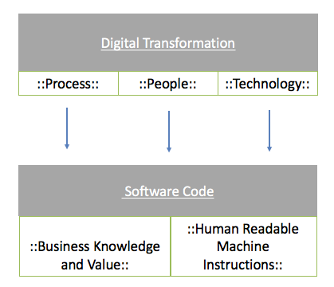
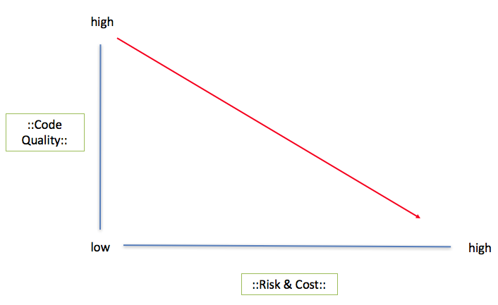

This article will discuss code quality in the context of large scale Digital Transformation. Specifically we will look at the disadvantages to allowing poor quality code to become embedded in your applications and assess some of the risks and costs it brings.

## What We Will Cover :

- The Close Relationship Between Software Code And Digital Transformation
- Why Would Code Quality Be Important?
- The Financial Cost Of Bad Code
- The Operational Risk Of Bad Code
- Leveraging Marginal Gains On Code Quality : Optimising Agile Software Delivery
- Conclusion

## The Close Relationship between Software Code and Digital Transformation

Digital Transformation deals with both the people process and the technology that drives organisational change in order to compete digitally. Firstly we will take a look at couple of simple facts about Software Code in general and then position them into the context of Digital Transformation.

There are two high level observations that we can make about software in general:

1. **Human Readable Machine Instructions** : Modern day programming, for the most part, uses Object Oriented languages (such as Javascript, C#, Ruby etc) to efficiently encapsulate knowledge in a context that is easy for the human to understand (objects) and turn it into something that easy for a machine to understand (binary instructions). It&#39;s important to understand this point because it provides us with a maxim; the code within your organisation is simply a set of instructions that needs to processed by a machine but they are written in a way that they can be understood by humans.
2. **Encapsulation of Business Knowledge** : Your applications are looking to connect your internal business processes including the services that you offer to customers and people within your organisation.  This is the essence of the value that you provide as a business and is important to understand this because it means that your digital systems hold a huge amount of monetary worth when it comes to your business.

In the context of a Digital Transformation that involves people processes and technology, all three have a dependency on digital systems which are powered by code and that code is extremely important.

> The close relationship between Digital Transformation and Software Code

## Why Would Code Quality Matter?

The code in your organisation holds business value and process; it&#39;s a sort of living breathing document which powers your digital infrastructure to do the things that you would otherwise have to do manually.

If we view code as a document expressing a business process then we must realize that like any other document in an organisation, it should have certain quality standards appertaining to it.

### It&#39;s Just Documentation

The code is describing something important and needs to be read by multiple people in an organisation. In almost every other department (legal, executive, marketing etc) there are implicit controls about the standard of documentation which circulates, even if this means people double checking emails that are sent before they hit &#39;send&#39;, re-reading important corporate documentation or even running spelling and grammar checks.

Almost every official documentation in an organisation is expected to be:

- clear
- well structured
- free from errors
- formed with proper English and good grammar
- edited to the company standard
- compliant
- secure
- easy to read and understand

It would not be a good scenario if the CEO sent out an email with bad spelling and grammar, or  a marketing executive put together a brief that didn&#39;t read correctly. We ensure that we don&#39;t do this in business because as professionals we don&#39;t want to waste each others time with low quality communication or create an inferior image.

### Why Quality Control is Often Weak in Agile Software Delivery

So if this is a standard that we set with natural language documents why should software code be any different? It shouldn&#39;t be but unfortunately it often is.

Only a small slice of the company is able to reliably detect these code quality problems early on in the development process (the software developers themselves) so you can see how a business can potentially be exposed to a large amount of risk.   This is because in almost every other process where complexity is involved there is some level of external auditing to make sure standards are adhered to.

For example; builders have a site foreman, accountants are independently audited and even doctor&#39;s results are scrutinized year upon year.  However, with software this quality control often doesn&#39;t take place to a rigorous enough standard.  Very often we just leave it to the teams that are writing the code and it&#39;s easy enough to see how quality problems can quietly creep in deep inside an organisation, slowly eroding the immense investment that they hold whilst they aren&#39;t even aware of the issue. Of course this isn&#39;t to say teams can&#39;t self-regulate; they often do and do it well (I have been on a number of them). But when we talk about quality control at an organisational level often this attitude of self regulation can leave gaping holes in a company&#39;s investment in digital infrastructure.

Invariably as time passes, organisations eventually become aware that they have quality issues; excessive bugs, late releases, high developer churn and often the straight up inability to retain customers can all be symptoms of **bad code** ; we refer to this bad code as &#39;technical debt&#39;.



## The Financial Cost of Bad Code / Technical Debt

A [study](http://www.castsoftware.com/castresources/materials/wp/cast_2010-annual-report_keyfindings.pdf) by Cast Software performed an audit of 75 code bases and produced some interesting but also quite startling costs which provide us with an indication as to the financial burden that problems with code quality can place upon an organisation. What they found is that on average a code base has exactly $2.82 of **technical debt** per line of code. What this means is an average cost of fixing some problems with that code base will equate to that cost per line. They identified problems by running a code analysis tool and identifying (Security, Performance, Robustness and Changeability) problems in the code. Whilst this automated tooling is not enough to spot software quality problems, it does provide us with at least a repeatable way of gathering data on this topic.

The conclusion was interesting; they found that the average size of a code base was 347,000 lines of code and this produces approximately $1,055,000 of technical debt! That means that on average a code base is carrying a million dollars worth of value locked up in &#39;Bad Code&#39; or &#39;Technical Debt&#39;.

&#39;The Average Technical Debt in a Code Base Equates to $1,055,000.&#39;

## Risks Associated With Poor Quality Code

We have seen how poor quality code can carry cost, but in the world of business it&#39;s impossible to address cost without considering risk. A high risk business venture may yield short term capital gains but if it promptly puts you out of business it probably isn&#39;t a wise move. So looking at code quality through the lens of risk is the second way to evaluate it.

A [study](http://downloads.seapine.com/pub/papers/CostPoorQuality.pdf) performed by Seapine cited data it collected which identified that 24% of organisations were seeking to reduce the risk of poor customer satisfaction from the digital products they provide. Interestingly, later on in the report,  organisations claim that software quality and reliability are lifelines to securing long term customer retention and growth.

> The relationship between cost and risk and code quality is inverselely proportional 

If keeping customers happy is a core part of your business strategy then addressing quality in a pragmatic way will help you ensure your long term financial goals can be not only met but improved upon. This article has only cited a small amount of evidence but there are an abundance of independent research papers published which add to the argument that improved software quality helps to dramatically reduce costs.

- [http://www.castsoftware.com/castresources/materials/wp/cast\_2010-annual-report\_keyfindings.pdf](http://www.castsoftware.com/castresources/materials/wp/cast_2010-annual-report_keyfindings.pdf)
- [http://downloads.seapine.com/pub/papers/CostPoorQuality.pdf](http://downloads.seapine.com/pub/papers/CostPoorQuality.pdf)
- [https://www.infoq.com/news/2009/03/TDD-Improves-Quality](https://www.infoq.com/news/2009/03/TDD-Improves-Quality)
- [http://www.springer.com/computer/swe/journal/10664](http://www.springer.com/computer/swe/journal/10664)

## Leveraging Marginal Gains On Code Quality : Optimising Agile Software Delivery

The topic of marginal gains is an exciting new business topic that has emerged in recent years.  It is related to being able to optimise at the small scale in order to produce seismic shifts at the large scale; the basic idea is that this is a bottom-up approach to business which uses, data, feedback and statistics at the micro level in order to drive strategy at the higher level.

An [interesting article](http://www.economist.com/news/business/21607816-businesses-should-aim-lots-small-wins-big-data-add-up-something-big-little) from the Economist goes into more detail about marginal gains. The great thing about taking code quality seriously in your organisation is that it is a very tangible asset which holds value in the form of information and process. If we are adopting a marginal gains approach to your business and are looking to optimise at the small level to drive higher competitiveness, then improving code quality provides a huge opportunity for maximizing growth.  It does this firstly by addressing debt and secondly by driving greater customer experience.

## Conclusion

Organisations can and do chug along with poor quality code and it is possible to keep the wheels turning without paying sufficient due care and attention.

However, as we have seen, this comes loaded with higher **risk** and increased **cost** over the long term.  If you then take this increased risk and cost to it&#39;s conclusion it will simply drag an organisation down to its weakest point and will make it uncompetitive.

In a modern Digital Transformation programme an organisation should firstly look to unlock the hidden value in improving code quality and reducing technical debt for direct cost savings. Secondly they can reduce operational risk and improve customer satisfaction by driving up the internal quality of their applications. Improving code quality should be used as a tool to leverage faster and more efficient Digital Transformation.



