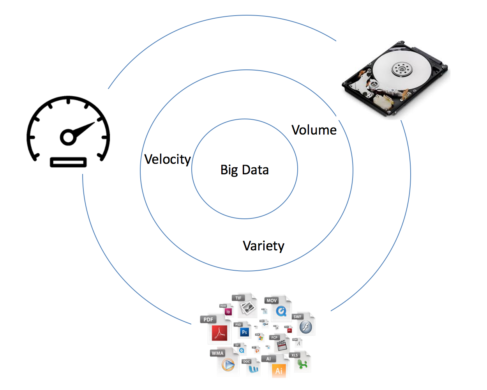
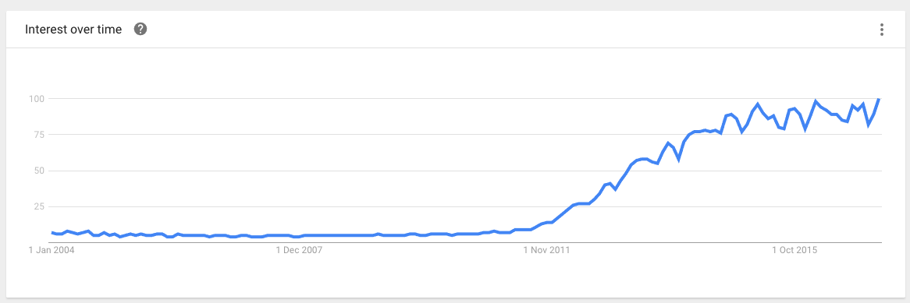
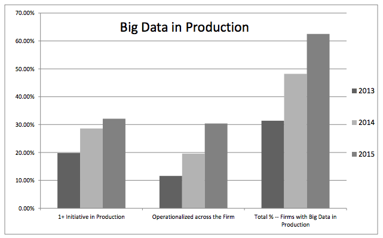
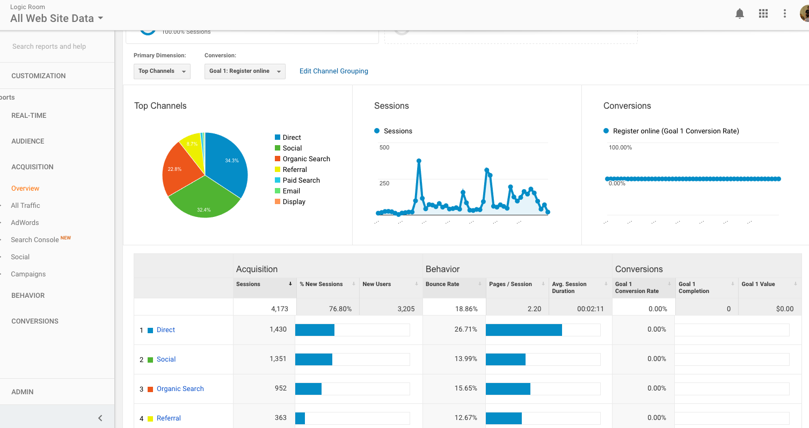
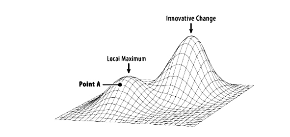

In modern day businesses with a transformational change process in place, C-levels are increasingly looking towards data and the analysis of data (analytics) to provide them with insight into ways of improving their organisations.

[Digital Transformation](https://www.logicroom.co/no-one-understands-digital-transformation-heres-why/){:target="_blank"} is about the underlying changes a business makes which exposes new opportunities and creates new operating models in a company by leveraging digital assets.

In this article we will establish what big data is and how it can be used to drive change.  We will also look at the limitations of big data and see how we still need process and creative thinking to spot opportunity and assess risk in today’s digital and technology-led economy.

## What We Will Cover :

-	What is Big Data?
-	The Rise In Popularity of Big Data
-	2 Ways Big Data Helps With Business Transformation
-	Big Data Only Allows Single-Step Analysis and Change
-	What Big Data Doesn't Show Us
-	Conclusion

## What is Big Data?

Big data is a term that describes the capture, storage and analysis (query and visualisation) of data but simply on a 'large scale'. What we mean by 'large scale' is that typically the data will come from many different sources and be in different formats.

Gartner describes it succinctly as; high-volume, high-velocity and high variety, known as the [Three V's](http://blogs.gartner.com/doug-laney/files/2012/01/ad949-3D-Data-Management-Controlling-Data-Volume-Velocity-and-Variety.pdf){:target="_blank"} . These three sub-phrases attempt to capture the notion of big data in a way that we can understand it in terms of it attributes:

- **Volume** -	being the amount of information it captures
- **Velocity** - being the speed at which it captures the information (specifically, the rate of change of that data)
- **Variety** -	being the number of different streams that big data can come from (e.g. file formats)

## The Rise In Popularity of Big Data

Big data in itself is not actually new. In fact the term has been used since the 1990's, although in recent years as IT infrastructures have become more pervasive and the internet has started to allow the very fast transmit and retrieval of many data points, it has grown in interest as a topic. The rise of mobile usage has also created much more varied data; fuelling the trend.

Interest in the term "big data" has always existed but it started to grow rapidly in 2011. Google Trends shows a very rapid upsweep since that time (although this does seem to have flattened from 2015 onwards).

In one report by  [New Vantage](http://newvantage.com/wp-content/uploads/2016/01/Big-Data-Executive-Survey-2016-Findings-FINAL.pdf){:terget="_blank"} we can see that 62.5% of firms report that they now have at least one instance of big data in production. This is nearly double the 31.4% who reported the same result in 2013.

The key consideration is that big data, including the visualisations, statistical models, predictive analytics and the processes by which we apply meaning to the data is more popular now more than ever to businesses.
	
## 2 Ways Big Data Helps With Business Transformation

### It Let's us Test our Assumptions

It's common to think that we can trust our gut, but trusting our gut is fraught with problems. In the book  [The Chimp Paradox](https://www.amazon.co.uk/dp/B006K26BEQ/ref=dp-kindle-redirect?_encoding=UTF8&btkr=1){:target="_blank"} the author Professor Steve Peters talks about this subject. He explains that in all of us we have two separate brains working (a chimp brain and a human brain). He says that sometimes we have a tendency to allow the irrational 'chimp' part of our brain to take over from the rational 'human' part. He makes the point: 

> "Humans look for evidence and then draw up conclusions. Chimps draw up conclusions then look for evidence to support them." - Professor Steve Peters

This creates an obvious problem; we can end up in a conflicted state of thinking. We think we know something when we might not. Given the risks and costs associated with getting things wrong, trusting our gut creates potential problems for all of us so anything that can help us check our assumptions when making decisions is useful.

### It Gives us a Roadmap For Digital and Process Change

As I mentioned in my article  [6 Ways CXOs Can Cut the Cost of Agile Software Development](https://www.logicroom.co/6-ways-cxos-lower-the-cost-of-software-development/){:target="_blank"} when using a Lean product development mind-set, being able to cut away less valuable parts from our roadmap will help us optimise our offerings.
                                                                                                                By finding ways to identify what will actually be helpful for our users (and thus drive our bottom line) we can become Leaner. This will save us time and money.

Big data can provide us with unique insight into our customers’ behaviours from a broad spectrum of interactions across the organisation.

Due to the scope of a typical big data 'set', we can begin to see patterns emerge. For example; a customer who might be interested in one type of product or service may show behaviours or interact with us in a different way somewhere else in our business. With big data we can potentially spot this and leverage it.

Visualisations, analytics and predictive models are very practical ways that data can help us actually check our assumptions. When I relaunched Logic Room this year a key part of the strategy was to use the data on this site to understand our customers better and tailor the business to the customer before starting other marketing initiatives. The deep analytics that Google provides about browsing habits let's me do this.

Knowledge like this really helps us shape not only our digital products but our entire business transformation. Big data supports digital transformation because it allows us to understand the direction in which our offerings and processes will change.

## Big Data Only Allows Single-Step Analysis and Change

As we have seen, big data allows us to progress our business transformation by checking assumptions and deciding which direction to take with product decisions and process. But it does have a limitation!

Big data can only show us what we wanted to know in the first place, or relative approximations 'of' that.

For example, when we want an answer to a question, we almost always start at a biased position. It's not possible to start from a completely open ended position because we have to make decisions on our data, models and visualisation set up.

If I was using big data to model financial markets and I wanted to know which events trigger a recession, I can put in all the financial data that I have on the market place; transaction velocity, debts, loans etc., but this still won't take into consideration one major contributor to a recession; psychology.

Big data doesn't show us the **counterfactual** position. It won't show us things that are completely off the radar; it will give us insight which is in the same direction or adjacent to our current train of thought. This means that using data can only drive us towards the highest point within one sphere of change. It won't take us to revolutionary positions outside of that sphere of change.

## What Big Data Doesn't Show Us

We often refer to technology as being 'disruptive'. What this usually refers to is both the speed and amount of change that happens.

Within the space of a few short years, technologies that companies have invested heavily in become obsolete. New opportunities present themselves so fast that we miss them.

The first limitation that Big Data has is identifying risk.

In the book  [Black Box Thinking](https://www.amazon.co.uk/Black-Box-Thinking-Surprising-Success-ebook/dp/B00PW634YQ/ref=sr_1_1?ie=UTF8&qid=1487656256&sr=8-1&keywords=black+box+thinking) the author Matthew Sayed makes this point.
                                                                                                                He speaks about an example from modern business; Blockbuster Video. He explains that as Blockbuster grew. they could have used data to optimise their business and make better decisions. For example, putting action films before thrillers or organising the snacks in a certain way near the checkout to improve sales or even something subtle like playing different things on the radio. And whilst these approaches would have been useful to determine shopper habits/desires and slowly 'tweak' revenues they were missing a shockwave about to hit the industry; online streaming! Big data is often not suitable to assess risks of this nature.

The other factor that big data won't reveal is opportunity. Without good knowledge of an industry, new technologies can emerge which actually present new opportunities. For example, when the iPhone was released, few people probably predicted that the application economy would be worth [$51b](https://waracle.net/app-economy-forecast-2016/){:target="_blank"}. The same can be said for the advent of the computer; look at this famous quote from the CEO of IBM in 1943:

> I think there is a world market for maybe five computers. - "Thomas J. Watson"

## Conclusion

In modern digital transformation programmes, companies are looking to transform their businesses and big data is being used more and more to guide changes because it helps with roadmaps and insights.

However, as we have seen,  big data can only take us so far in one sphere of thought. It will drive us to the highest possible point within one single change in an organisation. We still need to use more traditional techniques to make large 'step changes'. To be able to innovate still requires human intelligence and creativity.

The key consideration here is that technology is disruptive. This disruption manifests itself in both speed and size of change to our operating models. Too much reliance on big data can firstly leave us exposed to risk, and secondly, can mean that we miss opportunity.

It's important that businesses focus on meaningful processes that help them to identify these opportunities and risks and create larger changes where necessary.

