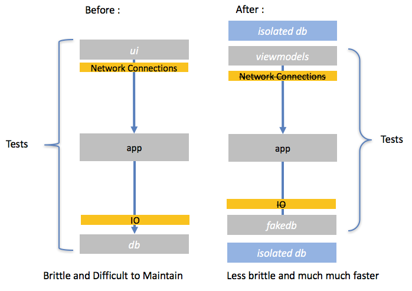
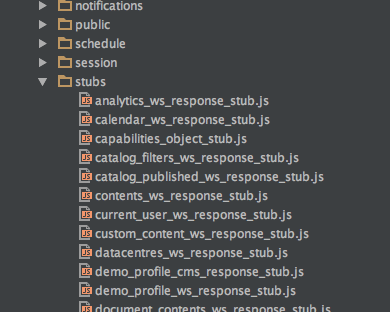

This article will discuss the potential pitfalls and problems in [Continuous Integration](https://en.wikipedia.org/wiki/Continuous_integration){:target="_blank"} and [Continuous Deployment](https://www.agilealliance.org/glossary/continuous-deployment/){:target="_blank"} (CI and CD respectively). Most importantly we will discover how to avoid them. Since the purpose is to create software we will begin this discussion by thinking about it from a software development perspective; most problems can be reduced down to writing code so this is a good place to start from; a bottom up approach so to speak.

## What We Will Cover :

- Recap: What is CI and CD
- Goals of CI and CD
- Pitfall 1: Lack of Skills (Dev-Ops)
- Pitfall 2: Network Connections and IO
- Pitfall 3: Test Data
- Conclusion: It's All About Speed

## Recap : What is CI and CD?

Continuous Integration (CI) is a word that describes how Software Developers will merge their code as often as possible into a centralised location. Generally, this centralised location will be responsible for building some sort of artefact and executing automated testing on it (to check it's viability for release).

Continuous Deploment (CD) is the bit that happens after CI. It describes all the processes by which the merged code will be repackaged and deployed into target enviroments with the ultimate objective of releasing to a live environment.

The word **continuous** with regard to both of these terms means that we keep repeating the process over and over.  Here is a handy diagram to help you:

> Continuous Integration and Continuous Deployment Feedback Loops!

## Goals of CI and CD

We can't deem something a pitfall unless we know the context under which we measure success. For that reason let's quickly look at the goals of CI and CD.

Working software without proof is useless. Trying to say something is done unless it has been tested is difficult to justify. This is a simple tenant of Agile. So when we look at the overall picture of software, it isn't enough to just write code. There are a number of other factors; notably that the software 'works'. More to the point, that it works in every intended environment that we will want it to work in. Therefore we can assert that CI and CD's first goal is to ensure some sort of output.  Since organizations can spend millions implementing even only medium sized projects so it's important that the investment is protected. We have therefore arrived at our first goal:

**GOAL 1** : To ensure high quality output (both functionality and code)

The ultimate goal of a company is to make money. Of course we can argue for more noble goals but when it comes to spending large sums of money on making software then we should focus this business objective. If an organisation needs to make money then they can do it in any number of ways. Lately we have seen the [Digital Transformation](https://en.wikipedia.org/wiki/Digital_transformation){:target="_blank"} movement begin to take shape. If our business objective is to make money then how can our software delivery process support this objective? The answer is that we should try and create software for the lowest possible cost (as long as it fulfils the first goal).   Now we have arrived at our second goal:

**GOAL 2** : To decrease cost

Let's have a look at some pitfalls so you know what the main problems are when implementing a large scale Continuous Integration or Continuous Deployment pipeline!

## Pitfall 1 : Skills Gaps (Dev-Ops)

Okay, so the first and most common problem I see with clients using CI and CD is a skills gap. There may be engineers who understand enough about a wide variety of platforms, technologies, operating systems and languages but multi-faceted all-rounders that can deal with both developers and business stakeholders in multiple locations can often be hard to find.

The key here is to realise that recruiting people solely for their ability to manage your CI and CD process is leaving a large knowledge gap in your overall software delivery capability. When we talk about Agile in Software Engineering one of the things that comes up time and time again is that of collaboration. If you want to build a highly collaborative team you have to create 'specialised generalists'. A 'specialised generalist' is someone who understands one area in depth but is also comfortable working in other roles in order to get the team as a whole to deliver software. What we don't want is the situation where developers think that their work is done when they finish writing code. Ideally you want to foster an environment of collective ownership of all parts of the development pipeline, specification --> deployment.

This is fundamentally the take home message with Dev-Ops; you need to start to integrate the engineers that help with your CI and CD into the team. This has a knock on effect of introducing more responsibility to the team as a whole to manage CI and CD. The result is an improved delivery capability since you have more protection against bottlenecks.

**Bottom Line: Mitigate skills gaps by merging your build and release pipeline engineers more closely into your development teams.  This is called dev-ops and will help ensure a quality product because everyone is takes ownership of the deliverables.**

## Pitfall 2: Network Connections and IO

During both CI and CD we will need to have automated testing in place to check that new functionality is working and that past functionality has not broken. Most software will need at least 1 forms of connection to the real world; the user interface and or the database. Without them it would be difficult to use most applications. In order to test it, very often the software is built and packaged and a test suite (e.g. selenium) will drive the user interface and that interface will work with a real database.

Whilst this form of testing provides a very real and human like form of testing it also has a major drawback.   Here are a couple of points to note about this approach:

1. It must not use an unreliable network connection (under heavy load your test may time out)
2. It must make physical changes to a database (meaning we have to write reset scripts every time we run our tests).

Both of these side effects affect the **entire** application and will end up having a higher cost because of their complexity.  So is there a better way?

### Creating a Testable Architecture

In order to limit Network Connections and Database IO (Input Output) when you design your application it is important to create a layer of abstraction around your application components, we call this creating a 'testable architecture'. This layer of abstraction will allow the software team to use something called Inversion of Control which is where they can use fake implementations of IO dependant modules (like the database). In order to test the view they can use viewmodels (which you can read about in our TDD E-Book). This will allow rapid testing of view like structures in order to give us total confidence that our business objectives have been met.

After this, the view and the database can be tested in isolation. This diagram shows a before and after, introducing these abstractions in the right place.

By optimising your architecture in this way and increasing the speed of your pipeline development and execution you will reduce cost.  This is because speed and cost are inversely proportional in the context of software development.

> A diagram of a testable architecture
 
**Handy tip** : With the emergence of Single Page Applications people often assume that anything in the browser is the UI. This is not strictly the case. Often the entire application can live in the browser and the point I am making here is relevant to browser based apps too. The same principles apply with test strategies (to remove dependencies on the user interface portion of the Single Page app (for example Angular/React) and keep testing around just pure code (for example JavaScript.)

**Bottom Line: By considering application architecture and designing it so that it can be tested without the over use of network connections and real databases you will find that your CI/CD pipline is less brittle and will run faster. Ultimately this will help to meet the objective of reducing COST.**

## Pitfall 3: Test Data

As we saw in our goals, the first objective of CI and CD is to get a high quality output. In order to do that (and as we discovered in Pitfall 2) we need to have automated testing. The ability for a developer to continuously change code without the fear of breaking it is one of the most important things that developers should be in the position to do. Automated testing allows this and fast automated testing promotes this!

In order to write tests we need to be able to accurately set a system up in a consistent fashion every time we execute the test. This means taking any moving variables out of the equation. Specificially what we want to do is 'lock' our test data. In large systems this is hard because the test data needs to be represented somehow. We already saw that it is not a good idea to use the database directly to store this test data ( it is too slow and complex to keep resetting).   The next best thing is to use our abstraction layers (from pitfall 2) and pass test data into the right parts of our CI/CD pipeline.

In order to make sure our tests don't give us false positives (from dealing with incorrect data) then we need to make sure that the test data is kept up-to-date. In order to know when our test data becomes invalid we can to either create some sort of automated script to produce it (which might be too costly/difficult) or we can be diligent and keep on top of it. In order to facilitate the process of keeping test data up-to-date it is wise to keep all the test data in one place. This can be a as simple as having a folder where it is kept in your source control repository. In most of the projects we have done recently we stick to a rule and we keep it in a folder called ``/stubs. Every release, someone who understands the data architecture should give all the files in this folder the 'once over' and try and understand if any changes have been made to the schema. If they have these stubs should be updated. That way your CI/CD system will flag any errors before deployment.

> Some test data in one of our projects

**Bottom Line: Keep test data up-to-date to avoid costly mistakes going into production.  Either automate this or get someone to regularly audit test data.  This will ensure a high quality output.**

#### Conclusion: It's All About Speed

In this article we have seen how we can clarify our goals with regard to Continuous Integration and Deployment. In all Software Engineering the first task should be to clarify our objectives. Of course, quite often in business we can forget the basics but we should remind ourselves of this! In the case of releasing software our objective is speed - and the speed of feedback! By feeding-back failure quicker you reduce cost. We have seen how :

1. Encouraging your entire software team to be interested in and contribute to release and deployment (Dev Ops) you will remove bottlenecks
2. Limiting IO  by creating testable architectures will increase pipeline and thus decrease cost
3. Keeping your test data up to date will help you improve quality (by spotting defects sooner)

Organisations that consistently optimise their CI and CD process will experience a faster time-to-market with their products and a higher level of both technical and functional quality. Ultimately, by paying attention to, and optimising the release pipeline they can leverage a competitive advantage by shipping better software faster!