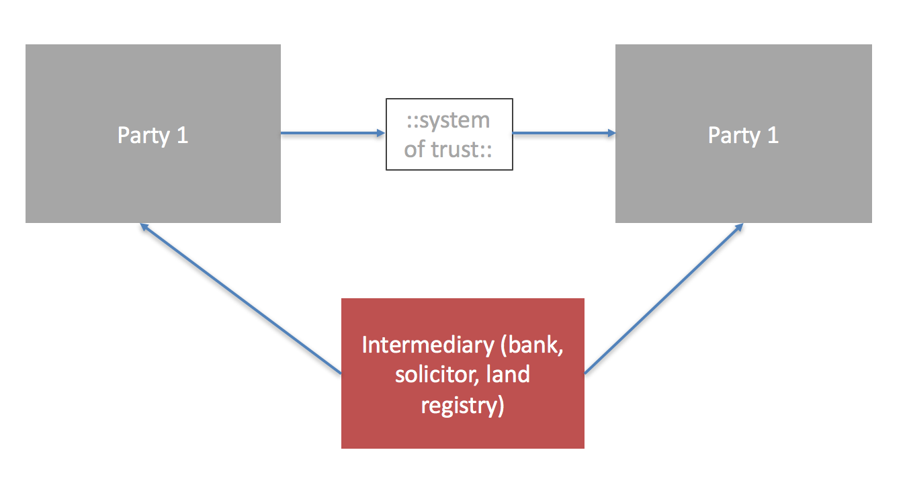
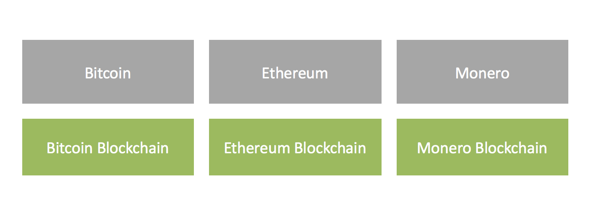
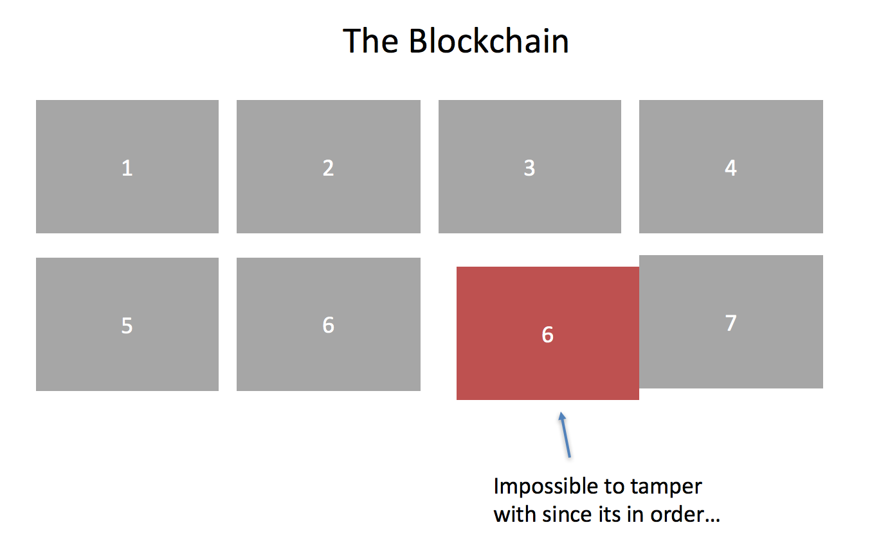

Blockchain is a technology that makes transactions easier, faster and more secure; it is set to shake up lot's of industries from finance to property. 

To understand the basics about blockchain and it's ability to change business we begin our journey with our most lovable of friend; money! 

## How Transactions Traditionally Work

When people want to make a transaction they have always had to rely on intermediaries to make sure a it is carried out properly. These intermediaries provide a 'man in the middle' service that is independent. Each party agrees that the middle man is responsible for ensuring that the transaction can take place. This is known as 'trust'. 

A typical example of trust is a bank. If you want to give someone money you can transfer it through a bank using a cheque. Or if you want to purchase shares you may do so through the brokerage arm of a bank.

Intermediaries don't just exist in the finance world. We also have other bearers of trust such as solicitors, will writers and land registrars.

These systems of trust are not free to operate, you need to pay the bearer of the trust (the middle man) to enable this to happen; and this comes with **cost**.

## Blockchain vs Cryptocurrencies (Bitcoin, Ethereum, Monero)

Blockchain is the underlying mechanism of which cryptocurrencies often reside upon. There are many types of cryptocurrency.

Each of the currencies currently have their own blockchain. Its a 1 to 1 relationship. Bitcoin lives on the Bitcoin blockchain. Ethereum lives on the Ethereum  blockchain.

Technically speaking the currency is independent of the blockchain it resides on.

## The Blockchain : A Distributed Transaction (Ledger)

Our trust based intermediaries provide a centralised point of control to our transaction. They are the governers of our trade; so for each trade they  perform they also need to record it in some sort of database. This means that each intermediary (bank, land registry etc) has to store it's own database. We call this a 'ledger'.

In the blockchain world this is different. Instead of there being a central ledger, we get something called a 'distributed ledger'.

The distruted ledger stores trades across multiple points in the blockchain network. And these points are all updated together.

Each transaction is added to a 'queue' of transactions waiting to be processed.

Next, computers called 'miners' are paid to cryptographically 'sign' the transaction. 

When the miners have finished the record is updated and the whole network recognises the transaction. The queue is then moved on and more items are added behind it.

Because the blockchain is linear and shared across the network it's impossible to tamper with it; since each block is cryptographically signed against the one **before** and the one **after** it. This provides a record of ledger that no single entity has ownership over. This is very secure.

## Will Blockchain Transform Business?

If we think back to our original trust based system which needed an intermediary, we realise that apart from being slow this system is also expensive. These costs and speed slow growth and [inhibit trade](https://www.wto.org/english/res_e/booksp_e/aid4trade15_chap1_e.pdf){:terget="_blank"}.

Because blockchain technology enables peer to peer based trust this means that anyone can validate transactions. Both costs and barriers to entry are reduced for everyone. This has huge potential for business because the mechanisms of trade are going to undergo a monumental shift.

The key attributes of the technology include the following:

- Security : security is improved because of the distributed ledger
- Transparency : the ledger is potentially viewable by anyone  
- Privacy : for private transactions blockchain technology can still be used
- Risk : the nature of peer to peer is always more resiliant than centralised systems 

One [report](http://uk.reuters.com/article/us-tech-blockchain-ibm-idUKKCN11Y28D){:terget="_blank"} suggests that by 2017 15% of banks will have a blockchain implementation in place.

A new global economy of immediate value transfer is on its way, where big intermediaries no longer play a major role. An economy where trust is established not centrally but through consensus and complex computer code enabling a distributed and equal trust.

## Conclusion 

Blockchain will profoundly disrupt hundreds of industries that rely on intermediaries, including banking, finance, academia, real estate, insurance, legal, health care and the public sector — amongst many others.

This will result in job losses and the complete transformation of entire industries. Overall, the elimination of intermediaries brings mostly positive benefits since historically improving technology actually [increases the amount of jobs](https://www.theguardian.com/business/2015/aug/17/technology-created-more-jobs-than-destroyed-140-years-data-census){:terget="_blank"} regardless of what the media might [have us believe](http://www.cnbc.com/2016/11/04/elon-musk-robots-will-take-your-jobs-government-will-have-to-pay-your-wage.html){:terget="_blank"}.

Blockchain also promises to democratize & expand the global financial system. Giving people who have limited exposure to the global economy (such as 3rd world countries), better access to financial and payment systems and stronger protection against corruption and exploitation. This is of benefit to us all!