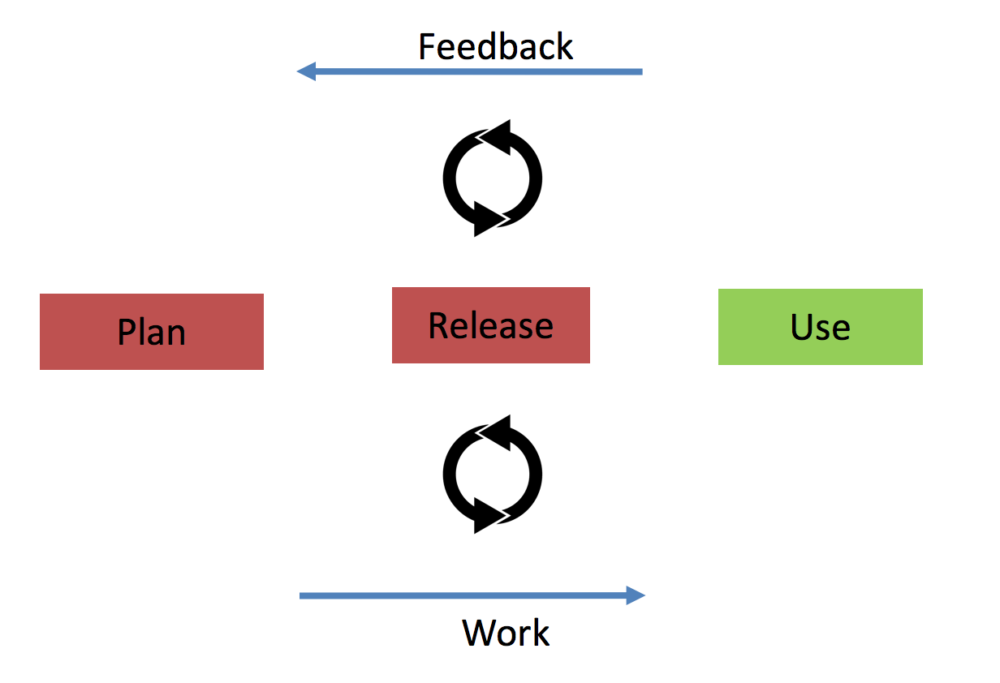
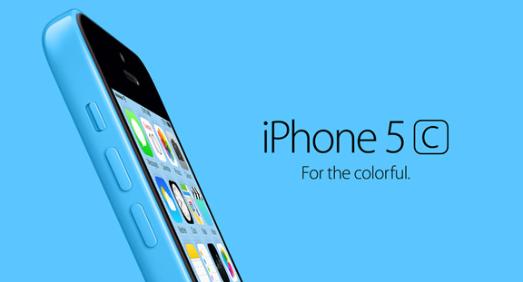
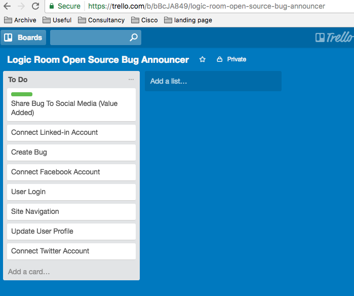
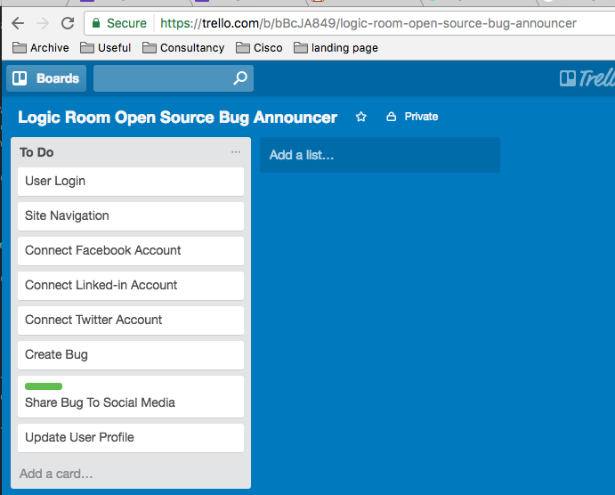
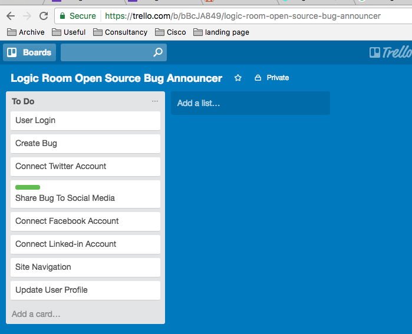
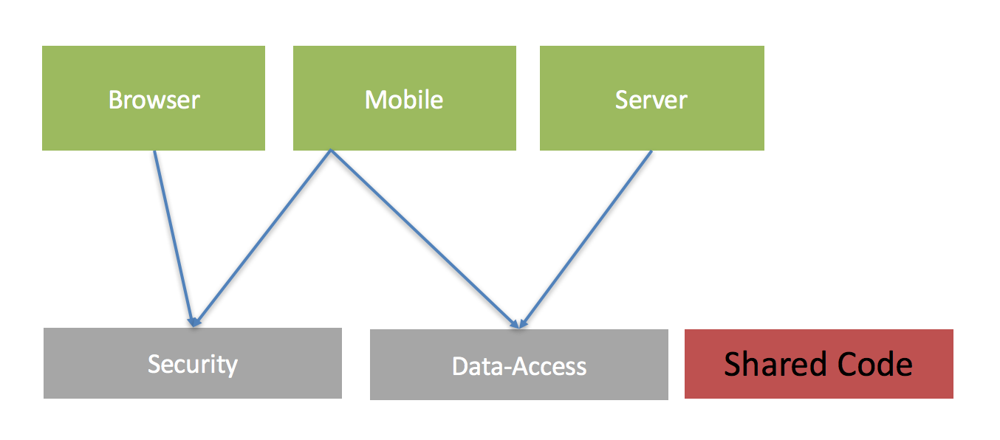

# How To Build And Launch A Software Product FAST [Web and Mobile Apps]

This article will discuss how to build and launch a software product fast! It's written for SME to corporate organisations but can also be used by entrepreneurs and small teams.

Developing any product, whether physical or digital takes an enormous amount of resource both in management and in development. Doing it faster can have benefits since both cost can be reduced and a faster time to market allows you to learn and adapt quicker. 

However, simply saying 'fast' is subjective. It's hard to just 'speed' up the development of something. It's a bit like saying 'think fast' it just isn't realistic. What we can do however is optimise the way we work so that we cut all non-essential effort from the process. The principle of cutting waste from the manufacturing of something has a name, it's called [Lean](https://en.wikipedia.org/wiki/Lean_product_development){:target="_blank"} and is a pretty big subject in software development. 

## What We Will Cover :

- Introduction
- Decide Product Goals
- Raising Awareness
- The Build (Technology, People and Rapid Application Development)
- Conclusion

## Introduction

### Feedback

We discussed at the introduction of this article the concept of 'Lean'. Lean will help you from expending effort that isn't needed. The energy you save from work not done will have two consequences : 

1. It will save you time
2. It will increase your ability to learn

The first one you could probably have guessed, but it's the second one that we really need to establish as an important part of developing digital products. The quicker you can learn when developing your digital product the more successful it is likely to be. In order for your product to be successful you need to have users that want to use it. In fact they need to be fanatical about it. The most important thing to find out if a user want's to use your product is to actually let them try it!

The more waste we cut from the process using lean and the quicker we release our product the sooner we can get this feedback; we create a feedback loop. And this feedback loop is critical for your product success.

The following diagram shows a feedback as part of a 3 stage manufacturing process involving planning, releasing and using a product. It's worth noting the two critical parts of this diagram. That is; feedback and work. Feeback flows upstream, and work flows downstream. By keeping this cycle continuous we incrementally improve our product. 

> A rapid feedback cycle speeds up product development since earlier feedback let's you adapt quicker.

### The Minimum Viable Product

This guide is about creating a Minimum Viable Product (MVP). An MVP should be the minimum amount of features on your product that is required in order to start adding value. This article will detail steps to identify what should be in your MVP. Then it will give you a guide to begin development.

### Data and Analytics

In order to launch your product your marketing and commications need to resonate with your expected users. Luckily, there is a lot of data available online which can help you research your product.

**Social Media** Try using twitter and facebook to search for words and hastags surrounding your product. This will give you insight into what people are talking about with regards to your intended product.

**Google Trends** You may have a product idea in mind but it's worth knowing the current topics that are associated with it that might be popular. Trends can give you useful insight into what is growing and the direction a market is taking.

**Google Keyword Planner** The free planner from google will tell you the number of monthly searches on a phrase. This information is useful for product development because it can help you work out what is most in demand. For example, if I was creating a product for independant financial advice I could search for 'pensions' or 'insurance' to find out what is being searched for more. Then I know how to proposition my marketing.

**Current Data & Industry Reports** For organisations that are targetting current or known markets they can use their current usage stats to help them refine their ideas. They may also want to buy market reports which will provide curated data about what they are trying to achieve.

**Collecting Data** If you feel there is weak data related to your digital product idea and you would like some verification performing some user questionnaires can be a good step to go through. You can collect data by making a form with questions using either [typeform](https://www.typeform.com/){:target="_blank"} or [Google Forms](https://docs.google.com/forms/u/0/){:target="_blank"}. By collecting data from your users you will be able to establish what will be important to them with your intended product.

## Decide Product Goals

In order to decide what is going into your MVP you will need to decide the goal for your product. There are two types of goals

1. Value Added
2. Functional

### 1 Deciding Value Added Goals :

After you feel you have done enough research it's time to clearly define the 'value added' goals for your product. These goals should be based around how your product helps the user. It's important to focus the functional design of your product around users. One company which does this incredibly well is Apple. You always hear apple talk about how their products affect the user first before they reel off stats about what it does.

Your value added goals are also known as Unique Selling Points (USP). They should show how your product set's itself aside from competitors.

### 2 Deciding Functional Goals :

After you know your value added objectives then you need to decide the functional objectives that are neeed to help you achieve your value added objectives. 

For example when facebook started they decided to connect people who were in the same university, their objective was to connect like minded people with other people in their sphere of education. This was their `Value Added` goal. However in order to do that they had to develop things like 'The Wall' and 'Friending' as functional features.

By making the distinction between Value Add and Functional objectives for your product you will be able to establish the highest priority features and leave the less important ones. This alignment will drive the rest of the process from marketing to actual physical development of the product. 

## Raising Awareness

### Beta Users

You will want to start inviting people to beta test your MVP product (when it is launched). In order to find beta users you can either use current customers (which you may have access to from your current business operations). 

Alternatively, you can run an initial digital ad campaign. The idea is that you offer something of value (such as a reduced rate sign up fee on launch), in exchange for them using your MVP. 

In both cases you need to provide a place for Beta users to register, for this it's good at this stage to create a Landing Page.

### Build a Landing Page (Website)

Part of raising awareness is to have a place that will explain your offering. A landing page is a single page of a website that will help you do this. It serves 3 basic purposes.

1. Explain your product offering in a simple, elegant and informative way
2. Capture details from anyone that might be interested (using an embedded form)
3. Test subtle variations of your offering and how it is marketed (to see if more people engage with it)

Landing pages usually follow a simple formula known as the [Sales Copy](http://www.digitalmarketer.com/how-to-write-sales-copy/){:target="_blank"}. The `Sales Copy` is a formula which is based on basic human emotion and is designed to entice a user, hold their interest and make them engage. It should : 

1. Qualify the user with a catchy headline
2. Explain a generic problem (which you just caught their attention with)
3. Go on to explain potential solutions and then drill down into your solution and why it is so unique
4. Urge the user to take some action (like fill in a form)

In step 4 you may want to offer an incentive to get them to engage. You may offer an e-book or another digital download.

#### A Landing Page Example

For example if I wanted to sell a new product which helps people with back pain I could set up a landing page which would cover the following steps :

1. Do you have back pain?
2. Did you know 90% of back pain is psychological?
3. I have an e-book on relaxation techniques which are proven to help back pain
4. Enter your details below now; for a free copy ( normal price 5.99 )!!

Many sites these days are in fact very elaborate landing pages. They contain a lot of information too but for the most part they are seeking to qualify the user with a headline. 

Then they will explain their offering, why it's unique and try and get the user to engage. Websites are marketing tools and the landing page concept is a great format to try and capture the details of whoever is looking at it.

#### Targetted Ads with Landing Pages

When you have created your website/landing page you may want to invest a small amount of money into getting some traffic to it so you can begin to build your beta user list and find out what is working with your marketing. As discussed, information like this earlier in the build process can help to refine your efforts later down the line.

Social media can be a good way to select the right sort of demographic that will be interested in your product.

#### The Hollow Product (Dropbox)

It **is** possible to begin to test market reaction to your product without building it. In fact [Dropbox](https://techcrunch.com/2011/10/19/dropbox-minimal-viable-product/){:target="_blank"} did this in the early days. They had significant early technology problems and needed funding. The original video is [here](https://www.youtube.com/watch?v=7QmCUDHpNzE){:target="_blank"} and unbelievably this was only a demo video it wasn't a working product!

The way the 'hollow product' works is that you can use it as an explainer with your landing pages to see if this is something that users will be interested in. 

You can word your landing page in such a way to ask your users to become 'early adopters' or 'beta users'. The benefit here is that you are gauging interest without actually building anything.

## The Build

So far, we have covered the basics about Lean product development, feedback and initial research about your product. At some stage you are going to want to build your product. It's worth noting that the first part of this guide is an on-going process. The techniques in it should be used for the entire lifecycle of your digital product development. This way you will constantly foster a discipline of learning and adapting.

### The Mvp

### Requirements Analysis 

##### Step 1 : Listing Requirements

The first step is to actually list out your requirements. There are two important considerations for this list:

1. It should be in priority order (of your value added and functional requirements that you already established).
2. That is should be in a format that is understandable by anyone.

In order to start building our list of requirements we should start by brainstorming all the features we think we need to implement in order to release one of our value added requirements (which we identified earlier). It's best to collect your list on a digital tool that can be shared. An excellent free tool to use is [Trello](https://trello.com){:target="_blank"}. 

I have created an example application in the following diagram which is called the 'Social Media Open Source Bug Announcer'. The idea of the app is to share an open source bug for any application across social media (so that any of my followers can fix it). The first thing I did was thought about the minimum set of things that are needed in order to complete it's value added goal. The value added goal in this case is 'Share Bug To Social Media' (marked with a green line). What I came up with was the following :

We know from our earlier exercise we want to build our software to focus around delivering it's value added objectives first. 

In the perfect world we would only build our value added features because that is what we will eventually be able to monetise. But we realise that in order to release our value added features there are some non functional requirements we need to satisfy first. For example we are almost definitely going to need the user to be able to login to our application and create a bug first.

##### Step 2 : Re-ordering Requirements

We are now going to re-order our requirements so that we can push all non-essential items of work to the bottom of the priority queue. What we are trying to do is make sure we aren't building software that isn't needed. At this point you will want to speak with your developers.

The developers need to be made aware of the value added goals behind this product. At this stage they will need to discuss and advise you on the absolute minimum required non functional features that are needed in order for you to fulfil your value added requirements. 

With my example application that I made I have gone through the process and placed them in order of what I think I need to be able to get my value added offering to market as soon as possible. 

We can see that being able to login, navigate and connect all my social media profiles is an absolute MUST in order to get my green 'Share Bug To Social Media' feature implemented. 

Well, on first go this seems to be the case. But what if I went back and tried again to cut even more away?

##### Step 3 : CUT CUT and CUT (LEAN)

Earlier on in this guide we saw that cutting waste was an essential part of implementing product development. And applying this principle to every facet of our production process is invaluable.

After a good sit down, cup of coffee and a think about my product. Something has hit me. In order to test what is working I want to get this into the hands of my users and fast. I know that most of my users are on twitter. So I think, why am I implementing the ability to share to all social media platforms when 90% of my customers are on twitter?

I now decide I will just move all of the other social media items below my Value Added item. After doing this I also realise because I am only using one social media platform I can vastly cut down my navigation too since I don't need as many options. 

Now my list is even more refined: 

We can see how, organising items into a priority list, speaking with your developers and focusing your efforts behind cutting all non essentials we have literally halved the amount of development required to get a first prototype of our MVP to market. 

This is the essence of Lean product development. It's not possible to simply develop fast unless you develop clever, and that requires a disciplined focus on thinking and iterating over your requirements.

##### Step 2 : Fleshing Out The Requirements

Now that we have spent some time working out our initial application requirement ordering we need to begin to flesh out our requirements. Simply having a couple of words to describe each feature to begin with is fine from a brainstorming perspective. But we need to spend some time on them in order to make sure they can be developed. The point about applying ordering first is to make sure we don't waste time developing requirements for features which aren't in the priority list. 

Each feature should have the following

1. Something called a `User Story`
2. Some level of design/wireframe

A 'User Story' is simply a structured way of describing a feature. The user story will go something like this...

- As a 'user'
- I want 'some feature'
- So that 'some goal'

The point about a user story is to avoid bloated documents that don't get to the point. Developers don't usually love to read documentation, they would rather be writing code. The quicker we can explain what we want from our features to them the better. By keeping this format we also enable everyone to read, understand and amend the requirements to the same stanard.

In our social media sharing app we realise that we can take our Value Added proposition and write it like this... 

As a 'registered user'
I want 'to be able to share my bug on twitter'
So that 'my followers can fix it'

After we add our user story we can annotate it with either hand drawn sketches or photoshop designs. Or we can use a prototyping tool such as [Axure](https://www.axure.com/){:target="_blank"}. You can see that below; I have decided to begin mocking up what I want the sofware to do using a pen and paper. It's important to realised that developing software can be as simple or as complex as you allow it. But fundamentally the basics of requirements building should be kept as lightweight as possible.

##### Step 3 : Rinse and Repeat (Agile Backlog Grooming)

Step 1 and 2 of building requirements should be done repeatedly at a fixed time throughout the duration of the project. When developing complex systems it's important to realise that the end deliverable will be changed by new information that is gained through actually beginning to build the product. And it's important that we update our priorities and requirements in light of the new information that we gain.

At it's heart keeping a fixed cycle of updating and re-prioritising is an Agile practice. But like with all Agile practices discipline has to be applied to keep it working.

Make sure you re-prioritise and update requriements on a weekly or bi-weekly basis.

### Choosing The Right Technology

Choosing the right people to work with on your project is key to success. After you have established the 'ifs' (marketing) and the 'whats' (requirements analysis) you will now need to understand how to build your product.

Some points to consider at this stage will help to guide your technological decisions. It's worth identifying at this point.

1. What platforms will you want to deliver your digital product to? Mobile, Desktop, Web/Browser?
2. What technologies will you be using?
3. Will you be developing shared cross-platform code?

Many languages and frameworks can be used to achieve the goal of delivering to different platforms. As a quick overview for anyone new to this, here is a quick list of technolgies and typically what they allow you to do. There are exceptions but for the most part the following list is a good representation of the technologies overall abilities.

| Technology/Framework/Language   | Backend (server) | Frontend (browser) | Native Mobile (ios/android) | Cross Platform |
|---------------------------------|------------------|--------------------|-----------------------------|----------------|
| Javascript (Node/Angular/React) | yes              | yes                | yes                         | yes            |
| Ruby (Rails)                    | yes              | no                 | no                          | no             |
| Python (Django)                 | yes              | no                 | no                          | no             |
| Java (Tomcat,Android)                            | yes              | yes                | yes                         | no             |
| C#                              | yes              | no                 | yes                         | yes            |
| Swift                           | no               | no                 | yes                         | no             |
| PHP                             | yes              | no                 | no                          | no             |

As you can see JavaScript has a lot of bases covered. It's worth noting that whilst JavaScript covers a lot of bases it doesn't automatically make it the right choice. When evaluating technolgies you should also take into consideration which skills your developers have.

Point 3 mentioned shared cross-platform code. With todays modern tools and frameworks it is possible to develop a core of project code that can be re-used across different platforms. For example; a client we currently work with uses a core set of code for things like security and then they write individual interfaces and components for web mobile and server.

JavaScript will allow shared and cross platform code. It uses various package management tools to be able to do this. Sharing code across different platforms will help to speed up development because for much functionality you only need to write once, but you do need to have a high level of code quality to effectively do it. 

> In todays modern environment it's possible to use the same language for the entire stack, JavaScript is the most popular language accoding to [GitHut](http://githut.info/){:target="_blank"} and it supports cross-platform shared code

### Find the Right Designer/Developer Combination

For this stage in the product there are 4 main things I usually recommend to look for in developers. These traits work well with software that is highly complex. 

1. **Agile Experience** That they know how to develop products in an incremental fashion where information is fed back through the value chain
2. **Full Stack** They can develop code for both the front end or the back end (or aren't afraid to learn how to)
3. **Care About Quality** They care about the aesthetic quality of the user interface, how well it works for users and also about the quality of the code they write. It should have good automated testing to go with it. Products of today need to have user interfaces that look great but are also well-engineered well so they are performant and robust. 
4. **Rapid Application Development (RAD) Experience** is a form of development where much of the boiler plate code that will be used on a project is either auto-generated or is simply created by the developer that has done similar work before. Meteor.js is a JavaScript. [Meteor.js](https://www.meteor.com/) framework that can help to get apps off the ground quickly because it combines both the front end and back end into single source code files. 

## Conclusion

When building digital products the first thing that teams and organisations usually identify as important are time to market, otherwise known as 'speed'. 

In this guide we have established that whilst you can't artificially just speed something up you can optimise the work that you do.

By going through a requirements building phase that is designed to cut away waste anything that doesn't add immediate value to your customers will be ignored allowing you to focus on features that do add value. This style of product development has it's routes in 'Lean'. 

We also looked at choosing the right technology and have seen that some languages such as JavaScript support a wide variety of platforms which will allow you greater efficiency through the use of 'shared code'.

Then we looked at your overall choices for choosing a team and that working with developers who have some Agile experience, care about quality and also have some skills in Rapid Application Development will help you to put together your initial ideas and deliver working software FAST!

